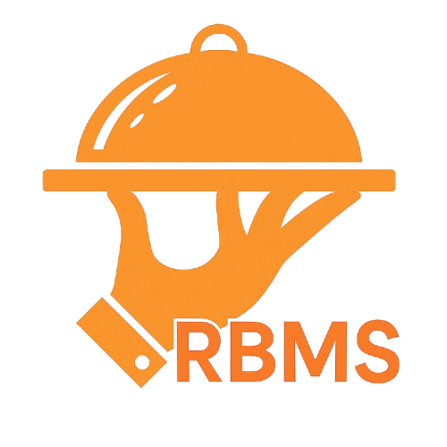

<p align="center">
  
</p>

<h1 align="center">RBMS-POS</h1>

<p align="center">
  <strong>ระบบ Point of Sale แบบครบวงจร สำหรับร้านอาหารและเครื่องดื่ม</strong>
</p>

<p align="center">
  
  
  
  
  
  
</p>

---

## Overview

**RBMS-POS** คือระบบ POS ที่ออกแบบมาเพื่อร้านอาหาร ร้านกาแฟ และร้านเครื่องดื่มโดยเฉพาะ ครอบคลุมตั้งแต่การจัดการเมนู สั่งอาหาร จอแสดงครัว ไปจนถึงการชำระเงินและรายงานยอดขาย พร้อมระบบ QR Self-Order ให้ลูกค้าสั่งอาหารผ่านมือถือ

ทุกฟีเจอร์ทำงานแบบ **Real-time** ผ่าน SignalR ทำให้ทุกหน้าจอ (แคชเชียร์, ครัว, บาร์, ลูกค้า) อัพเดตทันทีโดยไม่ต้องรีเฟรช

### เหมาะสำหรับธุรกิจ

- ร้านอาหาร / ภัตตาคาร / บุฟเฟ่ต์
- ร้านกาแฟ / ร้านเครื่องดื่ม / ร้านชา-นม
- ร้านขนมหวาน / เบเกอรี่ / คาเฟ่
- Food Court / ศูนย์อาหาร (รองรับหลายโซน)

---

## Tech Stack

### Frontend

| เทคโนโลยี            | ใช้ทำอะไร                                        |
| -------------------- | ------------------------------------------------ |
| **Angular 19.1**     | Framework หลัก + Signals สำหรับ State Management |
| **Tailwind CSS 3.4** | Styling ด้วย Design Tokens                       |
| **PrimeNG 19**       | UI Components (Table, Dialog, Form, etc.)        |
| **SignalR Client**   | Real-time Communication กับ Backend              |
| **ng-openapi-gen**   | Auto-generate TypeScript API Client จาก Swagger  |
| **ng2-charts**       | กราฟและแผนภูมิบน Dashboard                       |

### Backend

| เทคโนโลยี                   | ใช้ทำอะไร                             |
| --------------------------- | ------------------------------------- |
| **ASP.NET Core 9.0**        | Web API (N-Tier Architecture)         |
| **Entity Framework Core 9** | ORM + Migration                       |
| **SignalR**                 | Real-time Hub (Order, Kitchen, Table) |
| **JWT + Refresh Token**     | Authentication & Authorization        |
| **Swagger / OpenAPI**       | API Documentation                     |

### Infrastructure

| เทคโนโลยี           | ใช้ทำอะไร                                                |
| ------------------- | -------------------------------------------------------- |
| **SQL Server 2022** | Database หลัก                                            |
| **MinIO**           | S3-compatible Object Storage (รูปเมนู, Logo, รูปพนักงาน) |
| **Nginx**           | Reverse Proxy + SSL/TLS                                  |
| **Docker Compose**  | Container Orchestration                                  |
| **Certbot**         | Auto SSL Certificate Renewal                             |

---

## Modules & Features

### Order & Operations

| Module                    | รายละเอียด                                                           |
| ------------------------- | -------------------------------------------------------------------- |
| **ภาพรวมร้าน**            | แสดงสถานะโต๊ะทั้งร้านแบบ Real-time (ว่าง, กำลังใช้, จอง)             |
| **รายการออเดอร์**         | ดูออเดอร์ทั้งหมด พร้อม filter สถานะ, ค้นหา, pagination               |
| **สั่งอาหาร (Staff)**     | พนักงานสั่งอาหารหน้าร้าน พร้อมตัวเลือกเสริมและหมายเหตุ               |
| **Kitchen Display (KDS)** | จอแสดงออเดอร์แยกตามสถานี (อาหาร / เครื่องดื่ม / ของหวาน) พร้อม Timer |
| **ชำระเงิน**              | รับชำระเงินสด / QR Payment, แบ่งบิล (Split Bill), ใบเสร็จ            |
| **รอบการขาย**             | เปิด-ปิดกะแคชเชียร์, สรุปยอดรอบขาย                                   |

### Menu Management

| Module                                | รายละเอียด                                              |
| ------------------------------------- | ------------------------------------------------------- |
| **หมวดหมู่เมนู**                      | จัดการหมวดย่อย ลากเรียงลำดับ (Drag & Drop)              |
| **เมนูอาหาร / เครื่องดื่ม / ของหวาน** | CRUD เมนูพร้อมรูปภาพ, ราคา, Tags, ช่วงเวลาขาย           |
| **ตัวเลือกเสริม**                     | กลุ่มตัวเลือก (เช่น ระดับความหวาน, ท็อปปิ้ง) ผูกกับเมนู |

### Table & Reservation

| Module                       | รายละเอียด                               |
| ---------------------------- | ---------------------------------------- |
| **ผังร้าน (Floor Plan)**     | ออกแบบผังร้านด้วย Drag & Drop, แยกตามโซน |
| **จัดการโซน/โต๊ะ**           | สร้างโซน, จำนวนโต๊ะ, จำนวนที่นั่ง        |
| **เชื่อมโต๊ะ (Link Tables)** | รวมบิลหลายโต๊ะเข้าด้วยกัน                |
| **จองโต๊ะ**                  | ระบบจองล่วงหน้า พร้อมปฏิทิน              |

### QR Self-Order (Mobile Web)

| Feature                | รายละเอียด                                         |
| ---------------------- | -------------------------------------------------- |
| **สแกน QR**            | ลูกค้าสแกน QR Code บนโต๊ะ เข้า Mobile Web ทันที    |
| **ดูเมนู + สั่งอาหาร** | Browse เมนูพร้อมรูป, เลือกตัวเลือกเสริม, ใส่ตะกร้า |
| **ติดตามออเดอร์**      | ดูสถานะอาหาร Real-time (กำลังทำ / พร้อมเสิร์ฟ)     |
| **ดูบิล**              | ดูยอดรวมบิลปัจจุบัน                                |

### HR & Admin

| Module                  | รายละเอียด                                                    |
| ----------------------- | ------------------------------------------------------------- |
| **พนักงาน**             | ข้อมูลส่วนตัว, ที่อยู่, ประวัติการศึกษา/การทำงาน, รูปภาพ      |
| **ผู้ใช้งาน**           | สร้าง/จัดการบัญชี Login, ผูกกับตำแหน่ง                        |
| **ตำแหน่งงาน + สิทธิ์** | RBAC — กำหนดสิทธิ์แต่ละ Module ตามตำแหน่ง (Permission Matrix) |
| **ค่าบริการ**           | จัดการ Service Charge (%, บาท)                                |
| **ตั้งค่าร้าน**         | ข้อมูลร้าน, Logo, Branding, เวลาเปิด-ปิดร้าน                  |

### Dashboard & Analytics

| Module           | รายละเอียด                                         |
| ---------------- | -------------------------------------------------- |
| **ภาพรวม**       | KPI ยอดขายวันนี้/เดือนนี้, จำนวนออเดอร์, เมนูขายดี |
| **รายงานยอดขาย** | กราฟยอดขายรายวัน/รายเดือน, ช่วงเวลาขายดี           |

---

## Architecture

```
┌─────────────────────────────────────────────────────────┐
│                     Nginx (Reverse Proxy + SSL)         │
├──────────────┬──────────────┬───────────────────────────┤
│  Admin Client│  Mobile Web  │         Backend API        │
│  (Angular)   │  (Angular)   │     (ASP.NET Core 9)       │
│  port 4300   │  port 4400   │       port 5300            │
├──────────────┴──────────────┼───────────────────────────┤
│                             │  SignalR Hubs (Real-time)  │
│          Frontend           ├───────────────────────────┤
│                             │  Controllers (thin)        │
│  Angular 19 + Signals       │  Services (business logic) │
│  PrimeNG + Tailwind         │  Repositories + UnitOfWork │
│  ng-openapi-gen (API)       │  EF Core + SQL Server      │
│  SignalR Client             │  MinIO (S3 Storage)        │
└─────────────────────────────┴───────────────────────────┘
```

**Backend — N-Tier Layered Architecture:**

```
WebAPI → Business Services → Repositories → Dal (EF Core) → Core
```

- **Controller** รับ request → เรียก Service → return response (ไม่มี business logic)
- **Service** จัดการ business logic → เรียก Repository
- **Repository** จัดการ database query → ผ่าน UnitOfWork
- **Global Exception Filter** จัดการ errors ทั้งระบบอัตโนมัติ

**Real-time — SignalR:**

- Order Hub — broadcast เมื่อมีออเดอร์ใหม่ / เปลี่ยนสถานะ
- Kitchen Hub — ครัวเห็นออเดอร์ทันทีพร้อม Timer
- Table Hub — สถานะโต๊ะอัพเดตทุกหน้าจอ
- Notification Hub — แจ้งเตือน Toast + Drawer แบบ Real-time

---

## Quick Start

### Prerequisites

- [.NET 9 SDK](https://dotnet.microsoft.com/download)
- [Node.js 20+](https://nodejs.org/)
- [Docker Desktop](https://www.docker.com/products/docker-desktop/)

### 1. Start Dependencies (Docker)

```bash
docker compose up -d sqlserver minio minio-init
```

### 2. Run Backend

```bash
cd Backend-POS/POS.Main/RBMS.POS.WebAPI
dotnet run
```

Swagger: `https://localhost:5300/swagger`

### 3. Run Frontend (Admin Client)

```bash
cd Frontend-POS/RBMS-POS-Client
npm install
npx ng serve
```

Admin Client: `http://localhost:4300`

### 4. Run Frontend (Mobile Web - Customer QR)

```bash
cd Frontend-POS/RBMS-POS-Mobile-Web
npm install
npx ng serve
```

Mobile Web: `http://localhost:4400`

### Default Login

| Username | Password   | Role                        |
| -------- | ---------- | --------------------------- |
| `admin`  | `P@ssw0rd` | Administrator (Full Access) |

> รายละเอียดเพิ่มเติม: [doc/development/quick-start.md](doc/development/quick-start.md)

---

## Project Structure

```
RBMS-POS/
├── Backend-POS/POS.Main/
│   ├── RBMS.POS.WebAPI/                 # Controllers, Hubs, Filters, Program.cs
│   ├── POS.Main.Business.Admin/         # Auth, ServiceCharge, ShopSettings, File
│   ├── POS.Main.Business.Menu/          # Menu, Category, Options
│   ├── POS.Main.Business.HumanResource/ # Employee
│   ├── POS.Main.Business.Authorization/ # Position-Based RBAC
│   ├── POS.Main.Repositories/           # Repository + UnitOfWork
│   ├── POS.Main.Dal/                    # Entities, DbContext, Migrations
│   └── POS.Main.Core/                   # Enums, Exceptions, Helpers
│
├── Frontend-POS/
│   ├── RBMS-POS-Client/                 # Admin/Staff Client (Angular)
│   └── RBMS-POS-Mobile-Web/             # Customer Mobile Web (Angular)
│
├── doc/                                 # Documentation
│   ├── architecture/                    # System design, Database reference
│   ├── development/                     # Developer guides, Coding standards
│   ├── requirements/                    # Business requirements (8 modules)
│   ├── agents/                          # AI Agent specs (SA, BE, FE, Review)
│   └── tasks/                           # Task tracking
│
└── docker-compose.yml                   # Full-stack deployment
```

---

## Documentation

| หมวด                         | เอกสาร                                                                           |
| ---------------------------- | -------------------------------------------------------------------------------- |
| **Quick Start**              | [quick-start.md](doc/development/quick-start.md)                                 |
| **System Overview**          | [system-overview.md](doc/architecture/system-overview.md)                        |
| **Database & API Reference** | [database-api-reference.md](doc/architecture/database-api-reference.md)          |
| **Backend Guide**            | [backend-guide.md](doc/development/backend-guide.md)                             |
| **Frontend Guide**           | [frontend-guidelines.md](doc/development/frontend-guidelines.md)                 |
| **Design System**            | [design-system.md](doc/architecture/design-system.md)                            |
| **Development Workflow**     | [module-development-workflow.md](doc/development/module-development-workflow.md) |
| **Project Status**           | [project-status.md](doc/features/project-status.md)                              |

---

## Deployment

Production deployment ใช้ **Docker Compose** พร้อม Nginx reverse proxy + SSL auto-renewal:

```bash
docker compose up -d
```

| Service       | Port            |
| ------------- | --------------- |
| Nginx (HTTPS) | 443             |
| Backend API   | 5000 (internal) |
| Admin Client  | /client         |
| Mobile Web    | /mobile         |
| SQL Server    | 1433 (internal) |
| MinIO         | 9000 (internal) |

> รายละเอียด: [doc/development/DEPLOYMENT-GUIDE.md](doc/development/DEPLOYMENT-GUIDE.md)

---

## License

This project is proprietary. All rights reserved.

---

<p align="center">
  <sub>Built with Angular 19 + ASP.NET Core 9 + SignalR + SQL Server</sub>
</p>
