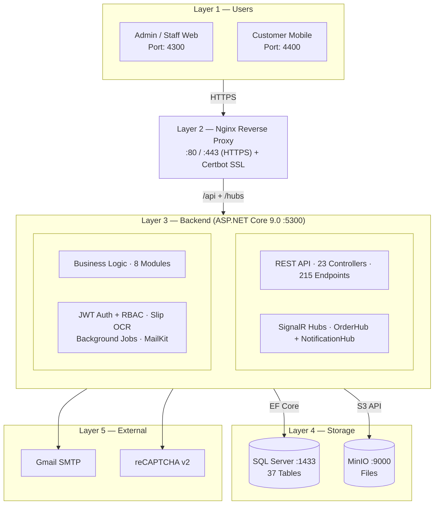
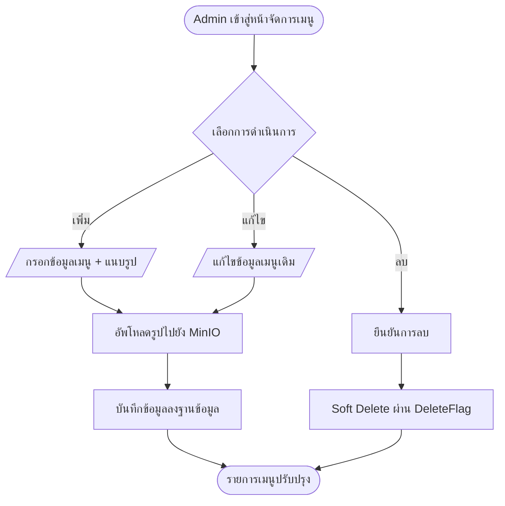
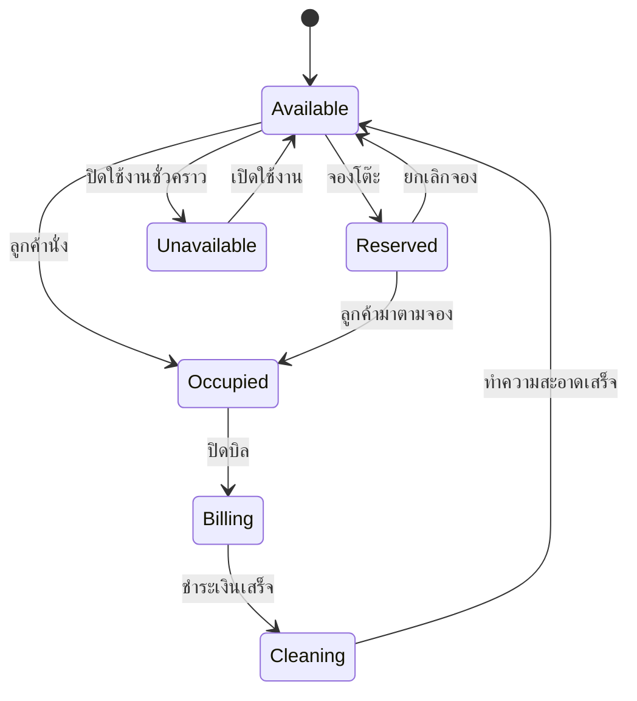
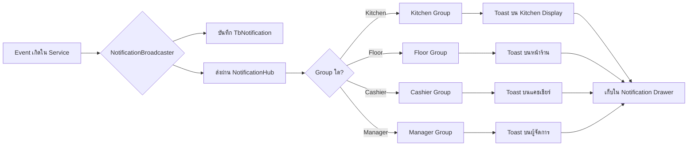
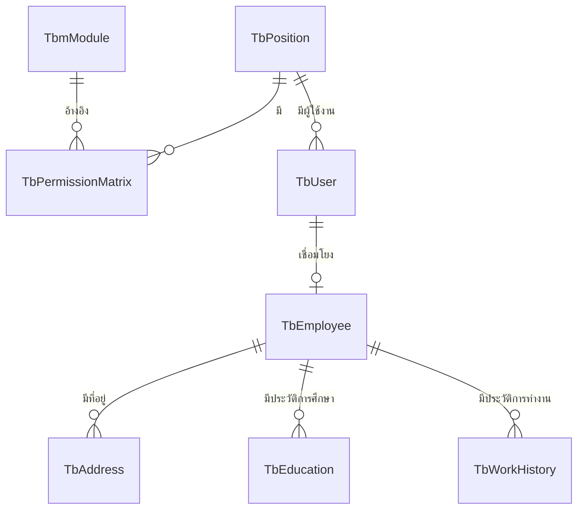
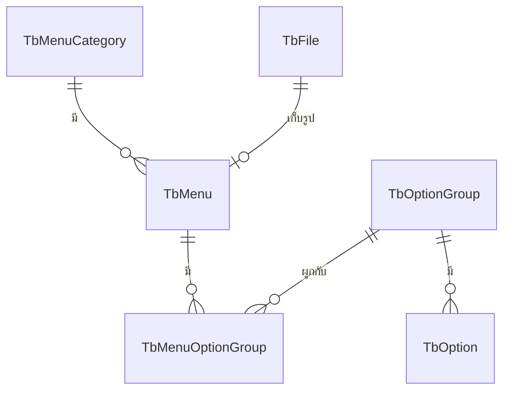
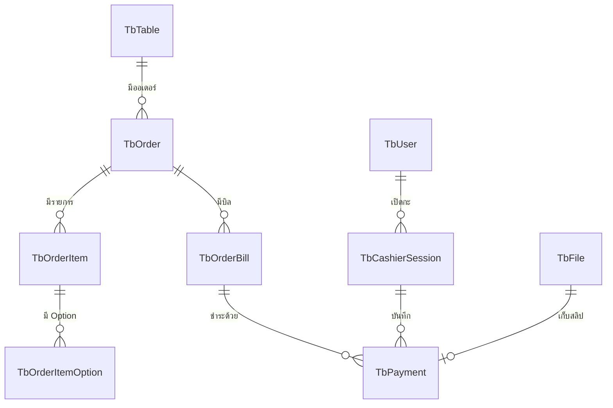
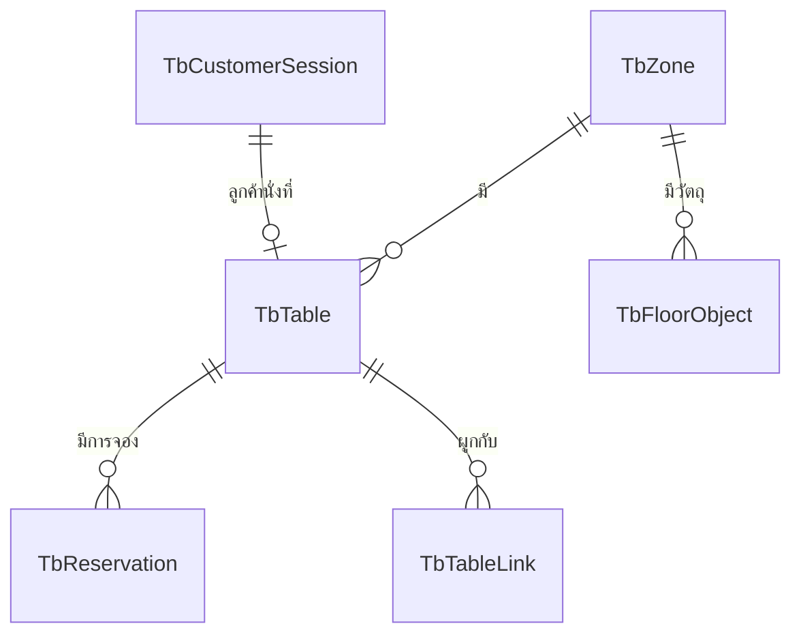
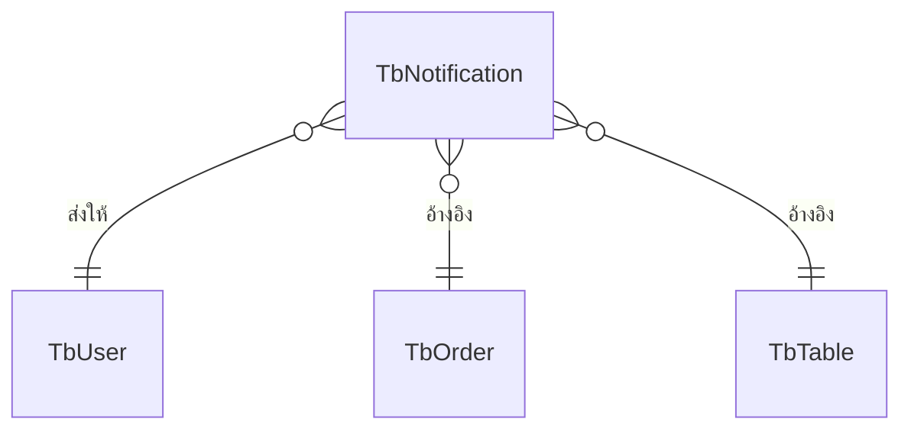

# บทที่ 3 การออกแบบ

> เนื้อหาพร้อมใช้ — ส่วน Mermaid Code สำหรับ Flowchart และ ER Diagram สามารถนำไปวางใน draw.io ได้ทันที (Extras → Edit Diagram หรือ Arrange → Insert → Advanced → Mermaid)

---

ในการจัดทำโครงงานระบบบริหารธุรกิจร้านอาหารผ่านเว็บพร้อมระบบ POS คณะผู้จัดทำได้นำข้อมูลที่ได้จากการศึกษาและรวบรวมความต้องการของผู้ใช้งานในร้านอาหารตัวอย่าง มาวิเคราะห์และออกแบบระบบเพื่อให้ตอบสนองต่อวัตถุประสงค์ของการดำเนินงาน โดยมีรายละเอียดการวิเคราะห์และออกแบบระบบ ดังนี้

---

## 3.1 สถาปัตยกรรมระบบ (System Architecture)

**รูปที่ 3.1 สถาปัตยกรรมระบบของระบบบริหารธุรกิจร้านอาหารผ่านเว็บพร้อมระบบ POS**

แผนภาพสถาปัตยกรรมระบบแสดงความสัมพันธ์และการทำงานร่วมกันของเทคโนโลยีต่าง ๆ ที่ใช้ในการพัฒนาระบบบริหารธุรกิจร้านอาหารผ่านเว็บพร้อมระบบ POS โดยออกแบบในรูปแบบสถาปัตยกรรมแบบหลายชั้น (N-Tier Architecture) ที่แบ่งการทำงานออกเป็น 5 ชั้น (Layer) โดยมีรายละเอียดของแต่ละชั้นและการสื่อสารระหว่างชั้นดังนี้

1. **Layer 1 — กลุ่มผู้ใช้งาน (Users)** ประกอบด้วย 3 บทบาทตามหลักการ Use Case ได้แก่ ผู้ดูแลระบบ (Admin) พนักงาน (Staff) และลูกค้า (Customer) โดยผู้ดูแลระบบและพนักงานเข้าถึงระบบผ่าน Client Web ที่พัฒนาด้วยเฟรมเวิร์ก Angular 19.1 (ทำงานที่พอร์ต 4300) ครอบคลุมการเข้าถึง Dashboard การจัดการออเดอร์และครัว และการจัดการข้อมูลพื้นฐาน ส่วนลูกค้าเข้าถึงระบบผ่าน Mobile Web ที่พัฒนาด้วย Angular 19.1 เช่นกัน (ทำงานที่พอร์ต 4400) ครอบคลุมการสั่งอาหารด้วยตนเองผ่านการสแกนคิวอาร์โค้ด (QR Code) ที่โต๊ะ การติดตามสถานะ และการขอชำระเงิน

2. **Layer 2 — เว็บเซิร์ฟเวอร์และเกตเวย์ (Gateway)** คำขอจากเบราว์เซอร์ทั้งสองแอปพลิเคชันจะถูกส่งมายัง Nginx Reverse Proxy ซึ่งทำหน้าที่เป็นตัวกลางในการรับ-ส่งข้อมูลระหว่างผู้ใช้กับระบบหลังบ้าน Nginx ทำงานที่พอร์ต 80 (HTTP) ที่จะถูกเปลี่ยนเส้นทางไปยังพอร์ต 443 (HTTPS) โดยอัตโนมัติ พร้อมทั้งกระจายเส้นทาง (Routing) ตามรูปแบบของคำขอ โดยส่งคำขอที่ขึ้นต้นด้วย `/api/*` ไปยัง Web API และส่งคำขอที่ขึ้นต้นด้วย `/hubs/*` ไปยัง SignalR Hub เพื่อรองรับการสื่อสารแบบเวลาจริงผ่าน WebSocket ส่วนใบรับรองความปลอดภัย (SSL Certificate) จะถูกออกและต่ออายุโดยอัตโนมัติด้วยเครื่องมือ Certbot ที่เชื่อมต่อกับบริการ Let's Encrypt

3. **Layer 3 — ส่วนประมวลผล (Backend)** พัฒนาด้วย ASP.NET Core 9.0 (ทำงานที่พอร์ต 5300) ในรูปแบบสถาปัตยกรรมแบบหลายชั้น ที่ประกอบด้วยกลุ่มโมดูลหลัก 4 กลุ่ม ได้แก่ กลุ่ม REST API ที่มี Controllers จำนวน 23 ตัว และจุดบริการ (Endpoint) จำนวนประมาณ 215 จุดบริการ สำหรับการรับ-ส่งข้อมูลผ่านโปรโตคอล HTTP กลุ่ม SignalR Hubs ที่ประกอบด้วย OrderHub และ NotificationHub สำหรับการสื่อสารแบบเวลาจริงผ่าน WebSocket กลุ่ม Business Logic ที่ประกอบด้วยโมดูลธุรกิจ 8 โมดูล ครอบคลุมการทำงานหลักของระบบจัดการร้านอาหาร และกลุ่มบริการสนับสนุน (Auxiliary Services) ที่รวบรวมโมดูลสนับสนุนการทำงานของระบบ ประกอบด้วย JWT Auth + RBAC สำหรับการยืนยันตัวตนและการตรวจสอบสิทธิ์การเข้าถึงตามตำแหน่งงาน Slip OCR สำหรับการอ่านคิวอาร์โค้ดและตรวจสอบยอดเงินจากสลิปโอน Background Jobs ที่ทำงานเบื้องหลังเพื่อทำความสะอาดข้อมูลอัตโนมัติ (Auto-Cleanup) และส่งการแจ้งเตือนการจองโต๊ะ (Reservation Reminder) ตลอดจน MailKit สำหรับการส่งอีเมลรหัสครั้งเดียว (One-Time Password: OTP) สำหรับการลืมรหัสผ่าน

4. **Layer 4 — ชั้นจัดเก็บข้อมูล (Data Storage)** ประกอบด้วยระบบจัดเก็บข้อมูล 2 ระบบ ได้แก่ SQL Server 2022 (ทำงานที่พอร์ต 1433) ที่ใช้จัดเก็บข้อมูลเชิงสัมพันธ์จำนวน 37 ตาราง (Entity) ครอบคลุมข้อมูลออเดอร์ เมนู โต๊ะ พนักงาน การชำระเงิน สิทธิ์การเข้าถึง และการแจ้งเตือน โดยเชื่อมต่อกับ Backend ผ่าน Entity Framework Core 9 ในฐานะเครื่องมือเชื่อมต่อฐานข้อมูลแบบอ็อบเจกต์เชิงสัมพันธ์ (Object-Relational Mapper) และ MinIO (ทำงานที่พอร์ต 9000) ที่เป็นระบบจัดเก็บไฟล์แบบ Object Storage ที่เข้ากันได้กับ Amazon S3 API สำหรับจัดเก็บไฟล์รูปเมนู รูปประจำตัวพนักงาน โลโก้ร้าน คิวอาร์โค้ดสำหรับชำระเงิน รูปสลิปโอน และใบเสร็จ โดยเชื่อมต่อผ่านชุดเครื่องมือ AWS SDK สำหรับ .NET

5. **Layer 5 — บริการภายนอก (External Services)** ระบบมีการเชื่อมต่อกับบริการภายนอก 2 ระบบ ได้แก่ Gmail SMTP สำหรับการส่งอีเมลแจ้งเตือนและรหัส OTP ผ่านไลบรารี MailKit ในชั้น Backend และ Google reCAPTCHA v2 สำหรับการตรวจสอบความเป็นมนุษย์ของผู้ใช้งานในขั้นตอนการเข้าสู่ระบบ เพื่อป้องกันการโจมตีแบบอัตโนมัติจากบอท (Bot Protection)

ในด้านการติดตั้งและการ Deploy ระบบทั้งหมดถูกห่อหุ้มในรูปแบบคอนเทนเนอร์ (Container) ผ่านเครื่องมือ Docker Compose ที่จัดการบริการทั้งหมด (Nginx, Backend, SQL Server, MinIO) ภายใต้เครือข่ายเสมือนชื่อ `rbms-pos-network` (Bridge Network) พร้อมพื้นที่จัดเก็บถาวร (Persistent Volume) จำนวน 2 ที่ ได้แก่ `sqlserver-data` สำหรับข้อมูลฐานข้อมูล และ `minio-data` สำหรับไฟล์ใน Object Storage ซึ่งทำให้สามารถติดตั้งและรันระบบทั้งหมดได้ด้วยคำสั่งเดียว (`docker compose up -d`)

---

## 3.2 ความต้องการของระบบ (System Requirements)

การวิเคราะห์ความต้องการของระบบแบ่งออกเป็น 2 ส่วนหลัก ได้แก่ ความต้องการด้านฟังก์ชันการทำงาน (Functional Requirements) และความต้องการที่อยู่นอกเหนือฟังก์ชันการทำงาน (Non-Functional Requirements)

### 3.2.1 ความต้องการด้านฟังก์ชันการทำงาน (Functional Requirements)

#### 1) ส่วนของผู้ดูแลระบบ (Admin)

- ระบบต้องรองรับการเข้าสู่ระบบด้วย Username และ Password ผ่าน JWT พร้อม Refresh Token
- ระบบต้องรองรับการกู้คืนรหัสผ่านด้วยรหัสครั้งเดียว (One-Time Password: OTP) ผ่านอีเมล ซึ่งมีอายุการใช้งาน 3 นาที
- ระบบต้องมีนโยบายล็อคบัญชี (Lockout Policy) แบบเพิ่มระดับ เมื่อกรอกรหัสผิด 3, 5, 7 และ 9 ครั้ง จะถูกล็อค 1, 3, 5 และ 7 นาทีตามลำดับ
- ระบบต้องตรวจสอบประวัติรหัสผ่าน 3 ครั้งล่าสุดเพื่อป้องกันการนำกลับมาใช้ซ้ำ
- ระบบต้องสามารถจัดการเมนูอาหาร หมวดหมู่ และกลุ่มตัวเลือกเสริม (Option Group) ทั้งเพิ่ม แก้ไข และลบได้
- ระบบต้องสามารถจัดการตำแหน่งงานและกำหนดสิทธิ์การเข้าถึงผ่านเมทริกซ์สิทธิ์ (Permission Matrix) แบบไดนามิก
- ระบบต้องสามารถจัดการข้อมูลพนักงาน พร้อมข้อมูลที่อยู่ การศึกษา และประวัติการทำงาน
- ระบบต้องสามารถส่งอีเมลรหัสผ่านเริ่มต้นให้พนักงานโดยอัตโนมัติเมื่อสร้างบัญชีผู้ใช้งานใหม่
- ระบบต้องสามารถจัดการโต๊ะและผังร้านแบบลากและวาง (Drag-and-Drop) พร้อมระบุวัตถุภายในร้าน (Floor Object)
- ระบบต้องสามารถจัดการข้อมูลร้านในรูปแบบ Shop Settings (Singleton) ครอบคลุมชื่อร้าน โลโก้ คิวอาร์โค้ดสำหรับชำระเงิน บัญชีพร้อมเพย์ บัญชีธนาคาร และเวลาทำการ
- ระบบต้องสามารถตั้งค่าค่าบริการ (Service Charge) พร้อมระบุช่วงวันที่บังคับใช้
- ระบบต้องจัดเก็บประวัติการเปลี่ยนแปลงข้อมูลทุกประเภทผ่านระบบ Audit Trail (CreatedBy, UpdatedBy, CreatedAt, UpdatedAt)
- ระบบต้องสามารถจัดเก็บไฟล์รูปภาพ (โลโก้ร้าน รูปเมนู รูปประจำตัวพนักงาน) ผ่าน MinIO Object Storage
- ระบบต้องสามารถเรียกดูแดชบอร์ด (Dashboard) และรายงานยอดขาย รวมถึงเมนูที่ขายดีและช่วงเวลาที่ขายดีของร้าน

#### 2) ส่วนของพนักงาน (Staff)

- ระบบต้องรองรับการเข้าสู่ระบบและตรวจสอบสิทธิ์ตามตำแหน่งงาน
- ระบบต้องสามารถเปิด-ปิดกะแคชเชียร์ (Cashier Session) พร้อมระบุยอดเงินสดเริ่มต้นและสิ้นกะ
- ระบบต้องสามารถบันทึกรายการเงินสดเข้า (Cash In) และเงินสดออก (Cash Out) ระหว่างกะของแคชเชียร์
- ระบบต้องเปรียบเทียบยอดเงินสดที่ระบบบันทึก (Expected) กับยอดเงินสดจริง (Actual) ตอนปิดกะ พร้อมแสดงผลต่าง
- ระบบต้องสามารถรับชำระเงินทั้งเงินสด (Cash) และการโอนผ่านคิวอาร์โค้ด (QR Code)
- ระบบต้องสามารถตรวจสอบสลิปโอนเงินผ่านระบบรู้จำตัวอักษรด้วยภาพ (OCR) และเปรียบเทียบยอดเงิน วันที่ และเลขบัญชีปลายทางกับยอดบิลที่ต้องชำระ
- ระบบต้องรองรับการแยกบิล (Split Bill) ทั้งแบบแยกตามรายการและแยกตามจำนวนเงิน รวมถึงการรวมบิลก่อนการชำระเงิน
- ระบบต้องสามารถออกใบเสร็จแบบรวม (Consolidated Receipt) สำหรับออเดอร์ที่มีหลายบิล
- ระบบต้องแสดงจอแสดงผลของครัว (Kitchen Display System: KDS) แบบเวลาจริงผ่าน SignalR โดยแยกตามสถานี 3 ประเภท ได้แก่ สถานีอาหาร เครื่องดื่ม และของหวาน
- ระบบต้องสามารถเปลี่ยนสถานะรายการอาหาร (OrderItem) ตามกลไกการเปลี่ยนสถานะ (State Machine) ที่กำหนด
- ระบบต้องรองรับการยกเลิกรายการก่อนส่งครัว (Void) และการยกเลิกหลังส่งครัว (Cancel) ซึ่งต้องระบุเหตุผลในการยกเลิก
- ระบบต้องบันทึกผู้สั่ง (OrderedBy) ของแต่ละรายการอาหารเพื่อใช้ในการตรวจสอบย้อนหลัง
- ระบบต้องบันทึกสำเนาราคาเมนู (Price Snapshot) ที่ใช้ขณะสั่งซื้อ เพื่อป้องกันการคำนวณผิดเมื่อราคาเมนูถูกปรับเปลี่ยนในภายหลัง
- ระบบต้องรองรับการรับออเดอร์ที่โต๊ะ และการเปลี่ยนสถานะของโต๊ะ (พร้อมใช้งาน / กำลังใช้งาน / รอชำระเงิน / กำลังทำความสะอาด)
- ระบบต้องรองรับการจองโต๊ะล่วงหน้า พร้อมตรวจสอบช่วงเวลาที่ชนกัน ±2 ชั่วโมงโดยอัตโนมัติ
- ระบบต้องรองรับการผูกโต๊ะหลายโต๊ะเข้าด้วยกัน (Table Link) สำหรับลูกค้ากลุ่มใหญ่ และการรวมออเดอร์จากโต๊ะที่ผูกกัน
- ระบบต้องสามารถบริหารวัตถุภายในร้าน (Floor Object) เช่น เสา ห้องน้ำ และทางออก ในผังร้าน

#### 3) ส่วนของลูกค้า (Customer Self-Order)

- ระบบต้องรองรับการสแกนคิวอาร์โค้ดที่โต๊ะ พร้อมโทเค็น (Token) ที่มีอายุการใช้งาน 12 ชั่วโมง
- ระบบต้องรองรับการป้อนรหัสสั้น (Short Code) ด้วยมือ ในกรณีที่การสแกนคิวอาร์โค้ดไม่สำเร็จ
- ระบบต้องป้องกันการสั่งซ้ำซ้อนจากหลายอุปกรณ์ผ่านโทเค็นยึดบิล (Bill Claim Token) แบบ Exclusive Lock
- ระบบต้องแสดงรายการเมนูพร้อมรูปภาพ ราคา และกลุ่มตัวเลือกเสริม (Option Group)
- ระบบต้องรองรับการขอเรียกพนักงานและการขอชำระเงินจากหน้าจอของลูกค้า
- ระบบต้องแสดงรายการอาหารที่สั่งไปแล้วและสถานะของแต่ละรายการในออเดอร์ของโต๊ะแบบเวลาจริง

#### 4) ระบบแจ้งเตือนแบบเวลาจริง (Real-time Notification)

- ระบบต้องประกอบด้วย SignalR Hub จำนวน 2 ตัว ได้แก่ OrderHub สำหรับการซิงโครไนซ์สถานะออเดอร์ และ NotificationHub สำหรับการแจ้งเตือนทั่วไป
- ระบบต้องจัดกลุ่มผู้รับการแจ้งเตือนอัตโนมัติตามสิทธิ์การเข้าถึงของผู้ใช้งาน ได้แก่ กลุ่ม Kitchen, Floor, Cashier และ Manager
- ระบบต้องส่งการแจ้งเตือนไปยังครัวเมื่อมีออเดอร์ใหม่ผ่าน SignalR Group
- ระบบต้องส่งการแจ้งเตือนไปยังพนักงานหน้าร้านเมื่ออาหารพร้อมเสริฟ
- ระบบต้องส่งการแจ้งเตือนไปยังแคชเชียร์เมื่อลูกค้าขอชำระเงิน
- ระบบต้องจัดเก็บประวัติการแจ้งเตือนไว้ในฐานข้อมูล พร้อมรองรับการอ่านและล้างประวัติ
- ระบบต้องแสดงตัวนับจำนวนข้อความที่ยังไม่ได้อ่าน (Badge) ในส่วนแสดงผลของผู้ใช้งาน

### 3.2.2 ความต้องการที่อยู่นอกเหนือฟังก์ชันการทำงาน (Non-Functional Requirements)

1) **ด้านการยืนยันตัวตนและความปลอดภัย (Authentication & Security)**: ระบบใช้ JWT ร่วมกับ Refresh Token ในการจัดการ Session และเข้ารหัสรหัสผ่านด้วย BCrypt โดยมีนโยบายการล็อคบัญชี (Lockout Policy) ในกรณีที่กรอกรหัสผิดเกินจำนวนครั้งที่กำหนด

2) **ด้านการแสดงผล (User Interface & Display)**: ระบบรองรับการใช้งานบนหน้าจอ Desktop และ Tablet สำหรับพนักงาน และ Mobile Web สำหรับลูกค้า โดยแยกออกเป็น Application 2 ตัวบน Port ที่ต่างกัน

3) **ด้านการจัดการฐานข้อมูล (Database Management)**: ระบบใช้ SQL Server เป็น RDBMS และ Entity Framework Core 9 เป็น ORM พร้อมระบบ Migration ในการจัดการโครงสร้างฐานข้อมูล มีระบบ Soft Delete ผ่านฟิลด์ DeleteFlag และ Audit Fields อัตโนมัติผ่าน BaseEntity

4) **ด้านการสื่อสารแบบ Real-time (Real-time Communication)**: ระบบใช้ SignalR Hub จำนวน 2 ตัว ได้แก่ OrderHub และ NotificationHub สื่อสารผ่าน WebSocket ที่ออกแบบให้มี latency ต่ำสำหรับการตอบสนองในร้านอาหาร

5) **ด้านการจัดเก็บไฟล์ (File Storage)**: ระบบใช้ MinIO เป็น Object Storage ที่เข้ากันได้กับ Amazon S3 API สำหรับจัดเก็บไฟล์รูปเมนู โลโก้ร้าน รูปพนักงาน และสลิปโอนเงิน

6) **ด้านการแจ้งเตือน (Notification)**: ระบบรองรับการแจ้งเตือนผ่าน 3 ช่องทาง ได้แก่ Toast ที่แสดงบนหน้าจอทันที Notification Drawer ที่เก็บรายการประวัติแจ้งเตือน และการกระจาย Event ผ่าน SignalR Group ตามบทบาทผู้ใช้งาน

7) **ด้านความเสถียร (Reliability)**: ระบบถูกออกแบบให้รองรับการใช้งานในช่วงเวลาที่มีลูกค้าหนาแน่น โดยใช้สถาปัตยกรรมแบบ N-Tier ที่แยกชั้นการทำงานอย่างชัดเจน และใช้ Async/Await ในการจัดการคำขอจำนวนมากพร้อมกัน

---

## 3.3 การออกแบบการทำงานของระบบ (System Flowchart)

การออกแบบการทำงานของระบบประกอบด้วยแผนภาพการทำงานหลัก 10 ส่วน โดยใช้รูปแบบ Mermaid Diagram ซึ่งสามารถนำไปวาดต่อใน draw.io ได้ทันที

### 3.3.1 แผนภาพการทำงานส่วนการเข้าสู่ระบบและตรวจสอบสิทธิ์

**คำอธิบายขั้นตอนการทำงาน:**
- ผู้ใช้งานกรอก Username และ Password ที่หน้า Login
- ระบบตรวจสอบข้อมูลที่กรอกกับฐานข้อมูล หากไม่ถูกต้องจะเพิ่มจำนวนครั้งที่ล็อกอินผิด
- หากครบจำนวนครั้งที่กำหนด ระบบจะล็อคบัญชีชั่วคราวตาม Lockout Policy
- หากข้อมูลถูกต้อง ระบบจะสร้าง JWT และ Refresh Token พร้อมตรวจสอบสิทธิ์ผ่าน Permission Matrix
- ระบบจะนำผู้ใช้เข้าสู่หน้าหลักตามบทบาทที่ได้รับ

### 3.3.2 แผนภาพการทำงานส่วนการจัดการเมนูอาหาร

### 3.3.3 แผนภาพการทำงานส่วนการสั่งอาหารผ่าน QR Code (Self-Order)

### 3.3.4 แผนภาพการทำงานส่วนการสร้าง Order โดยพนักงาน

### 3.3.5 แผนภาพการทำงานส่วน Kitchen Display และ State Machine

### 3.3.6 แผนภาพการทำงานส่วนการปิดบิลและ Split Bill

### 3.3.7 แผนภาพการทำงานส่วนการชำระเงินและ OCR Slip Verification

### 3.3.8 แผนภาพการทำงานส่วนการจัดการสถานะโต๊ะ

### 3.3.9 แผนภาพการทำงานส่วน Permission Matrix

### 3.3.10 แผนภาพการทำงานส่วนแจ้งเตือน Real-time ผ่าน SignalR

---

## 3.4 การออกแบบฐานข้อมูล (Data Dictionary)

ระบบมีการจัดเก็บข้อมูลโดยใช้ระบบฐานข้อมูลเชิงสัมพันธ์แบบ SQL Server ซึ่งประกอบด้วยตารางทั้งหมด 37 Entity โดยในรายงานฉบับนี้จะนำเสนอตารางหลัก 10 ตารางที่เป็นโครงสร้างสำคัญของระบบ ส่วนตารางย่อย ตาราง Master Data และตาราง Junction จัดอยู่ในภาคผนวก

### 3.4.0 การกำหนดตัวเลือกที่ตายตัว (ENUMS)

1. **EOrderStatus**: สถานะออเดอร์ ได้แก่ Open (กำลังสั่ง), Billing (เริ่มปิดบิล), Completed (เสร็จสิ้น)
2. **EOrderItemStatus**: สถานะรายการอาหาร ได้แก่ Pending (รอส่ง), Sent (ส่งครัว), Preparing (กำลังทำ), Ready (พร้อมเสริฟ), Served (เสริฟแล้ว), Voided (ยกเลิกหลังส่ง), Cancelled (ยกเลิกก่อนส่ง)
3. **ETableStatus**: สถานะโต๊ะ ได้แก่ Available, Reserved, Occupied, Billing, Cleaning, Unavailable
4. **EPaymentMethod**: วิธีชำระเงิน ได้แก่ Cash (เงินสด), QrPayment (QR Code)
5. **EPaymentStatus**: สถานะการชำระเงิน ได้แก่ Pending, Paid, Refunded
6. **ESlipVerificationStatus**: สถานะการตรวจสลิป ได้แก่ None, Matched, Mismatched, Manual
7. **ECategoryType**: ประเภทหมวดเมนู ได้แก่ Food, Beverage, Dessert
8. **EMenuTag**: แท็กเมนู ได้แก่ Recommended, Seasonal, SlowPreparation
9. **ENotificationGroup**: กลุ่มผู้รับแจ้งเตือน ได้แก่ Kitchen, Floor, Cashier, Manager
10. **EFloorObjectType**: ประเภทวัตถุภายในร้าน ได้แก่ Restroom, Stairs, Counter, Kitchen, Exit, Cashier, Plant, Decoration

### 3.4.1 ตาราง TbUser (ข้อมูลผู้ใช้งาน)

**หน้าที่**: เก็บข้อมูลบัญชีผู้ใช้งานสำหรับเข้าสู่ระบบ

| ชื่อฟิลด์ | ชนิดข้อมูล | คีย์ | ว่างได้ | คำอธิบาย |
|----------|------------|------|---------|----------|
| Id | INT | PK | No | รหัสผู้ใช้งาน (Auto Increment) |
| Username | NVARCHAR(50) | - | No | ชื่อผู้ใช้ (Unique) |
| PasswordHash | NVARCHAR(255) | - | No | รหัสผ่านที่เข้ารหัสด้วย BCrypt |
| RefreshToken | NVARCHAR(500) | - | Yes | Refresh Token สำหรับต่ออายุ Session |
| RefreshTokenExpiresAt | DATETIME2 | - | Yes | วันเวลาหมดอายุของ Refresh Token |
| PositionId | INT | FK | No | รหัสตำแหน่งงาน (อ้างอิง TbPosition) |
| EmployeeId | INT | FK | Yes | รหัสพนักงาน (อ้างอิง TbEmployee) |
| FailedLoginCount | INT | - | No | จำนวนครั้งที่ล็อกอินผิด |
| LockedUntil | DATETIME2 | - | Yes | วันเวลาที่ปลดล็อค |
| IsActive | BIT | - | No | สถานะการใช้งานบัญชี |
| CreatedAt | DATETIME2 | - | No | วันที่สร้างบัญชี (BaseEntity) |

**ตารางที่ 3.1** TbUser (ข้อมูลผู้ใช้งาน)

### 3.4.2 ตาราง TbPosition (ตำแหน่งงาน)

**หน้าที่**: เก็บข้อมูลตำแหน่งงานในร้าน

| ชื่อฟิลด์ | ชนิดข้อมูล | คีย์ | ว่างได้ | คำอธิบาย |
|----------|------------|------|---------|----------|
| Id | INT | PK | No | รหัสตำแหน่ง |
| Name | NVARCHAR(100) | - | No | ชื่อตำแหน่งงาน |
| Description | NVARCHAR(500) | - | Yes | คำอธิบายเพิ่มเติม |
| IsActive | BIT | - | No | สถานะการใช้งาน |

**ตารางที่ 3.2** TbPosition (ตำแหน่งงาน)

### 3.4.3 ตาราง TbPermissionMatrix (สิทธิ์การเข้าถึง)

**หน้าที่**: เก็บข้อมูลสิทธิ์การเข้าถึงของแต่ละตำแหน่ง

| ชื่อฟิลด์ | ชนิดข้อมูล | คีย์ | ว่างได้ | คำอธิบาย |
|----------|------------|------|---------|----------|
| Id | INT | PK | No | รหัสสิทธิ์ |
| PositionId | INT | FK | No | รหัสตำแหน่ง (อ้างอิง TbPosition) |
| ModuleId | INT | FK | No | รหัส Module |
| CanRead | BIT | - | No | สิทธิ์อ่านข้อมูล |
| CanCreate | BIT | - | No | สิทธิ์สร้างข้อมูล |
| CanUpdate | BIT | - | No | สิทธิ์แก้ไขข้อมูล |
| CanDelete | BIT | - | No | สิทธิ์ลบข้อมูล |

**ตารางที่ 3.3** TbPermissionMatrix (สิทธิ์การเข้าถึง)

### 3.4.4 ตาราง TbEmployee (ข้อมูลพนักงาน)

**หน้าที่**: เก็บข้อมูลพนักงานของร้าน

| ชื่อฟิลด์ | ชนิดข้อมูล | คีย์ | ว่างได้ | คำอธิบาย |
|----------|------------|------|---------|----------|
| Id | INT | PK | No | รหัสพนักงาน |
| FirstName | NVARCHAR(100) | - | No | ชื่อ |
| LastName | NVARCHAR(100) | - | No | นามสกุล |
| NickName | NVARCHAR(50) | - | Yes | ชื่อเล่น |
| Phone | NVARCHAR(20) | - | Yes | เบอร์โทรศัพท์ |
| Email | NVARCHAR(255) | - | Yes | อีเมล |
| StartDate | DATETIME2 | - | No | วันเริ่มงาน |
| EndDate | DATETIME2 | - | Yes | วันสิ้นสุดงาน |
| ProfileImageId | INT | FK | Yes | รหัสไฟล์รูปประจำตัว |
| IsActive | BIT | - | No | สถานะการทำงาน |

**ตารางที่ 3.4** TbEmployee (ข้อมูลพนักงาน)

### 3.4.5 ตาราง TbMenu (ข้อมูลเมนูอาหาร)

**หน้าที่**: เก็บข้อมูลเมนูอาหารและเครื่องดื่ม

| ชื่อฟิลด์ | ชนิดข้อมูล | คีย์ | ว่างได้ | คำอธิบาย |
|----------|------------|------|---------|----------|
| Id | INT | PK | No | รหัสเมนู |
| Name | NVARCHAR(200) | - | No | ชื่อเมนู |
| Description | NVARCHAR(MAX) | - | Yes | คำอธิบาย |
| Price | DECIMAL(18,2) | - | No | ราคา |
| CategoryId | INT | FK | No | รหัสหมวดหมู่ |
| ImageFileId | INT | FK | Yes | รหัสไฟล์รูป |
| Tag | INT | - | Yes | แท็กเมนู (EMenuTag) |
| IsAvailable | BIT | - | No | พร้อมขายหรือไม่ |
| IsPinned | BIT | - | No | ปักหมุดเมนูแนะนำ |

**ตารางที่ 3.5** TbMenu (ข้อมูลเมนูอาหาร)

### 3.4.6 ตาราง TbZone และ TbTable (โซนและโต๊ะ)

**หน้าที่**: เก็บข้อมูลโซนและโต๊ะในร้าน

| ชื่อฟิลด์ TbTable | ชนิดข้อมูล | คีย์ | ว่างได้ | คำอธิบาย |
|------------------|------------|------|---------|----------|
| Id | INT | PK | No | รหัสโต๊ะ |
| Name | NVARCHAR(50) | - | No | ชื่อ/เลขโต๊ะ |
| ZoneId | INT | FK | No | รหัสโซน |
| Seats | INT | - | No | จำนวนที่นั่ง |
| Status | INT | - | No | สถานะโต๊ะ (ETableStatus) |
| PositionX | DECIMAL | - | No | พิกัด X บนผังร้าน |
| PositionY | DECIMAL | - | No | พิกัด Y บนผังร้าน |

**ตารางที่ 3.6** TbTable (ข้อมูลโต๊ะ)

### 3.4.7 ตาราง TbOrder (ข้อมูลออเดอร์)

**หน้าที่**: เก็บข้อมูลออเดอร์แต่ละครั้ง

| ชื่อฟิลด์ | ชนิดข้อมูล | คีย์ | ว่างได้ | คำอธิบาย |
|----------|------------|------|---------|----------|
| Id | INT | PK | No | รหัสออเดอร์ |
| OrderNumber | NVARCHAR(50) | - | No | เลขที่ออเดอร์ (YYYYMMDD-NNN) |
| TableId | INT | FK | Yes | รหัสโต๊ะ |
| Status | INT | - | No | สถานะออเดอร์ (EOrderStatus) |
| OrderedBy | NVARCHAR(100) | - | Yes | ผู้สั่ง (employee:id หรือ customer:sessionId) |
| TotalAmount | DECIMAL(18,2) | - | No | ยอดรวม |

**ตารางที่ 3.7** TbOrder (ข้อมูลออเดอร์)

### 3.4.8 ตาราง TbOrderItem (รายการอาหารใน Order)

**หน้าที่**: เก็บข้อมูลรายการอาหารแต่ละรายการในออเดอร์

| ชื่อฟิลด์ | ชนิดข้อมูล | คีย์ | ว่างได้ | คำอธิบาย |
|----------|------------|------|---------|----------|
| Id | INT | PK | No | รหัสรายการอาหาร |
| OrderId | INT | FK | No | รหัสออเดอร์ |
| MenuId | INT | FK | No | รหัสเมนู |
| MenuName | NVARCHAR(200) | - | No | ชื่อเมนู (Snapshot) |
| Price | DECIMAL(18,2) | - | No | ราคา (Snapshot) |
| Quantity | INT | - | No | จำนวน |
| Status | INT | - | No | สถานะ (EOrderItemStatus) |
| VoidReason | NVARCHAR(500) | - | Yes | เหตุผลในการ Void |

**ตารางที่ 3.8** TbOrderItem (รายการอาหาร)

### 3.4.9 ตาราง TbOrderBill และ TbPayment (บิลและการชำระเงิน)

**หน้าที่**: เก็บข้อมูลบิลและการชำระเงิน

| ชื่อฟิลด์ TbPayment | ชนิดข้อมูล | คีย์ | ว่างได้ | คำอธิบาย |
|--------------------|------------|------|---------|----------|
| Id | INT | PK | No | รหัส Payment |
| OrderBillId | INT | FK | No | รหัสบิล |
| Method | INT | - | No | วิธีชำระ (EPaymentMethod) |
| Amount | DECIMAL(18,2) | - | No | จำนวนเงิน |
| Status | INT | - | No | สถานะ (EPaymentStatus) |
| SlipImageId | INT | FK | Yes | รหัสไฟล์สลิป |
| SlipVerificationStatus | INT | - | Yes | สถานะตรวจสลิป (ESlipVerificationStatus) |
| PaidAt | DATETIME2 | - | Yes | วันเวลาชำระสำเร็จ |

**ตารางที่ 3.9** TbPayment (ข้อมูลการชำระเงิน)

### 3.4.10 ตาราง TbCashierSession (Session ลิ้นชักเงินสด)

**หน้าที่**: เก็บข้อมูล Session การเปิด-ปิดลิ้นชักเงินสดของแคชเชียร์

| ชื่อฟิลด์ | ชนิดข้อมูล | คีย์ | ว่างได้ | คำอธิบาย |
|----------|------------|------|---------|----------|
| Id | INT | PK | No | รหัส Session |
| UserId | INT | FK | No | รหัสแคชเชียร์ที่เปิดกะ |
| OpenedAt | DATETIME2 | - | No | วันเวลาเปิดกะ |
| ClosedAt | DATETIME2 | - | Yes | วันเวลาปิดกะ |
| InitialCash | DECIMAL(18,2) | - | No | ยอดเงินสดเริ่มต้น |
| FinalCash | DECIMAL(18,2) | - | Yes | ยอดเงินสดสิ้นกะ |
| ExpectedCash | DECIMAL(18,2) | - | Yes | ยอดที่ระบบคำนวณได้ |
| Difference | DECIMAL(18,2) | - | Yes | ผลต่าง |

**ตารางที่ 3.10** TbCashierSession (Session ลิ้นชักเงินสด)

---

## 3.5 แผนภาพความสัมพันธ์ของเอนทิตี (Entity-Relationship Diagram)

ในการพัฒนาระบบ ได้มีการออกแบบโครงสร้างฐานข้อมูลเชิงสัมพันธ์โดยมี Entity หลักทั้งหมด 37 Entity ในรายงานฉบับนี้แสดง ER Diagram แยกตามขอบเขตของแต่ละ Module เพื่อความชัดเจน รวม 5 รูป

### 3.5.1 ER Diagram ส่วน Authentication และ Authorization

### 3.5.2 ER Diagram ส่วน Menu Management

### 3.5.3 ER Diagram ส่วน Order และ Payment

### 3.5.4 ER Diagram ส่วน Table Management

### 3.5.5 ER Diagram ส่วน Notification

**คำอธิบายความสัมพันธ์ของระบบฐานข้อมูล:**

1. **TbZone กับ TbTable (1:N)**: 1 โซนสามารถมีโต๊ะได้หลายโต๊ะ แต่ละโต๊ะอยู่ในโซนเดียว (เชื่อมโยงผ่าน ZoneId)

2. **TbTable กับ TbOrder (1:N)**: 1 โต๊ะสามารถมีออเดอร์ได้หลายครั้งตามช่วงเวลา แต่ละออเดอร์อยู่ที่โต๊ะเดียว (เชื่อมโยงผ่าน TableId)

3. **TbOrder กับ TbOrderItem (1:N)**: 1 ออเดอร์มีรายการอาหารได้หลายรายการ (เชื่อมโยงผ่าน OrderId)

4. **TbOrder กับ TbOrderBill (1:N)**: 1 ออเดอร์สามารถมีบิลได้หลายใบในกรณี Split Bill (เชื่อมโยงผ่าน OrderId)

5. **TbOrderBill กับ TbPayment (1:N)**: 1 บิลสามารถชำระแบบหลาย Payment ได้ เช่น จ่ายเงินสดบางส่วนและ QR Code บางส่วน

6. **TbEmployee กับ TbUser (1:1)**: 1 พนักงานมีบัญชี User เดียว (เชื่อมโยงผ่าน EmployeeId)

7. **TbPosition กับ TbUser (1:N)**: 1 ตำแหน่งสามารถมีพนักงานหลายคน (เชื่อมโยงผ่าน PositionId)

8. **TbPosition กับ TbPermissionMatrix (1:N)**: 1 ตำแหน่งมีสิทธิ์การเข้าถึงหลาย Module (เชื่อมโยงผ่าน PositionId)

9. **TbMenuCategory กับ TbMenu (1:N)**: 1 หมวดหมู่มีเมนูได้หลายเมนู (เชื่อมโยงผ่าน CategoryId)

10. **TbCashierSession กับ TbPayment (1:N)**: 1 Session บันทึก Payment หลายรายการ (เชื่อมโยงผ่าน SessionId)
