# บทที่ 3 การออกแบบ

> เนื้อหาพร้อมใช้ — ส่วน Mermaid Code สำหรับ Flowchart และ ER Diagram สามารถนำไปวางใน draw.io ได้ทันที (Extras → Edit Diagram หรือ Arrange → Insert → Advanced → Mermaid)

---

ในบทนี้จะกล่าวถึงการวิเคราะห์และออกแบบระบบของระบบบริหารธุรกิจร้านอาหารผ่านเว็บพร้อมระบบ POS เพื่อให้ตอบสนองต่อความต้องการของผู้ใช้งานและวัตถุประสงค์ของโครงงาน ซึ่งมีรายละเอียดดังนี้

---

## 3.1 สถาปัตยกรรมระบบ (System Architecture)

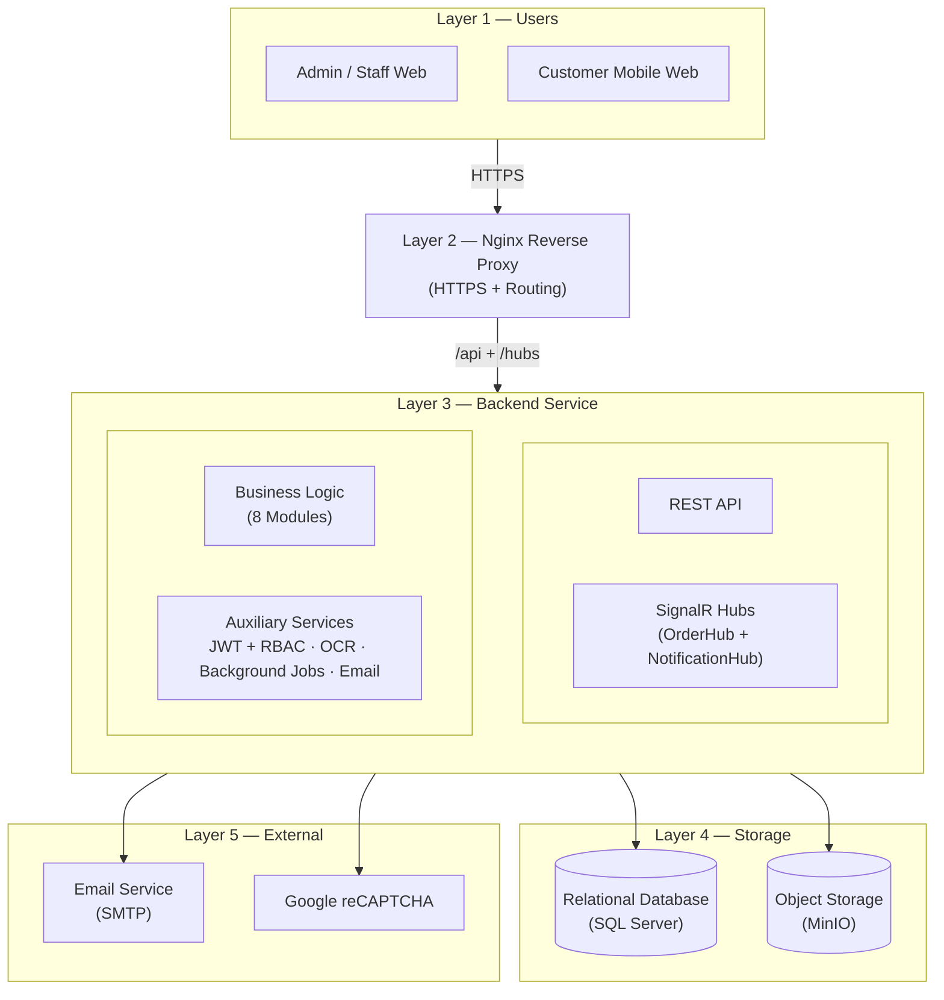

**รูปที่ 3.1 สถาปัตยกรรมระบบของระบบบริหารธุรกิจร้านอาหารผ่านเว็บพร้อมระบบ POS**

ระบบได้รับการออกแบบในรูปแบบสถาปัตยกรรมแบบหลายชั้น (N-Tier Architecture) เพื่อแยกหน้าที่ความรับผิดชอบของแต่ละส่วนอย่างชัดเจน โดยแบ่งออกเป็น 5 ชั้น (Layer) ดังนี้

1. **Layer 1 — กลุ่มผู้ใช้งาน (Users)** ประกอบด้วยผู้ใช้งาน 3 บทบาทตามหลักการ Use Case ได้แก่ ผู้ดูแลระบบ (Admin) พนักงาน (Staff) และลูกค้า (Customer) โดยผู้ดูแลระบบและพนักงานเข้าถึงระบบผ่าน Client Web สำหรับการจัดการข้อมูลพื้นฐาน การรับออเดอร์ การจัดการครัว และการเรียกดูแดชบอร์ด ส่วนลูกค้าเข้าถึงระบบผ่าน Mobile Web หลังจากสแกนรหัสคิวอาร์โค้ดที่โต๊ะ เพื่อสั่งอาหารด้วยตนเอง ติดตามสถานะ และขอชำระเงิน

2. **Layer 2 — เว็บเซิร์ฟเวอร์และเกตเวย์ (Gateway)** คำขอจากผู้ใช้งานทั้งสองฝั่งจะถูกส่งมายัง Nginx Reverse Proxy ซึ่งทำหน้าที่เป็นประตูทางเข้าหลักของระบบ โดยตรวจสอบใบรับรองความปลอดภัย (SSL Certificate) สำหรับการเชื่อมต่อแบบ HTTPS และกระจายเส้นทางคำขอ (Routing) ไปยังบริการที่เกี่ยวข้องในชั้นถัดไป ทั้งคำขอผ่านโปรโตคอล HTTP สำหรับการเรียกใช้ API และการเชื่อมต่อแบบ WebSocket สำหรับการสื่อสารแบบเวลาจริง

3. **Layer 3 — ส่วนประมวลผล (Backend)** เป็นชั้นที่รวมตรรกะทางธุรกิจของระบบทั้งหมด ประกอบด้วยกลุ่มบริการ 4 กลุ่ม ได้แก่ กลุ่ม REST API สำหรับการรับ-ส่งข้อมูลผ่านโปรโตคอล HTTP กลุ่ม SignalR Hubs ที่ประกอบด้วย OrderHub และ NotificationHub สำหรับการสื่อสารแบบเวลาจริง กลุ่ม Business Logic ที่ครอบคลุมโมดูลธุรกิจหลัก 8 โมดูล และกลุ่มบริการสนับสนุน (Auxiliary Services) ที่รวบรวมการยืนยันตัวตนและการตรวจสอบสิทธิ์การเข้าถึง (JWT + RBAC) ระบบรู้จำตัวอักษรด้วยภาพสำหรับตรวจสลิปการโอนเงิน (OCR) งานเบื้องหลังสำหรับทำความสะอาดข้อมูลและส่งการแจ้งเตือนการจองโต๊ะ ตลอดจนการส่งอีเมลรหัสครั้งเดียว (OTP) สำหรับการรีเซ็ตรหัสผ่าน

4. **Layer 4 — ชั้นจัดเก็บข้อมูล (Data Storage)** ประกอบด้วยระบบจัดเก็บข้อมูล 2 ระบบที่แยกหน้าที่กันอย่างชัดเจน ได้แก่ ฐานข้อมูลเชิงสัมพันธ์ (Relational Database) สำหรับจัดเก็บข้อมูลโครงสร้าง เช่น ออเดอร์ เมนู โต๊ะ พนักงาน การชำระเงิน สิทธิ์การเข้าถึง และการแจ้งเตือน และระบบจัดเก็บไฟล์แบบ Object Storage สำหรับจัดเก็บไฟล์รูปภาพและเอกสาร เช่น รูปเมนู รูปประจำตัวพนักงาน โลโก้ร้าน คิวอาร์โค้ดสำหรับชำระเงิน รูปสลิปโอน และใบเสร็จ

5. **Layer 5 — บริการภายนอก (External Services)** ระบบเชื่อมต่อกับบริการภายนอก 2 บริการ ได้แก่ บริการอีเมล (SMTP) สำหรับการส่งรหัส OTP และการแจ้งเตือนต่าง ๆ และบริการ Google reCAPTCHA สำหรับตรวจสอบความเป็นมนุษย์ของผู้ใช้งานในขั้นตอนการเข้าสู่ระบบ เพื่อป้องกันการโจมตีจากโปรแกรมอัตโนมัติ

ในด้านการติดตั้งและการเผยแพร่ใช้งาน (Deployment) ระบบทั้งหมดถูกห่อหุ้มในรูปแบบคอนเทนเนอร์ (Container) เพื่อให้สามารถติดตั้งและรันบนเครื่องเซิร์ฟเวอร์ใด ๆ ก็ได้โดยไม่ต้องตั้งค่าสภาพแวดล้อมเพิ่มเติม พร้อมพื้นที่จัดเก็บถาวร (Persistent Volume) สำหรับข้อมูลฐานข้อมูลและไฟล์ที่อัพโหลด เพื่อให้ข้อมูลคงอยู่แม้คอนเทนเนอร์จะถูกหยุดหรือสร้างใหม่ ซึ่งรายละเอียดของเครื่องมือและเฟรมเวิร์กที่ใช้ในการพัฒนาแต่ละชั้นได้อธิบายไว้แล้วในหัวข้อ 1.4.3 ขอบเขตด้านเครื่องมือและเทคโนโลยีที่ใช้ในการพัฒนา

---

## 3.2 ความต้องการของระบบ (System Requirements)

การวิเคราะห์ความต้องการของระบบแบ่งออกเป็น 2 ส่วนหลัก ได้แก่ ความต้องการด้านฟังก์ชันการทำงาน (Functional Requirements) ที่ระบุขอบเขตของฟังก์ชันที่ระบบต้องรองรับในภาพรวม และความต้องการที่อยู่นอกเหนือฟังก์ชันการทำงาน (Non-Functional Requirements) ที่ระบุคุณลักษณะเชิงคุณภาพของระบบ

### 3.2.1 ความต้องการด้านฟังก์ชันการทำงาน (Functional Requirements)

ฟังก์ชันของระบบสามารถจัดกลุ่มตามขอบเขตการทำงานออกเป็น 8 กลุ่ม โดยแต่ละกลุ่มระบุขอบเขตของฟังก์ชันที่ระบบต้องรองรับโดยภาพรวม ดังแสดงในตารางที่ 3.11

| รหัสกลุ่ม | กลุ่มฟังก์ชัน | ขอบเขตที่ระบบต้องรองรับ |
|-----------|----------------|---------------------------|
| FR-1 | การยืนยันตัวตนและการจัดการสิทธิ์ | JWT + Refresh Token, OTP กู้คืนรหัสผ่าน, Lockout Policy, ตรวจประวัติรหัสผ่าน และ Permission Matrix แบบไดนามิก |
| FR-2 | การจัดการข้อมูลพื้นฐาน | ข้อมูลร้าน เวลาทำการ อัตราภาษีและค่าบริการ ตำแหน่งงาน สิทธิ์ และข้อมูลพนักงาน |
| FR-3 | การจัดการเมนูและตัวเลือก | เมนู 2 ภาษา หมวดหมู่ย่อย Option Group แบบ Many-to-Many ช่วงเวลาเปิดขาย และ Price Snapshot ณ ขณะสั่ง |
| FR-4 | การจัดการโต๊ะและการจอง | โซน แผนผังร้านแบบลากและวาง Floor Object การเชื่อมโต๊ะ (Table Link) และการจองโต๊ะพร้อมตรวจการชนของช่วงเวลา |
| FR-5 | การรับและประมวลผลออเดอร์ | การเปิดโต๊ะ รับออเดอร์ Kitchen Display 3 สถานี State Machine ของรายการอาหาร และการยกเลิกแบบ Void/Cancel |
| FR-6 | การชำระเงินและรอบแคชเชียร์ | ชำระเงินสดและ QR, ตรวจสลิป OCR, Split/Merge Bill, รอบแคชเชียร์พร้อมเทียบยอด และบันทึกเงินสดเข้า-ออกลิ้นชัก |
| FR-7 | การสั่งอาหารด้วยตนเองผ่าน Mobile Web | QR ที่โต๊ะ (โทเค็น 12 ชม.), Short Code สำรอง, Bill Claim Token แบบ Exclusive Lock และอัพโหลดสลิปจากลูกค้า |
| FR-8 | การแจ้งเตือนแบบเวลาจริง | SignalR 2 Hub (OrderHub, NotificationHub) จัดกลุ่มผู้รับตามสิทธิ์ จัดเก็บประวัติ และแสดงผลผ่าน Toast/Drawer/Badge |

**ตารางที่ 3.11 สรุปกลุ่มฟังก์ชันการทำงานของระบบ**

### 3.2.2 ความต้องการที่อยู่นอกเหนือฟังก์ชันการทำงาน (Non-Functional Requirements)

1) **ด้านความปลอดภัย (Security)**: ระบบเข้ารหัสรหัสผ่านด้วยอัลกอริทึม BCrypt ป้องกันการโจมตีแบบ Brute-force ผ่านนโยบายล็อคบัญชี ส่งข้อมูลผ่านโปรโตคอล HTTPS และควบคุมการเข้าถึงตามสิทธิ์ของตำแหน่งงาน (Role-Based Access Control) พร้อมบันทึกร่องรอยการเปลี่ยนแปลงข้อมูลผ่านระบบ Audit Trail ที่บันทึกผู้สร้าง ผู้แก้ไข เวลาที่สร้าง และเวลาที่แก้ไข

2) **ด้านการใช้งาน (Usability)**: ระบบรองรับการใช้งานบนหน้าจอเดสก์ท็อปและแท็บเล็ตสำหรับพนักงาน และเว็บบนอุปกรณ์เคลื่อนที่ (Mobile Web) สำหรับลูกค้า โดยแยกเป็นแอปพลิเคชันสำหรับฝั่งพนักงานและฝั่งลูกค้าออกจากกันอย่างชัดเจน และใช้ภาษาไทยเป็นภาษาหลักของส่วนติดต่อผู้ใช้งาน

3) **ด้านสมรรถนะและความเสถียร (Performance & Reliability)**: ระบบใช้สถาปัตยกรรมแบบหลายชั้น (N-Tier) ที่แยกชั้นการทำงานอย่างชัดเจน ร่วมกับรูปแบบการประมวลผลแบบ Asynchronous ในการจัดการคำขอจำนวนมากพร้อมกัน เพื่อรองรับการใช้งานในช่วงเวลาที่มีลูกค้าหนาแน่น โดยคาดการณ์ตามสถาปัตยกรรมของระบบว่า การแจ้งเตือนแบบเวลาจริงผ่าน SignalR ในเครือข่ายภายในจะมีค่าหน่วงเวลา (Latency) ต่ำกว่า 1 วินาที และการตอบกลับจาก REST API จะอยู่ในระดับต่ำกว่า 200 มิลลิวินาที ทั้งนี้ตัวเลขดังกล่าวเป็นการคาดการณ์ตามสถาปัตยกรรม มิใช่ผลจากการทดสอบจริง

4) **ด้านการจัดการข้อมูล (Data Management)**: ระบบใช้ฐานข้อมูลเชิงสัมพันธ์เป็นฐานข้อมูลหลัก พร้อมระบบจัดการการปรับเปลี่ยนโครงสร้างฐานข้อมูล (Migration) รองรับการลบข้อมูลแบบไม่ทำลายข้อมูล (Soft Delete) ผ่านฟิลด์ DeleteFlag และการบันทึก Audit Fields อัตโนมัติผ่าน BaseEntity นอกจากนี้ยังจัดเก็บไฟล์รูปภาพและเอกสาร เช่น รูปเมนู โลโก้ร้าน รูปประจำตัวพนักงาน และสลิปการโอนเงิน แยกออกจากฐานข้อมูลหลักผ่าน Object Storage ที่เข้ากันได้กับมาตรฐาน Amazon S3 API เพื่อรองรับการขยายตัวของพื้นที่จัดเก็บในอนาคต

5) **ด้านการติดตั้งและการบำรุงรักษา (Deployability)**: ระบบทั้งหมดถูกห่อหุ้มในรูปแบบคอนเทนเนอร์ (Container) พร้อมพื้นที่จัดเก็บถาวร (Persistent Volume) และมี Reverse Proxy ร่วมกับระบบจัดการใบรับรอง SSL อัตโนมัติ ส่วนการอัปเดตโครงสร้างฐานข้อมูลใช้ระบบ Migration อัตโนมัติของ ORM เพื่อให้สามารถติดตั้ง ปรับปรุง และเผยแพร่ระบบใหม่ได้โดยไม่ต้องตั้งค่าสภาพแวดล้อมเพิ่มเติม

---

## 3.3 แผนภาพกรณีการใช้งาน (Use Case Diagram)

การวิเคราะห์ความต้องการของผู้ใช้งานในระบบบริหารธุรกิจร้านอาหารผ่านเว็บพร้อมระบบ POS สามารถแบ่งผู้ใช้งาน (Actor) ออกเป็น 3 กลุ่มหลัก ได้แก่ ผู้ดูแลระบบ (Admin) พนักงาน (Staff) และลูกค้า (Customer) โดยกลุ่มพนักงานสามารถแบ่งย่อยเป็นตำแหน่งงานต่าง ๆ ได้ตามโครงสร้างของแต่ละร้านผ่านระบบสิทธิ์การเข้าถึงแบบไดนามิก ซึ่งแต่ละกลุ่มมีสิทธิและขอบเขตการใช้งานระบบ (Use Case) ดังรายละเอียดต่อไปนี้

### 3.3.1 ผู้ดูแลระบบ (Admin)

เป็นกลุ่มผู้ใช้งานที่มีสิทธิ์สูงสุดในการบริหารจัดการระบบและตั้งค่าหลังบ้าน เพื่อให้ระบบสามารถดำเนินงานได้อย่างสมบูรณ์ โดยมีฟังก์ชันการทำงาน ดังนี้

3.3.1.1 เข้าสู่ระบบและจัดการบัญชี — ผู้ดูแลระบบสามารถเข้าสู่ระบบด้วยชื่อผู้ใช้และรหัสผ่าน เปลี่ยนรหัสผ่านของตนเอง และกู้คืนรหัสผ่านผ่านรหัสครั้งเดียว (One-Time Password หรือ OTP) ที่ส่งทางอีเมล

3.3.1.2 จัดการข้อมูลร้านและการตั้งค่า — ตั้งค่าข้อมูลร้าน ชื่อร้าน โลโก้ ที่อยู่ บัญชีธนาคาร พร้อมเพย์ และคิวอาร์โค้ดสำหรับรับชำระเงิน รวมถึงเวลาทำการรายวัน อัตราภาษีมูลค่าเพิ่ม (VAT) และค่าบริการ (Service Charge)

3.3.1.3 จัดการพนักงานและกำหนดสิทธิ์ — เพิ่ม แก้ไข และลบข้อมูลพนักงาน รวมถึงข้อมูลที่อยู่ การศึกษา และประวัติการทำงาน กำหนดตำแหน่งงาน และจัดสิทธิ์การเข้าถึงตามตำแหน่งงานผ่านระบบเมทริกซ์สิทธิ์แบบไดนามิก

3.3.1.4 จัดการเมนูและตัวเลือก — เพิ่ม แก้ไข และลบรายการเมนูอาหาร เครื่องดื่ม และของหวาน พร้อมจัดการหมวดหมู่ย่อยและกลุ่มตัวเลือกเสริม (Option Group) ที่ผูกกับเมนูแต่ละรายการ

3.3.1.5 จัดการโต๊ะและผังร้าน — สร้างโซนพื้นที่ เพิ่มโต๊ะ และจัดวางตำแหน่งโต๊ะบนผังร้านในรูปแบบลากและวาง (Drag-and-Drop) พร้อมระบุวัตถุประดับภายในร้าน เช่น เคาน์เตอร์ ห้องน้ำ และทางออก

3.3.1.6 เรียกดูรายงานและแดชบอร์ด — ตรวจสอบยอดขายรายวัน รายเดือน และรายปี รวมถึงรายงานเมนูที่มียอดขายสูงสุดและช่วงเวลาที่ขายดี เพื่อใช้เป็นข้อมูลประกอบการตัดสินใจในการดำเนินธุรกิจ

### 3.3.2 พนักงาน (Staff)

เป็นกลุ่มผู้ใช้งานที่ปฏิบัติงานภายในร้าน ครอบคลุมพนักงานเสริฟ พนักงานครัว แคชเชียร์ และผู้จัดการสาขา โดยแต่ละตำแหน่งจะได้รับสิทธิ์การเข้าถึงเฉพาะฟังก์ชันที่เกี่ยวข้องกับหน้าที่ของตนตามที่ผู้ดูแลระบบกำหนด มีฟังก์ชันการทำงานหลักดังนี้

3.3.2.1 เข้าสู่ระบบและจัดการเซสชั่นการทำงาน — เข้าสู่ระบบด้วยบัญชีที่ผู้ดูแลระบบสร้างให้ และเปิด-ปิดเซสชั่นการทำงานสำหรับพนักงานแคชเชียร์ (Cashier Session) พร้อมระบุยอดเงินสดเริ่มต้นและสิ้นกะ

3.3.2.2 รับและจัดการออเดอร์ — เปิดโต๊ะให้ลูกค้า รับออเดอร์ที่โต๊ะ ส่งรายการอาหารไปยังครัว เปลี่ยนสถานะรายการอาหารตามกลไกการเปลี่ยนสถานะ (State Machine) และยกเลิกออเดอร์ตามสิทธิ์ที่ได้รับ

3.3.2.3 จัดการการทำอาหารในครัว — พนักงานครัวดูหน้าจอแสดงรายการอาหาร (Kitchen Display) แยกตามประเภทเมนู ทั้งอาหาร เครื่องดื่ม และของหวาน พร้อมปรับสถานะของรายการอาหารจาก "กำลังทำ" ไปจนถึง "พร้อมเสริฟ"

3.3.2.4 จัดการโต๊ะและการจอง — ปรับสถานะของโต๊ะ ผูกโต๊ะหลายโต๊ะเข้าด้วยกัน (Table Link) สำหรับลูกค้ากลุ่มใหญ่ และจัดการการจองโต๊ะล่วงหน้าพร้อมตรวจสอบช่วงเวลาที่ชนกันโดยอัตโนมัติ

3.3.2.5 รับชำระเงินและตรวจสลิป — รับชำระเงินทั้งเงินสดและการสแกนคิวอาร์โค้ด พร้อมตรวจสอบสลิปการโอนเงินผ่านระบบรู้จำตัวอักษรด้วยภาพ (OCR) และเปรียบเทียบยอดเงิน วันที่ และเลขบัญชีปลายทางกับยอดบิลที่ต้องชำระ

3.3.2.6 แยกบิลและออกใบเสร็จ — แยกบิลตามรายการอาหารหรือตามจำนวนเงิน (Split Bill) รวมบิลก่อนการชำระเงิน และออกใบเสร็จในรูปแบบบิลเดี่ยวหรือใบเสร็จรวม (Consolidated Receipt) ให้ลูกค้า

3.3.2.7 ดูการแจ้งเตือนแบบเวลาจริง — รับการแจ้งเตือนผ่านระบบ SignalR เมื่อมีออเดอร์ใหม่ อาหารพร้อมเสริฟ หรือลูกค้าขอชำระเงิน โดยกลุ่มผู้รับการแจ้งเตือนจะถูกจัดตามสิทธิ์การเข้าถึงของผู้ใช้งานโดยอัตโนมัติ

### 3.3.3 ลูกค้า (Customer)

เป็นกลุ่มผู้ใช้งานปลายทางที่เข้าถึงระบบผ่านเว็บบนอุปกรณ์เคลื่อนที่ (Mobile Web) หลังการสแกนคิวอาร์โค้ดที่โต๊ะ โดยมีฟังก์ชันการทำงานที่สามารถเข้าถึงได้ ดังนี้

3.3.3.1 สแกนคิวอาร์โค้ดและเข้าสู่หน้าสั่งอาหาร — ลูกค้าใช้สมาร์ตโฟนสแกนคิวอาร์โค้ดที่โต๊ะ เพื่อเข้าสู่หน้าสั่งอาหารผ่าน Mobile Web พร้อมตั้งชื่อเล่นที่ใช้ในเซสชั่น โดยระบบจะมีโทเค็น (Token) อายุการใช้งาน 12 ชั่วโมงเพื่อยืนยันสิทธิ์การใช้งาน

3.3.3.2 ดูเมนูและเลือกรายการอาหาร — ค้นหาและเรียกดูรายละเอียดของเมนูอาหาร เครื่องดื่ม และของหวาน รวมถึงเลือกตัวเลือกเสริม เช่น ระดับความเผ็ดหรือขนาดของถ้วย พร้อมระบุจำนวนที่ต้องการสั่ง

3.3.3.3 ส่งออเดอร์และติดตามสถานะ — เพิ่มรายการลงในตะกร้า ยืนยันคำสั่งซื้อ ส่งออเดอร์เข้าสู่ระบบ และติดตามสถานะของรายการอาหารแบบเวลาจริง ตั้งแต่กำลังทำ พร้อมเสริฟ ไปจนถึงเสริฟแล้ว

3.3.3.4 เรียกพนักงาน — กดปุ่มเรียกพนักงานเพื่อขอความช่วยเหลือเมื่อต้องการ โดยระบบจะส่งการแจ้งเตือนไปยังพนักงานหน้าร้านทันที

3.3.3.5 ขอชำระเงิน — กดปุ่มขอชำระเงินเพื่อแจ้งพนักงานแคชเชียร์ พร้อมเลือกวิธีการชำระเงินระหว่างเงินสดและการโอนผ่านคิวอาร์โค้ด

3.3.3.6 อัพโหลดสลิปการโอนเงิน — สำหรับการชำระเงินผ่านคิวอาร์โค้ด ลูกค้าสามารถอัพโหลดสลิปการโอนเงินผ่าน Mobile Web เพื่อให้ระบบตรวจสอบความถูกต้องด้วยระบบ OCR และยืนยันการชำระเงิน โดยระบบใช้กลไกโทเค็นยึดบิล (Bill Claim Token) ป้องกันการสั่งซ้ำซ้อนจากหลายอุปกรณ์

### 3.3.4 แผนภาพ Use Case Diagram ของระบบ

แผนภาพต่อไปนี้แสดงความสัมพันธ์ระหว่าง Actor ทั้ง 3 กลุ่มกับ Use Case หลักของระบบ

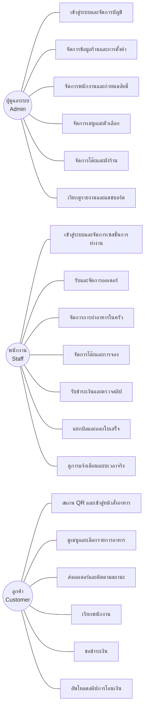

> **หมายเหตุ**: คณะผู้จัดทำใช้ Mermaid Diagram เป็นต้นแบบสำหรับการสร้างแผนภาพ จากนั้นนำโค้ดดังกล่าวไปวาดต่อในโปรแกรม draw.io และส่งออกเป็นไฟล์ภาพ PNG เพื่อใช้ในเอกสารรายงาน

---

## 3.4 ภาพรวมการทำงานของระบบ (System Overview Diagram)

เพื่อให้เห็นถึงความสัมพันธ์และหน้าที่รับผิดชอบในแต่ละขั้นตอนของระบบบริหารธุรกิจร้านอาหารผ่านเว็บพร้อมระบบ POS อย่างชัดเจน คณะผู้จัดทำได้ออกแบบแผนภาพภาพรวมการทำงานของระบบ โดยแบ่งแยกตามบทบาท (Swimlane) ออกเป็น 3 ส่วนหลัก ได้แก่ ลูกค้า (Customer) พนักงาน (Staff) และระบบประมวลผล (System) ซึ่งครอบคลุมขั้นตอนตั้งแต่ลูกค้าเข้ามาในร้าน การสั่งอาหาร การทำอาหาร การเสิร์ฟ การชำระเงิน ไปจนถึงการปิดบิล โดยมีรายละเอียดการไหลของข้อมูลในแต่ละส่วนดังนี้

### 3.4.1 ส่วนของลูกค้า (Customer)

ลูกค้าเป็นผู้เริ่มต้นกระบวนการของระบบ โดยลูกค้าสามารถเข้าใช้งานได้ใน 2 รูปแบบ คือ การแจ้งความประสงค์การสั่งอาหารกับพนักงานเสริฟโดยตรง หรือการสแกนรหัสคิวอาร์ที่โต๊ะเพื่อสั่งอาหารด้วยตนเองผ่านเว็บบนอุปกรณ์เคลื่อนที่ (Mobile Web)

ในกรณีของการสั่งอาหารด้วยตนเอง ลูกค้าจะตั้งชื่อเล่นเพื่อเข้าสู่เซสชั่นของโต๊ะ จากนั้นเลือกเมนูพร้อมระบุตัวเลือกเสริม และส่งออเดอร์เข้าสู่ระบบ ระหว่างรอลูกค้าสามารถติดตามสถานะของรายการอาหารแบบเวลาจริง ตั้งแต่กำลังทำ พร้อมเสิร์ฟ ไปจนถึงเสิร์ฟแล้ว เมื่อต้องการความช่วยเหลือลูกค้าสามารถกดปุ่มเรียกพนักงาน และเมื่อพร้อมชำระเงินลูกค้าสามารถกดขอชำระเงินผ่านระบบ พร้อมเลือกวิธีการชำระระหว่างเงินสดและการสแกนคิวอาร์โค้ดเพื่อโอนเงิน หากเลือกการโอนเงิน ลูกค้าจะอัพโหลดสลิปการโอนเงินผ่าน Mobile Web เพื่อให้ระบบตรวจสอบความถูกต้องด้วยระบบรู้จำตัวอักษรด้วยภาพ (Optical Character Recognition หรือ OCR) โดยอัตโนมัติ

### 3.4.2 ส่วนของพนักงาน (Staff)

พนักงานเป็นผู้ปฏิบัติงานภายในร้าน ครอบคลุม 3 ตำแหน่งหลัก ได้แก่ พนักงานเสริฟ พนักงานครัว และพนักงานแคชเชียร์ โดยแต่ละตำแหน่งมีหน้าที่ที่แตกต่างกันและทำงานประสานกันผ่านระบบ

พนักงานเสริฟมีหน้าที่เปิดโต๊ะให้ลูกค้า รับออเดอร์ที่โต๊ะในกรณีที่ลูกค้าไม่สั่งด้วยตนเอง รับการแจ้งเตือนเมื่ออาหารพร้อมเสิร์ฟ ยกอาหารไปเสิร์ฟที่โต๊ะ และเปลี่ยนสถานะของรายการอาหารเป็น "เสิร์ฟแล้ว" รวมถึงการจัดการผังโต๊ะและการเชื่อมโต๊ะ (Table Link) สำหรับลูกค้ากลุ่มใหญ่

พนักงานครัวปฏิบัติงานผ่านหน้าจอแสดงรายการอาหาร (Kitchen Display) ที่แยกตามประเภทเมนู ทั้งอาหาร เครื่องดื่ม และของหวาน เมื่อมีออเดอร์ใหม่จากระบบ พนักงานครัวจะเห็นรายการอาหารพร้อมตัวเลือกที่ลูกค้าเลือก จากนั้นกดเริ่มทำเพื่อเปลี่ยนสถานะเป็น "กำลังทำ" และเมื่อทำเสร็จกดยืนยันเพื่อเปลี่ยนสถานะเป็น "พร้อมเสิร์ฟ"

พนักงานแคชเชียร์เปิดเซสชั่นการทำงาน (Cashier Session) พร้อมระบุยอดเงินสดเริ่มต้น ตรวจสอบสลิปการโอนเงินที่ลูกค้าอัพโหลด ดำเนินการรับชำระเงินทั้งเงินสดและการโอนผ่านคิวอาร์โค้ด หากพบความผิดปกติของสลิปสามารถปฏิเสธการชำระเงินได้ ในขณะที่หากสลิปถูกต้องระบบจะเปลี่ยนสถานะบิลเป็น "ชำระแล้ว" และเมื่อสิ้นกะพนักงานจะปิดเซสชั่นพร้อมเปรียบเทียบยอดเงินสดจริงกับยอดที่ระบบคำนวณ

### 3.4.3 ส่วนของระบบประมวลผล (System)

ระบบทำหน้าที่เป็นตัวกลางในการประมวลผลและจัดการข้อมูลทั้งหมด ตั้งแต่การตรวจสอบความถูกต้องของโทเค็นคิวอาร์โค้ดเมื่อลูกค้าสแกน การสร้างเซสชั่นของลูกค้าและพนักงาน การบันทึกออเดอร์ลงในฐานข้อมูล การคำนวณราคารวมพร้อมค่าบริการและภาษีมูลค่าเพิ่ม รวมถึงการแยกบิลตามรายการหรือตามจำนวนเงินเมื่อลูกค้าร้องขอ

นอกจากนี้ ระบบยังทำหน้าที่กระจายการแจ้งเตือนแบบเวลาจริงผ่านเทคโนโลยี SignalR ไปยังกลุ่มผู้ใช้งานที่เกี่ยวข้องโดยอัตโนมัติ เช่น แจ้งเตือนพนักงานครัวเมื่อมีออเดอร์ใหม่ แจ้งเตือนพนักงานเสริฟเมื่ออาหารพร้อมเสิร์ฟ และแจ้งเตือนพนักงานแคชเชียร์เมื่อลูกค้าขอชำระเงิน รวมถึงการประมวลผลรูปสลิปการโอนเงินด้วยระบบ OCR เพื่ออ่านยอดเงิน วันที่ และเลขบัญชีปลายทาง พร้อมเปรียบเทียบกับข้อมูลที่ระบบบันทึกไว้โดยอัตโนมัติ และอัพเดตสถานะของรายการอาหาร ออเดอร์ บิล และโต๊ะตามขั้นตอนการทำงานที่กำหนดไว้

### 3.4.4 แผนภาพภาพรวมการทำงาน

แผนภาพต่อไปนี้แสดงการไหลของข้อมูลและการประสานงานระหว่าง 3 บทบาทหลักของระบบ โดยคณะผู้จัดทำใช้ Mermaid Diagram เป็นต้นแบบ และนำโค้ดดังกล่าวไปวาดต่อเป็นแผนภาพ Swimlane ในโปรแกรม draw.io เพื่อส่งออกเป็นไฟล์ภาพ PNG สำหรับใช้ในรายงาน

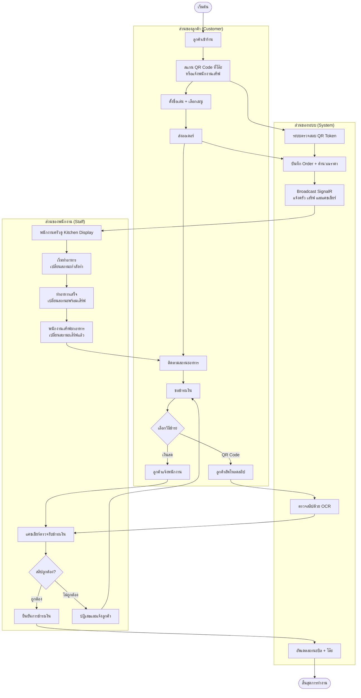

> **หมายเหตุ**: แผนภาพแยกบทบาทเป็น 3 กลุ่ม ได้แก่ ลูกค้า ระบบประมวลผล และพนักงาน คณะผู้จัดทำจะนำต้นแบบนี้ไปจัดเป็นแผนภาพ Swimlane แบบเต็มรูปแบบในโปรแกรม draw.io สำหรับใช้ในรายงานฉบับสมบูรณ์

---

## 3.5 การออกแบบการทำงานของระบบ (System Flowchart)

การออกแบบการทำงานของระบบประกอบด้วยแผนภาพการทำงานหลัก 24 ส่วน ซึ่งคณะผู้จัดทำจัดกลุ่มตามวงจรการใช้งานของระบบออกเป็น 6 กลุ่ม ได้แก่ การตั้งค่าระบบเริ่มต้น การจัดการบุคลากรและความปลอดภัย การจัดการเมนูและโต๊ะ การสั่งอาหารและกระบวนการครัว การชำระเงินและปิดบิล และการแจ้งเตือนแบบเรียลไทม์ การจัดกลุ่มในลักษณะนี้ช่วยให้ผู้อ่านเข้าใจลำดับการทำงานของระบบตามวงจรการใช้งานจริง ตั้งแต่การตั้งค่าระบบครั้งแรก การเตรียมข้อมูลพื้นฐาน ไปจนถึงการดำเนินงานประจำวัน โดยใช้รูปแบบ Mermaid Diagram ซึ่งสามารถนำไปวาดต่อใน draw.io ได้ทันที

---

**กลุ่มที่ 1 — การตั้งค่าระบบเริ่มต้น (System Setup)**

แผนภาพในกลุ่มนี้แสดงกระบวนการตั้งค่าระบบที่เจ้าของร้านและผู้จัดการต้องดำเนินการครั้งแรกก่อนเปิดใช้งานระบบจริง ครอบคลุมการตั้งค่าร้านค้า การจัดผังร้าน การกำหนดหมวดหมู่และกลุ่มตัวเลือกเสริมของเมนู และการกำหนดค่าบริการตามช่วงวันที่

### 3.5.1 แผนภาพการทำงานส่วนการตั้งค่าร้านครั้งแรก

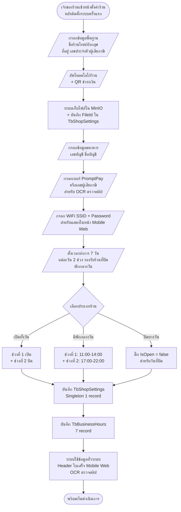

**คำอธิบายขั้นตอนการทำงาน:**
- การตั้งค่าร้าน (Shop Settings) เป็นกระบวนการที่เจ้าของร้านดำเนินการครั้งแรกหลังจากติดตั้งระบบ โดยใช้รูปแบบ Singleton Pattern ในการจัดเก็บ คือมีข้อมูลเพียง 1 ระเบียนในระบบ
- ข้อมูลที่ตั้งค่ามีผลต่อหลายส่วนของระบบ ได้แก่ การแสดงในส่วนหัวของหน้าเว็บ ใบเสร็จ หน้า Mobile Web ของลูกค้า และการตรวจสอบสลิปด้วย OCR ที่ต้องเทียบกับเลขบัญชีและเบอร์ PromptPay ของร้าน
- เวลาทำการเก็บแยกอีก 7 ระเบียนตามวันในสัปดาห์ โดยแต่ละวันรองรับ 2 ช่วงเวลา เพื่อรองรับร้านที่ปิดพักกลางวันหรือเปิดเฉพาะบางช่วง
- ข้อมูล WiFi ที่ตั้งค่าไว้จะแสดงในหน้า Mobile Web เพื่อให้ลูกค้าใช้สแกน QR Code และสั่งอาหารได้สะดวก

### 3.5.2 แผนภาพการทำงานส่วนการจัดผังร้านและพื้นที่บริการ

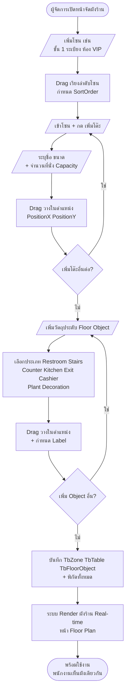

**คำอธิบายขั้นตอนการทำงาน:**
- การจัดผังร้านเป็นกระบวนการตั้งค่าครั้งแรกที่ผู้จัดการดำเนินการก่อนเริ่มใช้งานระบบ โดยใช้รูปแบบ Drag and Drop ในการกำหนดตำแหน่งของโซน โต๊ะ และวัตถุประดับ
- โซน (Zone) ใช้แบ่งพื้นที่ภายในร้านออกเป็นส่วน ๆ เช่น ชั้น 1 ระเบียง หรือห้อง VIP โดยแต่ละโซนสามารถมีโต๊ะหลายโต๊ะได้
- วัตถุประดับ (Floor Object) มีทั้งหมด 8 ประเภท ตาม EFloorObjectType ครอบคลุมห้องน้ำ บันได เคาน์เตอร์ ครัว ทางออก จุดแคชเชียร์ ต้นไม้ และวัตถุประดับอื่น ๆ เพื่อให้ผังร้านในระบบเหมือนกับสถานที่จริง
- เมื่อบันทึกข้อมูลแล้ว ระบบจะแสดงผังร้านในรูปแบบ Real-time บนหน้า Floor Plan ทำให้พนักงานทุกคนเห็นผังเดียวกันและรู้สถานะของโต๊ะแต่ละโต๊ะได้ทันที

### 3.5.3 แผนภาพการทำงานส่วนการจัดการหมวดหมู่และกลุ่มตัวเลือกเสริม

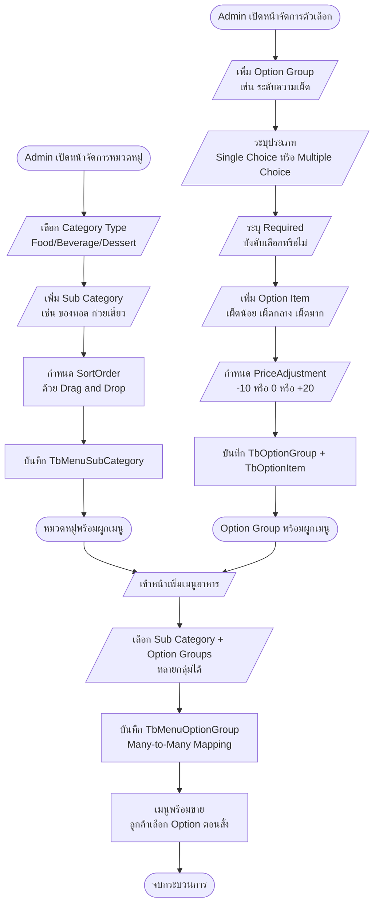

**คำอธิบายขั้นตอนการทำงาน:**
- โครงสร้างเมนูแบ่งออกเป็น 3 ระดับ ได้แก่ Category Type (Food/Beverage/Dessert) Sub Category และตัวเมนู โดยแต่ละ Sub Category สามารถมีเมนูได้หลายรายการ
- กลุ่มตัวเลือกเสริม (Option Group) สามารถสร้างครั้งเดียวและนำไปใช้ร่วมกับเมนูหลายรายการได้ ผ่านการเชื่อมแบบ Many-to-Many ในตาราง TbMenuOptionGroup
- แต่ละกลุ่มตัวเลือกระบุได้ว่าเป็นแบบเลือกตัวเดียว (Single Choice) หรือเลือกได้หลายตัว (Multiple Choice) และสามารถบังคับให้ลูกค้าต้องเลือกได้ (Required)
- รายการในกลุ่มตัวเลือกแต่ละรายการมีค่า PriceAdjustment สำหรับเพิ่มหรือลดราคา เช่น "เพิ่มไข่ดาว +10" ทำให้คำนวณราคาสุดท้ายของเมนูได้อัตโนมัติ

### 3.5.4 แผนภาพการทำงานส่วนการคำนวณค่าบริการตามช่วงวันที่

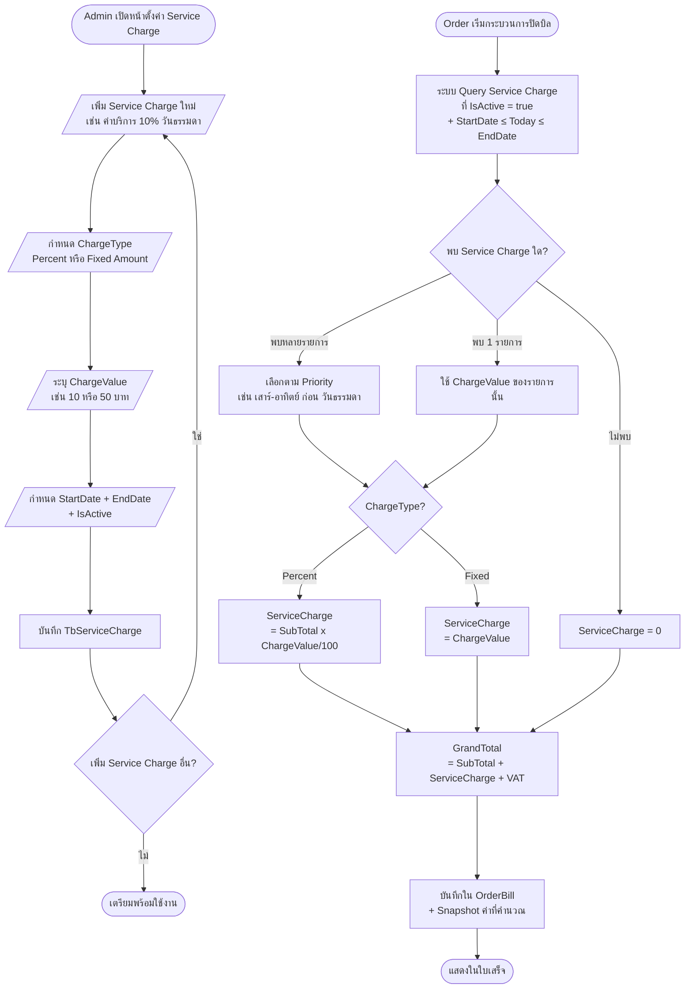

**คำอธิบายขั้นตอนการทำงาน:**
- ระบบรองรับการตั้งค่า Service Charge หลายรายการพร้อมกัน โดยแต่ละรายการมีช่วงวันที่ใช้งาน (StartDate และ EndDate) ของตนเอง เพื่อรองรับการคิดค่าบริการที่แตกต่างกันตามช่วงเวลา เช่น วันธรรมดา 10% และวันเสาร์-อาทิตย์ 15%
- ตอนปิดบิล ระบบจะ Query หา Service Charge ที่อยู่ในช่วงวันที่ปัจจุบันและมีสถานะ Active โดยอัตโนมัติ
- ค่าบริการสามารถคำนวณได้ทั้งแบบเปอร์เซ็นต์ของยอดรวม (Percent) และแบบจำนวนเงินคงที่ (Fixed Amount)
- ค่าที่คำนวณได้จะถูกบันทึก Snapshot ลงในตาราง TbOrderBill เพื่อให้ใบเสร็จย้อนหลังแสดงค่าบริการที่ใช้จริงในตอนปิดบิลแม้ว่าจะมีการแก้ไข Service Charge ในภายหลัง

---

**กลุ่มที่ 2 — การจัดการบุคลากรและความปลอดภัย (Authentication and Personnel)**

แผนภาพในกลุ่มนี้แสดงกระบวนการจัดการบุคลากรของร้านและกลไกการรักษาความปลอดภัยในการเข้าสู่ระบบ ตั้งแต่การรับพนักงานใหม่และสร้างบัญชีผู้ใช้ การกำหนดสิทธิ์การเข้าถึงผ่าน Permission Matrix การยืนยันตัวตนด้วย JWT การต่ออายุโทเค็นและการกู้คืนรหัสผ่าน ตลอดจนการใช้รหัส PIN สำหรับงานเฉพาะที่ต้องการความปลอดภัยสูง

### 3.5.5 แผนภาพการทำงานส่วนการรับพนักงานใหม่และสร้างบัญชีผู้ใช้

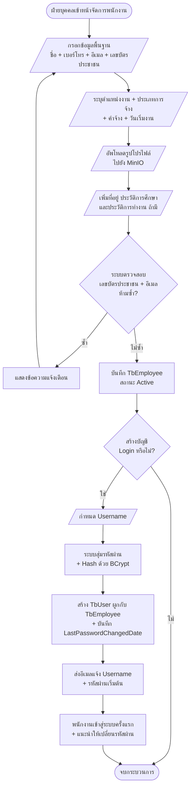

**คำอธิบายขั้นตอนการทำงาน:**
- กระบวนการรับพนักงานใหม่แบ่งออกเป็น 2 ขั้นตอนหลัก ได้แก่ การบันทึกข้อมูลพนักงานในตาราง TbEmployee และการสร้างบัญชีผู้ใช้ในตาราง TbUser
- ระบบตรวจสอบความซ้ำของเลขบัตรประชาชนและอีเมลก่อนบันทึกข้อมูล เพื่อป้องกันข้อมูลซ้ำซ้อน
- การสร้างบัญชีผู้ใช้เป็นขั้นตอนแยก ฝ่ายบุคคลสามารถบันทึกข้อมูลพนักงานไว้ก่อน แล้วค่อยสร้างบัญชีในภายหลังได้
- รหัสผ่านเริ่มต้นถูกสุ่มและส่งทางอีเมล โดยมีระบบ Password History ป้องกันการตั้งรหัสผ่านซ้ำกับ 3 รหัสล่าสุด

### 3.5.6 แผนภาพการทำงานส่วน Permission Matrix

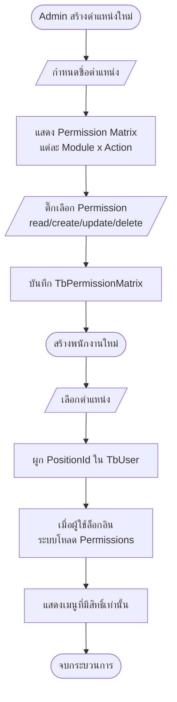

**คำอธิบายขั้นตอนการทำงาน:**
- ระบบใช้ Permission Matrix แบบ Position-based ที่ผูกสิทธิ์เข้ากับตำแหน่งงาน ไม่ผูกกับตัวพนักงานโดยตรง ทำให้การเปลี่ยนตำแหน่งของพนักงานปรับสิทธิ์ตามอัตโนมัติ
- สิทธิ์การเข้าถึงในแต่ละ Module แบ่งออกเป็น 4 ประเภท ตาม CRUD ได้แก่ read create update และ delete
- เมื่อผู้ใช้เข้าสู่ระบบสำเร็จ ระบบจะโหลดสิทธิ์ทั้งหมดของตำแหน่งงานนั้นมาเก็บไว้ใน JWT Claims เพื่อให้ฝั่ง Frontend ใช้ตรวจสอบการแสดงเมนูและปุ่มต่าง ๆ
- สิทธิ์ที่ไม่ได้รับอนุญาตจะไม่แสดงในเมนู และหากผู้ใช้พยายามเรียก API โดยตรง ระบบจะตอบกลับด้วย HTTP 403 Forbidden

### 3.5.7 แผนภาพการทำงานส่วนการเข้าสู่ระบบและตรวจสอบสิทธิ์


**คำอธิบายขั้นตอนการทำงาน:**
- ผู้ใช้งานกรอก Username และ Password ที่หน้า Login
- ระบบตรวจสอบข้อมูลที่กรอกกับฐานข้อมูล หากไม่ถูกต้องจะเพิ่มจำนวนครั้งที่ล็อกอินผิด
- หากครบจำนวนครั้งที่กำหนด ระบบจะล็อคบัญชีชั่วคราวตาม Lockout Policy
- หากข้อมูลถูกต้อง ระบบจะสร้าง JWT และ Refresh Token พร้อมตรวจสอบสิทธิ์ผ่าน Permission Matrix
- ระบบจะนำผู้ใช้เข้าสู่หน้าหลักตามบทบาทที่ได้รับ

### 3.5.8 แผนภาพการทำงานส่วนการต่ออายุโทเค็นและการกู้คืนรหัสผ่าน

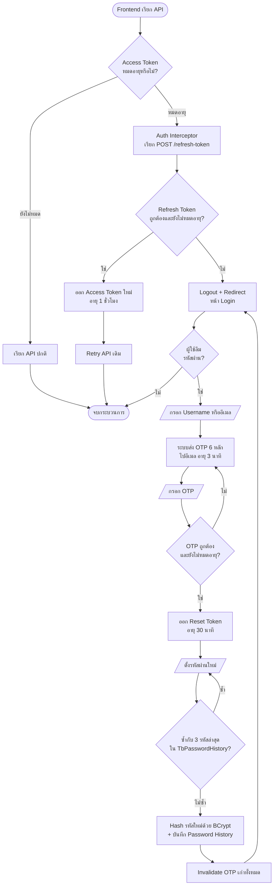

**คำอธิบายขั้นตอนการทำงาน:**
- ระบบใช้ JWT Access Token อายุ 1 ชั่วโมง ร่วมกับ Refresh Token อายุ 7 วัน (หรือ 30 วันหากเลือก "จดจำฉัน")
- เมื่อ Access Token หมดอายุ Auth Interceptor ทางฝั่งเฟรนต์เอนด์จะเรียก API ต่ออายุโทเค็นโดยอัตโนมัติ และทำการ Retry คำขอเดิม
- หากผู้ใช้ลืมรหัสผ่าน ระบบจะส่ง OTP 6 หลักไปยังอีเมลที่ลงทะเบียนไว้ และออก Reset Token เพื่อใช้ตั้งรหัสผ่านใหม่
- รหัสผ่านใหม่ต้องไม่ซ้ำกับ 3 รหัสล่าสุดในตาราง TbPasswordHistory เพื่อเพิ่มความปลอดภัย

### 3.5.9 แผนภาพการทำงานส่วนการตั้งและยืนยันรหัส PIN Code

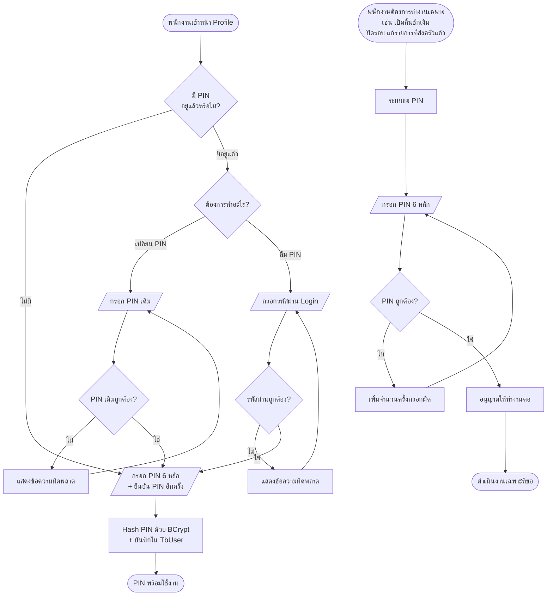

**คำอธิบายขั้นตอนการทำงาน:**
- ระบบ PIN Code เป็นกลไกการยืนยันตัวตนซ้ำสำหรับงานที่ต้องการความปลอดภัยสูงเป็นพิเศษ เช่น การเปิดลิ้นชักเงินสด การปิดรอบขายของแคชเชียร์ และการแก้ไขรายการที่ส่งครัวไปแล้ว
- พนักงานต้องตั้ง PIN 6 หลักครั้งแรกที่หน้า Profile ก่อนใช้งาน โดย PIN จะถูก Hash ด้วย BCrypt และเก็บในตาราง TbUser เช่นเดียวกับรหัสผ่าน
- การเปลี่ยน PIN ต้องยืนยัน PIN เดิมก่อน ในขณะที่กรณีลืม PIN พนักงานสามารถใช้รหัสผ่าน Login เพื่อยืนยันตัวตนและรีเซ็ต PIN ใหม่ได้
- เมื่อพนักงานต้องการทำงานที่ต้องยืนยัน PIN ระบบจะแสดง Dialog ขอ PIN และตรวจสอบความถูกต้องก่อนอนุญาตให้ดำเนินการต่อ เพื่อป้องกันการเข้าถึงโดยไม่ได้รับอนุญาต

---

**กลุ่มที่ 3 — การจัดการเมนูและโต๊ะ (Menu and Table Management)**

แผนภาพในกลุ่มนี้แสดงกระบวนการจัดการข้อมูลพื้นฐานที่ใช้ในการดำเนินงานประจำวัน ได้แก่ การจัดการเมนูอาหาร การควบคุมสถานะของโต๊ะ การจองโต๊ะล่วงหน้า การเชื่อมโต๊ะสำหรับลูกค้ากลุ่มใหญ่ และการจัดการวงจรชีวิตของโทเค็นคิวอาร์โค้ดประจำโต๊ะ

### 3.5.10 แผนภาพการทำงานส่วนการจัดการเมนูอาหาร


**คำอธิบายขั้นตอนการทำงาน:**
- ผู้ดูแลระบบสามารถดำเนินการจัดการเมนูได้ 3 รูปแบบหลัก ได้แก่ การเพิ่มเมนูใหม่ การแก้ไขข้อมูลเมนูเดิม และการลบเมนู
- รูปภาพของเมนูถูกอัพโหลดไปยัง MinIO ซึ่งเป็น Object Storage แบบ S3-compatible โดยฐานข้อมูลเก็บเพียง FileId เป็นการอ้างอิง
- การลบเมนูใช้กลไก Soft Delete ผ่านฟิลด์ DeleteFlag เพื่อรักษาความถูกต้องของออเดอร์เก่าที่ยังอ้างอิงถึงเมนูนั้น
- ข้อมูลราคาและชื่อเมนูถูกบันทึกเป็น Snapshot ในตาราง TbOrderItem ตอนที่ลูกค้าสั่งอาหาร ทำให้การแก้ไขราคาหรือชื่อเมนูในภายหลังไม่กระทบต่อออเดอร์ที่บันทึกไปแล้ว

### 3.5.11 แผนภาพการทำงานส่วนการจัดการสถานะโต๊ะ

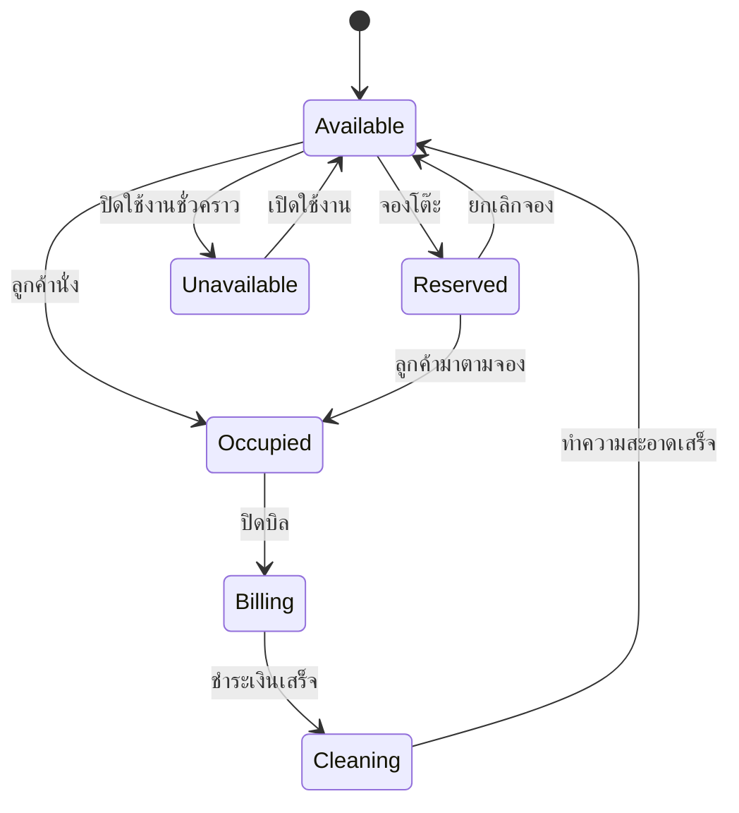

**คำอธิบายขั้นตอนการทำงาน:**
- สถานะของโต๊ะมีทั้งหมด 6 สถานะ ตาม ETableStatus ได้แก่ Available, Reserved, Occupied, Billing, Cleaning และ Unavailable
- สถานะเริ่มต้นของโต๊ะคือ Available ซึ่งสามารถเปลี่ยนเป็น Reserved เมื่อมีการจอง หรือเป็น Occupied เมื่อลูกค้านั่งทันที
- เมื่อเริ่มปิดบิล โต๊ะจะเปลี่ยนเป็น Billing และเมื่อชำระเงินเสร็จจะเปลี่ยนเป็น Cleaning เพื่อรอทำความสะอาดก่อนรับลูกค้ารายต่อไป
- สถานะ Unavailable ใช้สำหรับโต๊ะที่ปิดใช้งานชั่วคราว เช่น โต๊ะที่ชำรุดหรืออยู่ในระหว่างซ่อมแซม

### 3.5.12 แผนภาพการทำงานส่วนการจองโต๊ะและตรวจสอบช่วงเวลาที่ทับซ้อน

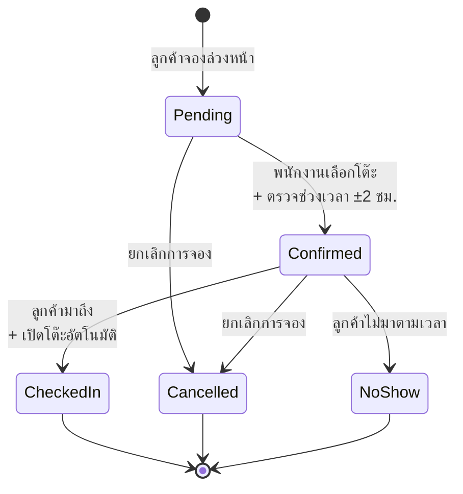

```mermaid
flowchart TD
    A([พนักงานเปิดหน้าจองโต๊ะ]) --> B[/กรอกชื่อลูกค้า + เบอร์โทร<br/>+ วันเวลา + จำนวนคน/]
    B --> C{วันที่จอง<br/>≥ วันปัจจุบัน?}
    C -- ไม่ --> D[แสดงข้อความแจ้งเตือน<br/>ห้ามจองวันย้อนหลัง]
    D --> B
    C -- ใช่ --> E[บันทึก TbReservation<br/>Status: Pending]
    E --> F[/พนักงานกดยืนยัน<br/>+ เลือกโต๊ะ/]
    F --> G[ระบบ Query การจองอื่น<br/>ในโต๊ะเดียวกัน ±2 ชั่วโมง]
    G --> H{มีการจองทับซ้อน?}
    H -- ใช่ --> I[แสดงข้อความ<br/>"ช่วงเวลานี้มีการจองแล้ว"]
    I --> F
    H -- ไม่ --> J[Status: Confirmed<br/>+ Table.Status = Reserved]
    J --> K{เหตุการณ์ในวันที่จอง?}
    K -- ลูกค้ามาถึง --> L[กด Check-In<br/>+ เปิดโต๊ะ + สร้าง Order]
    L --> M[Status: CheckedIn<br/>+ Table.Status = Occupied]
    K -- ลูกค้าไม่มา --> N[กด No Show<br/>+ ปล่อยโต๊ะ]
    N --> O[Status: NoShow<br/>+ Table.Status = Available]
    K -- ยกเลิก --> P[กดยกเลิกการจอง]
    P --> Q[Status: Cancelled<br/>+ Table.Status = Available]
    M --> R([จบกระบวนการ])
    O --> R
    Q --> R
```

**คำอธิบายขั้นตอนการทำงาน:**
- สถานะการจองมีทั้งหมด 5 สถานะ ตาม EReservationStatus ได้แก่ Pending, Confirmed, CheckedIn, Cancelled และ NoShow
- ระบบตรวจสอบช่วงเวลาทับซ้อนแบบอัตโนมัติด้วยการ Query การจองอื่นในโต๊ะเดียวกันภายในช่วงเวลา ±2 ชั่วโมง เพื่อป้องกันการจองซ้อนกัน
- เมื่อลูกค้ามาถึงและกด Check-In ระบบจะเปิดโต๊ะอัตโนมัติพร้อมสร้าง Order ใหม่และกำหนด GuestType = Reserved
- กรณีลูกค้าไม่มาตามเวลา พนักงานสามารถกด No Show เพื่อปล่อยโต๊ะกลับเป็นสถานะ Available

### 3.5.13 แผนภาพการทำงานส่วนการเชื่อมและยกเลิกการเชื่อมโต๊ะ

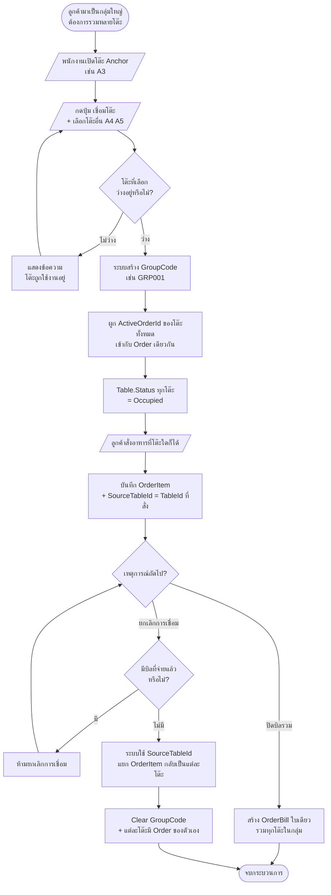

**คำอธิบายขั้นตอนการทำงาน:**
- การเชื่อมโต๊ะ (Table Link) ออกแบบมารองรับลูกค้ากลุ่มใหญ่ที่ต้องการรวมโต๊ะหลายโต๊ะเป็นกลุ่มเดียว เช่น ลูกค้า 10 คนต้องการ 3 โต๊ะติดกัน
- ระบบสร้างรหัสกลุ่ม (GroupCode) เพื่อผูกโต๊ะทั้งหมดเข้าด้วยกัน และใช้ ActiveOrderId เดียวกัน ทำให้รายการอาหารและบิลรวมเป็นชุดเดียว
- รายการอาหารแต่ละรายการเก็บฟิลด์ SourceTableId เพื่อบันทึกว่ามาจากโต๊ะใดเดิม ซึ่งจำเป็นสำหรับการแยกบิลกรณียกเลิกการเชื่อม
- การยกเลิกการเชื่อมโต๊ะ (Unlink) สามารถทำได้เฉพาะกรณีที่ยังไม่มีบิลใดถูกชำระเงิน หากมีบิลที่จ่ายแล้ว ระบบจะป้องกันการยกเลิกเพื่อรักษาความถูกต้องของข้อมูลทางการเงิน

### 3.5.14 แผนภาพการทำงานส่วนวงจรชีวิตของโทเค็นคิวอาร์โค้ดระดับโต๊ะ

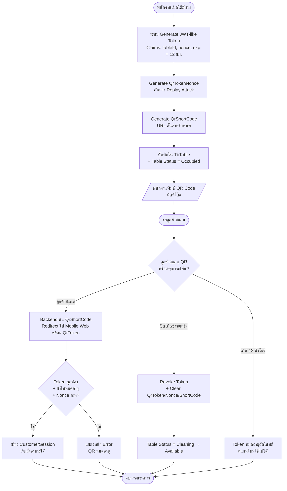

**คำอธิบายขั้นตอนการทำงาน:**
- ทุกครั้งที่เปิดโต๊ะใหม่ ระบบจะสร้าง QR Token แบบ JWT-like พร้อม Nonce แบบสุ่ม เพื่อป้องกันการนำโทเค็นเก่ามาใช้ซ้ำ (Replay Attack)
- QR Token มีอายุ 12 ชั่วโมงนับจากเวลาเปิดโต๊ะ และผูกกับ TableId เฉพาะโต๊ะนั้น
- เมื่อปิดโต๊ะหรือชำระเงินเสร็จ ระบบจะ Revoke โทเค็นทันที โดยลบค่า QrToken, QrTokenNonce และ QrShortCode ออกจากตาราง TbTable
- การใช้ Short Code ช่วยให้ URL ของ QR สั้นและพิมพ์ติดที่โต๊ะได้ง่าย โดย Backend จะ Redirect ไปยัง Mobile Web พร้อมส่ง JWT-like Token ที่เต็มรูปแบบไปด้วย

---

**กลุ่มที่ 4 — การสั่งอาหารและกระบวนการครัว (Ordering and Kitchen)**

แผนภาพในกลุ่มนี้แสดงกระบวนการหลักของการดำเนินงานประจำวันที่เกี่ยวข้องกับการสั่งอาหาร ทั้งการสั่งโดยพนักงานเสริฟและการสั่งโดยลูกค้าผ่าน Mobile Web การโต้ตอบของลูกค้ากับพนักงาน การเปลี่ยนสถานะของรายการอาหารในครัว และวงจรชีวิตของออเดอร์ตั้งแต่เริ่มต้นจนเสร็จสิ้น

### 3.5.15 แผนภาพการทำงานส่วนการสร้าง Order โดยพนักงาน

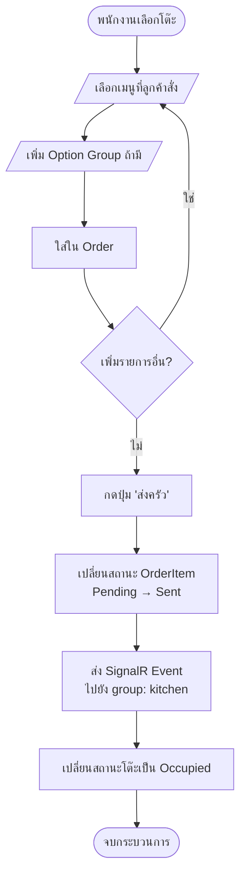

**คำอธิบายขั้นตอนการทำงาน:**
- พนักงานเลือกโต๊ะที่ลูกค้านั่งและเริ่มต้นการสั่งอาหารจากหน้า POS โดยสามารถเลือกเมนูพร้อมระบุ Option Group ที่ลูกค้าต้องการ
- รายการอาหารที่เพิ่มเข้า Order จะมีสถานะเริ่มต้นเป็น Pending จนกว่าพนักงานจะกดปุ่ม "ส่งครัว"
- เมื่อกดส่งครัว ระบบจะเปลี่ยนสถานะของทุกรายการเป็น Sent พร้อมส่ง SignalR Event ไปยังกลุ่ม Kitchen เพื่อแจ้งครัวให้เริ่มเตรียมอาหาร
- หากเป็นการสั่งครั้งแรกของโต๊ะ ระบบจะเปลี่ยนสถานะของโต๊ะจาก Available เป็น Occupied พร้อมกัน

### 3.5.16 แผนภาพการทำงานส่วนการสั่งอาหารผ่าน QR Code (Self-Order)

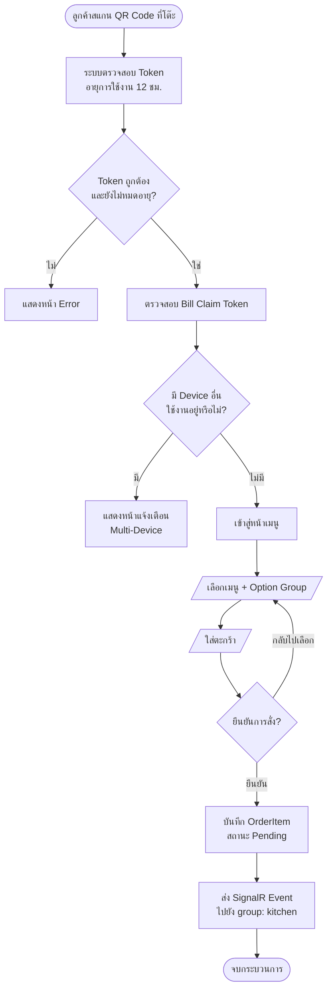

**คำอธิบายขั้นตอนการทำงาน:**
- ลูกค้าใช้ Mobile Web ในการสแกน QR Code ที่โต๊ะ ระบบจะตรวจสอบความถูกต้องของโทเค็นและอายุการใช้งาน 12 ชั่วโมง
- ระบบตรวจสอบ Bill Claim Token เพื่อให้แน่ใจว่าไม่มีลูกค้าคนอื่นกำลังทำธุรกรรมการชำระเงินอยู่
- ลูกค้าสามารถเลือกเมนูพร้อมระบุ Option Group ใส่ลงในตะกร้า และยืนยันการสั่งได้เอง
- เมื่อยืนยันการสั่ง ระบบจะบันทึก OrderItem ด้วยสถานะ Pending และส่ง SignalR Event ไปยังกลุ่ม Kitchen เพื่อให้ครัวเริ่มเตรียมอาหาร

### 3.5.17 แผนภาพการทำงานส่วนการโต้ตอบของลูกค้าผ่าน Mobile Web

```mermaid
flowchart TD
    A([ลูกค้าใช้ Mobile Web<br/>หลังสั่งอาหารเสร็จ]) --> B{ลูกค้าต้องการ<br/>ทำสิ่งใด?}
    B -- เรียกพนักงาน --> C[/กดปุ่ม Call Waiter/]
    C --> D[สร้าง Notification<br/>TargetGroup: Floor]
    D --> E[SignalR Broadcast<br/>+ Toast แจ้งพนักงานเสริฟ]
    B -- ขอบิล --> F[/กดปุ่ม Request Bill/]
    F --> G[Order.Status: Open → Billing<br/>+ Table.Status: Occupied → Billing]
    G --> H[สร้าง OrderBill รวมรายการทั้งหมด<br/>+ Notification ไป Cashier]
    B -- ขอชำระเงินสด --> I[/กดปุ่ม Request Cash/]
    I --> J[Notification ไป Floor + Cashier<br/>แจ้งเตรียมรับเงิน]
    B -- ขอแยกบิล --> K[/กดปุ่ม Request Split Bill/]
    K --> L[Notification ไป Floor<br/>ให้พนักงานมาช่วยแยกบิล]
    B -- ดูสถานะออเดอร์ --> M[/เข้าหน้า My Orders/]
    M --> N[Subscribe SignalR Group<br/>ของออเดอร์ตัวเอง]
    N --> O[แสดงสถานะ Real-time<br/>Pending → Sent → Preparing<br/>→ Ready → Served]
    E --> P([พนักงานรับเรื่อง])
    H --> P
    J --> P
    L --> P
    O --> P
```

**คำอธิบายขั้นตอนการทำงาน:**
- ลูกค้าที่สั่งอาหารผ่าน Self-Order สามารถโต้ตอบกับพนักงานได้ผ่านปุ่มในหน้า Mobile Web ทั้งหมด 4 ปุ่ม ได้แก่ Call Waiter, Request Bill, Request Cash และ Request Split Bill
- การกดแต่ละปุ่มจะสร้าง Notification ผ่าน SignalR ไปยังกลุ่มพนักงานที่เกี่ยวข้อง โดย Request Bill จะเปลี่ยนสถานะของออเดอร์เป็น Billing และสร้าง OrderBill อัตโนมัติ
- ลูกค้าสามารถติดตามสถานะของรายการอาหารแต่ละรายการได้แบบ Real-time ผ่านหน้า My Orders โดยระบบ Subscribe กลุ่ม SignalR เฉพาะออเดอร์ของตน
- การแสดงสถานะ Real-time ช่วยลดการเรียกถามพนักงานและทำให้ลูกค้ารู้ว่าอาหารกำลังอยู่ในขั้นตอนใด ลดความรู้สึกในการรอคอย

### 3.5.18 แผนภาพการทำงานส่วน Kitchen Display และ State Machine

```mermaid
stateDiagram-v2
    [*] --> Pending: ลูกค้า/พนักงานเพิ่มรายการ
    Pending --> Sent: กดส่งครัว
    Pending --> Voided: ยกเลิกก่อนส่งครัว
    Sent --> Preparing: ครัวกดเริ่มทำ
    Sent --> Cancelled: ยกเลิกพร้อมระบุเหตุผล
    Preparing --> Ready: ทำอาหารเสร็จ
    Preparing --> Cancelled: ยกเลิกพร้อมระบุเหตุผล
    Ready --> Served: พนักงานยกอาหารเสริฟ
    Voided --> [*]
    Cancelled --> [*]
    Served --> [*]
```

**คำอธิบายขั้นตอนการทำงาน:**
- รายการอาหารแต่ละรายการมีสถานะทั้งหมด 7 สถานะ ตาม EOrderItemStatus
- สถานะ Pending → Sent เกิดขึ้นเมื่อพนักงานหรือลูกค้ากดส่งครัว ซึ่งจะส่ง SignalR Event ไปยัง Kitchen Group ทันที
- ครัวกดเริ่มทำ (Preparing) และทำเสร็จ (Ready) ระบบจะส่ง SignalR Event ไปยังหน้าร้านเพื่อแจ้งพนักงานเสริฟ
- การยกเลิกแบ่งออกเป็น 2 รูปแบบ ได้แก่ Voided (ยกเลิกก่อนส่งครัว — ไม่ต้องระบุเหตุผล) และ Cancelled (ยกเลิกหลังส่งครัวแล้ว — ต้องระบุเหตุผลและผู้ยกเลิก)
- เมื่อรายการอยู่ในสถานะ Ready แล้ว จะไม่สามารถยกเลิกได้อีก เนื่องจากอาหารถูกปรุงเสร็จแล้ว

### 3.5.19 แผนภาพสถานะของออเดอร์ (Order State Diagram)

```mermaid
stateDiagram-v2
    [*] --> Open: เปิดโต๊ะ + สร้าง Order
    Open --> Open: เพิ่ม/แก้ไขรายการอาหาร
    Open --> Billing: ลูกค้า/พนักงานกดปิดบิล
    Billing --> Billing: สร้าง OrderBill หลายใบ<br/>กรณี Split Bill
    Billing --> Open: ยกเลิกการปิดบิล<br/>เพื่อเพิ่มรายการเพิ่ม
    Billing --> Completed: ทุกบิลชำระเงินสำเร็จ
    Completed --> [*]
```

**คำอธิบายขั้นตอนการทำงาน:**
- สถานะของออเดอร์ในระบบมีทั้งหมด 3 สถานะ ตาม EOrderStatus ได้แก่ Open, Billing และ Completed
- Open คือสถานะที่ออเดอร์ยังเปิดอยู่ ลูกค้าหรือพนักงานสามารถเพิ่มหรือแก้ไขรายการอาหารได้
- Billing คือสถานะที่เริ่มกระบวนการปิดบิล โดยระบบจะสร้าง OrderBill หนึ่งใบหรือหลายใบ (กรณีแยกบิล) และยังสามารถย้อนกลับไป Open ได้หากลูกค้าต้องการสั่งเพิ่ม
- Completed คือสถานะสุดท้ายเมื่อทุกบิลภายในออเดอร์ชำระเงินสำเร็จ จากนั้นโต๊ะจะเปลี่ยนสถานะเป็น Cleaning เพื่อเตรียมรับลูกค้ารายต่อไป

---

**กลุ่มที่ 5 — การชำระเงินและปิดบิล (Payment and Billing)**

แผนภาพในกลุ่มนี้แสดงกระบวนการที่เกี่ยวข้องกับการชำระเงิน ตั้งแต่การเปิด-ปิดรอบของแคชเชียร์และการจัดการลิ้นชักเงินสด การปิดบิลและการแยกบิลตามรายการหรือจำนวนเงิน กลไก Bill Claim Token ที่ป้องกันการชำระเงินซ้อนจาก Device หลายเครื่อง ตลอดจนการรับชำระเงินด้วยเงินสดและการตรวจสอบสลิปด้วย OCR

### 3.5.20 แผนภาพการทำงานส่วนการเปิด-ปิดรอบแคชเชียร์และจัดการลิ้นชักเงินสด

```mermaid
flowchart TD
    A([แคชเชียร์เริ่มกะ]) --> B[/กรอก Opening Balance<br/>เงินสดเริ่มต้นในลิ้นชัก/]
    B --> C[สร้าง TbCashierSession<br/>Status: Open]
    C --> D[ระหว่างกะ<br/>รับชำระเงิน/บันทึกรายการเงินสด]
    D --> E{เกิดเหตุการณ์ใด?}
    E -- รับเงินสด --> F[สร้าง TbPayment<br/>ผูกกับ CashierSessionId]
    E -- เงินเข้า --> G[/ระบุยอด + เหตุผล<br/>เช่น เติมเงินทอน/]
    G --> H[บันทึก TbCashDrawerTransaction<br/>Type: CashIn]
    E -- เงินออก --> I[/ระบุยอด + เหตุผล<br/>เช่น จ่ายค่าผัก/]
    I --> J[บันทึก TbCashDrawerTransaction<br/>Type: CashOut]
    F --> D
    H --> D
    J --> D
    E -- ปิดกะ --> K[ระบบคำนวณ Expected Balance<br/>= Opening + CashPayments<br/>+ CashIn - CashOut]
    K --> L[/แคชเชียร์นับเงินจริง<br/>+ กรอก Closing Balance/]
    L --> M[คำนวณ Difference<br/>= Closing - Expected]
    M --> N{Difference = 0?}
    N -- ใช่ --> O[Status: Closed<br/>เงินตรงกับระบบ]
    N -- ไม่ใช่ --> P[Status: Closed<br/>แสดงเงินขาดหรือเกิน]
    O --> Q([จบกระบวนการ])
    P --> Q
```

**คำอธิบายขั้นตอนการทำงาน:**
- ก่อนเริ่มรับชำระเงิน แคชเชียร์ต้องเปิดรอบโดยกรอกยอดเงินสดเริ่มต้นในลิ้นชัก (Opening Balance)
- ระหว่างกะ การชำระเงินสดทุกรายการและรายการเงินสดเข้า-ออกลิ้นชักจะถูกบันทึกผูกกับ CashierSessionId
- เมื่อปิดกะ ระบบจะคำนวณยอดเงินที่ควรมีในลิ้นชัก (Expected Balance) จากสูตร Opening + รับเงินสด + Cash In - Cash Out
- หากยอดเงินจริงไม่ตรงกับที่ระบบคำนวณ ระบบจะแสดงผลต่าง (Difference) เพื่อให้แคชเชียร์ตรวจสอบ และบันทึกเก็บไว้สำหรับการตรวจสอบย้อนหลัง

### 3.5.21 แผนภาพการทำงานส่วนการปิดบิลและ Split Bill

```mermaid
flowchart TD
    A([พนักงานเลือก Order<br/>สถานะ Open]) --> B[กดปุ่ม 'ปิดบิล']
    B --> C[เปลี่ยน Order Status<br/>Open → Billing]
    C --> D{ลูกค้าต้องการ<br/>แยกบิล?}
    D -- ไม่ --> E[สร้าง OrderBill 1 ใบ]
    D -- ใช่ --> F{แยกตามไหน?}
    F -- รายการ --> G[เลือกรายการแต่ละบิล]
    F -- จำนวนเงิน --> H[ระบุยอดแต่ละบิล]
    G --> I[สร้าง OrderBill หลายใบ]
    H --> I
    E --> J([ส่งให้แคชเชียร์])
    I --> J
```

**คำอธิบายขั้นตอนการทำงาน:**
- การปิดบิลเริ่มต้นจากการที่พนักงานเลือก Order ที่อยู่ในสถานะ Open และกดปุ่ม "ปิดบิล" ระบบจะเปลี่ยนสถานะของ Order เป็น Billing
- การแยกบิล (Split Bill) สามารถทำได้ 2 รูปแบบ ได้แก่ การแยกตามรายการอาหาร (Split By Item) และการแยกตามจำนวนเงิน (Split By Amount)
- กรณีแยกตามรายการ พนักงานเลือกรายการของแต่ละบิล โดยระบบจะคำนวณยอดรวมและค่าบริการของแต่ละบิลโดยอัตโนมัติ
- เมื่อสร้าง OrderBill เสร็จ ระบบจะส่งบิลทั้งหมดไปยังหน้าแคชเชียร์เพื่อรอการชำระเงิน

### 3.5.22 แผนภาพการทำงานส่วนกลไก Bill Claim Token ป้องกัน Multi-Device

```mermaid
flowchart TD
    A([ลูกค้าหลายคนใช้ Device แยก<br/>เข้าหน้าชำระเงินพร้อมกัน]) --> B[Device แรกกด<br/>อัพโหลดสลิป]
    B --> C{ระบบตรวจสอบ<br/>OrderBill.ClaimedBySessionId<br/>ว่างหรือไม่?}
    C -- ว่าง --> D[Claim บิล<br/>บันทึก ClaimedBySessionId<br/>= CustomerSessionId]
    D --> E[Device แรกเข้าหน้า<br/>อัพโหลดสลิป + รอ OCR]
    E --> F{ผู้ใช้ทำอย่างไรต่อ?}
    F -- อัพโหลดสำเร็จ --> G[Payment Confirmed<br/>+ Clear ClaimedBySessionId]
    F -- เปลี่ยนใจ/Release --> H[Clear ClaimedBySessionId<br/>+ ปล่อยให้ Device อื่น Claim]
    F -- Timeout --> H
    C -- ถูก Claim แล้ว --> I{เป็น Session<br/>เดียวกันหรือไม่?}
    I -- ใช่ --> E
    I -- ไม่ --> J[แสดงข้อความ<br/>"บิลนี้มีคนกำลังชำระอยู่"]
    J --> K{รอ Release<br/>หรือลองใหม่?}
    K -- ลองใหม่ --> C
    K -- ยกเลิก --> L([จบกระบวนการ])
    H --> M[Device อื่นกด<br/>อัพโหลดสลิปได้]
    M --> C
    G --> L
```

**คำอธิบายขั้นตอนการทำงาน:**
- กลไก Bill Claim Token ออกแบบมาเพื่อแก้ปัญหา Race Condition ในกรณีที่ลูกค้าหลายคนในโต๊ะเดียวกันใช้ QR Code เดียวกันแล้วเข้าหน้าชำระเงินพร้อมกัน
- ฟิลด์ `ClaimedBySessionId` ในตาราง TbOrderBill ทำหน้าที่เป็น Exclusive Lock ผูกกับ CustomerSession ของลูกค้าคนที่กดก่อน
- Device อื่นที่ไม่ได้ Claim จะเห็นข้อความว่ามีคนกำลังชำระอยู่ และต้องรอจน Device ที่ Claim ปล่อย Lock (Release) หรือชำระเงินเสร็จ
- กรณี Device ที่ Claim ออกจากหน้าโดยไม่ชำระ ระบบจะปล่อย Lock โดยอัตโนมัติเมื่อ Timeout เพื่อไม่ให้ลูกค้าคนอื่นรอนาน

### 3.5.23 แผนภาพการทำงานส่วนการชำระเงินและ OCR Slip Verification

```mermaid
flowchart TD
    A([แคชเชียร์เลือก OrderBill]) --> B{เลือกวิธีชำระ}
    B -- เงินสด --> C[/ระบุจำนวนเงินที่รับ/]
    C --> D[คำนวณเงินทอน]
    D --> E[บันทึก Payment<br/>Status: Paid]
    B -- QR Code --> F[สร้าง QR Code]
    F --> G[/ลูกค้าโอนเงิน + อัปโหลดสลิป/]
    G --> H[ระบบ OCR อ่านสลิป]
    H --> I{OCR Status?}
    I -- Matched --> J[ยืนยันชำระสำเร็จ]
    I -- Mismatched --> K[แสดงผลต่าง<br/>ให้แคชเชียร์ตรวจ]
    I -- Manual --> L[แคชเชียร์ตรวจมือ]
    J --> E
    K --> M{แคชเชียร์ยืนยัน?}
    L --> M
    M -- ยืนยัน --> E
    M -- ปฏิเสธ --> N([ยกเลิกการชำระ])
    E --> O[เปลี่ยน Order<br/>Billing → Completed]
    O --> P[เปลี่ยนสถานะโต๊ะ<br/>Billing → Cleaning]
    P --> Q([จบกระบวนการ])
```

**คำอธิบายขั้นตอนการทำงาน:**
- ระบบรองรับวิธีการชำระเงิน 2 รูปแบบ ได้แก่ เงินสด (Cash) และ QR Code (PromptPay หรือ Bank Transfer)
- กรณีชำระด้วยเงินสด แคชเชียร์ระบุจำนวนเงินที่รับ ระบบจะคำนวณเงินทอนและบันทึก Payment ด้วยสถานะ Paid ทันที
- กรณีชำระด้วย QR Code ลูกค้าโอนเงินผ่านแอปธนาคารและอัพโหลดสลิป ระบบจะใช้ OCR อ่านข้อมูลในสลิปและตรวจสอบความถูกต้อง 3 ระดับ ได้แก่ Matched (ตรงทุกฟิลด์) Mismatched (มีฟิลด์ไม่ตรง) และ Manual (อ่านสลิปไม่ออก ต้องตรวจด้วยตา)
- เมื่อชำระเงินสำเร็จ ระบบจะเปลี่ยนสถานะของ Order เป็น Completed และโต๊ะเป็น Cleaning เพื่อเตรียมรับลูกค้ารายต่อไป

---

**กลุ่มที่ 6 — การแจ้งเตือนแบบเรียลไทม์ (Real-time Notification)**

แผนภาพในกลุ่มนี้แสดงกลไกการแจ้งเตือนแบบเรียลไทม์ที่เชื่อมต่อทุกส่วนของระบบเข้าด้วยกัน โดยใช้เทคโนโลยี SignalR ในการส่งข้อมูลผ่าน WebSocket ซึ่งทำให้พนักงานทุกตำแหน่งงานเห็นการเปลี่ยนแปลงของออเดอร์ สถานะโต๊ะ และเหตุการณ์ต่าง ๆ พร้อมกันโดยไม่ต้องรีเฟรชหน้า

### 3.5.24 แผนภาพการทำงานส่วนแจ้งเตือน Real-time ผ่าน SignalR

```mermaid
flowchart LR
    A[Event เกิดใน Service] --> B{NotificationBroadcaster}
    B --> C[บันทึก TbNotification]
    B --> D[ส่งผ่าน NotificationHub]
    D --> E{Group ใด?}
    E -- Kitchen --> F[Kitchen Group]
    E -- Floor --> G[Floor Group]
    E -- Cashier --> H[Cashier Group]
    E -- Manager --> I[Manager Group]
    F --> J[Toast บน Kitchen Display]
    G --> K[Toast บนหน้าร้าน]
    H --> L[Toast บนแคชเชียร์]
    I --> M[Toast บนผู้จัดการ]
    J --> N[เก็บใน Notification Drawer]
    K --> N
    L --> N
    M --> N
```

**คำอธิบายขั้นตอนการทำงาน:**
- ระบบใช้ NotificationBroadcaster เป็นจุดศูนย์กลางในการกระจายการแจ้งเตือน เมื่อเกิด Business Event ใด ๆ ใน Service Layer จะถูกส่งไปยัง NotificationBroadcaster เพื่อบันทึกและกระจายต่อ
- การแจ้งเตือนถูกแบ่งออกเป็น 4 กลุ่มผู้รับ ตาม ENotificationGroup ได้แก่ Kitchen (พนักงานครัว), Floor (พนักงานเสริฟ), Cashier (แคชเชียร์) และ Manager (ผู้จัดการ)
- พนักงานในแต่ละกลุ่มจะเห็น Toast Notification แบบ Real-time โดยไม่ต้องรีเฟรชหน้าจอ พร้อมเก็บการแจ้งเตือนไว้ใน Notification Drawer เพื่อให้สามารถย้อนดูประวัติได้
- การใช้ WebSocket ผ่าน SignalR ทำให้ Latency ของการแจ้งเตือนอยู่ในระดับต่ำกว่า 1 วินาที ซึ่งเหมาะสมกับการใช้งานในร้านอาหารที่ต้องการความรวดเร็วในการสื่อสารระหว่างหน้าร้านและครัว

---

## 3.6 การออกแบบฐานข้อมูล (Data Dictionary)

ระบบบริหารธุรกิจร้านอาหารผ่านเว็บพร้อมระบบ POS (RBMS-POS) มีการจัดเก็บข้อมูลโดยใช้ระบบฐานข้อมูลเชิงสัมพันธ์ (Relational Database) แบบ Microsoft SQL Server ซึ่งประกอบไปด้วยตารางหลักจำนวน 37 ตาราง จัดกลุ่มตาม 8 โมดูลธุรกิจของระบบ และมีการกำหนดประเภทของข้อมูล (Enum) เพื่อควบคุมความถูกต้องของข้อมูลดังนี้

1. **EOrderStatus**: สถานะออเดอร์ ได้แก่ Open (กำลังสั่ง), Billing (เริ่มปิดบิล), Completed (เสร็จสิ้น)
2. **EOrderItemStatus**: สถานะรายการอาหาร ได้แก่ Pending (รอส่ง), Sent (ส่งครัว), Preparing (กำลังทำ), Ready (พร้อมเสริฟ), Served (เสริฟแล้ว), Voided (ยกเลิกหลังส่ง), Cancelled (ยกเลิกก่อนส่ง)
3. **ETableStatus**: สถานะโต๊ะ ได้แก่ Available (ว่าง), Reserved (จองแล้ว), Occupied (มีลูกค้าใช้งาน), Billing (กำลังออกบิล), Cleaning (กำลังทำความสะอาด), Unavailable (ปิดใช้งาน)
4. **EPaymentMethod**: วิธีชำระเงิน ได้แก่ Cash (เงินสด), QrPayment (ชำระผ่าน QR Code)
5. **EPaymentStatus**: สถานะการชำระเงิน ได้แก่ Pending (รอชำระ), Paid (ชำระแล้ว), Refunded (คืนเงินแล้ว)
6. **ESlipVerificationStatus**: สถานะการตรวจสลิป ได้แก่ None (ยังไม่ตรวจ), Matched (ตรงกัน), Mismatched (ไม่ตรงกัน), Manual (ตรวจสอบโดยมนุษย์)
7. **ECategoryType**: ประเภทหมวดเมนู ได้แก่ Food (อาหาร), Beverage (เครื่องดื่ม), Dessert (ของหวาน)
8. **EMenuTag**: แท็กเมนู ได้แก่ Recommended (แนะนำ), Seasonal (ตามฤดูกาล), SlowPreparation (ใช้เวลาเตรียมนาน)
9. **ENotificationGroup**: กลุ่มผู้รับแจ้งเตือน ได้แก่ Kitchen (พนักงานครัว), Floor (พนักงานเสริฟ), Cashier (แคชเชียร์), Manager (ผู้จัดการ)
10. **EFloorObjectType**: ประเภทวัตถุภายในร้าน ได้แก่ Restroom (ห้องน้ำ), Stairs (บันได), Counter (เคาน์เตอร์), Kitchen (ครัว), Exit (ทางออก), Cashier (จุดแคชเชียร์), Plant (ต้นไม้), Decoration (ของตกแต่ง)

ส่วนรายละเอียดของตารางทั้งหมดในฐานข้อมูล ประกอบด้วยชื่อฟิลด์ ชนิดข้อมูล คีย์อ้างอิง และคำอธิบายของแต่ละฟิลด์ จัดกลุ่มตามโมดูลธุรกิจของระบบ มีรายละเอียดดังนี้

---

## 3.7 แผนผัง ER Diagram (Entity-Relationship Diagram)

ในการพัฒนาระบบ คณะผู้จัดทำได้ออกแบบโครงสร้างฐานข้อมูลเชิงสัมพันธ์โดยมีเอนทิตี (Entity) ทั้งหมด 37 ตาราง เพื่อให้ผู้อ่านสามารถพิจารณาความสัมพันธ์ของข้อมูลได้อย่างชัดเจนและไม่หนาแน่นเกินไป รายงานฉบับนี้จึงแสดงแผนภาพ ER แยกตามขอบเขตของแต่ละโมดูลธุรกิจ รวม 7 รูป โดยซอร์สโค้ดของแผนภาพแต่ละรูปในรูปแบบ DBML สำหรับนำไปสร้างบนเครื่องมือ dbdiagram.io จัดเก็บไว้ในโฟลเดอร์ `doc/dbdiagram/` ดังรายละเอียดต่อไปนี้

### 3.7.1 ER Diagram ส่วน Authentication และ User Account

ส่วนนี้ครอบคลุมการยืนยันตัวตนของผู้ใช้งานระบบ ประกอบด้วยข้อมูลบัญชีผู้ใช้ การจัดการโทเค็นการเข้าใช้งาน ประวัติรหัสผ่านเพื่อป้องกันการนำกลับมาใช้ซ้ำ และโทเค็นสำหรับการกู้คืนรหัสผ่านผ่านรหัสครั้งเดียว (OTP)

**รูปที่ 3.11 แผนผัง ER Diagram ส่วน Authentication และ User Account**

### 3.7.2 ER Diagram ส่วน Authorization และ Human Resource

ส่วนนี้ครอบคลุมการกำหนดสิทธิ์การเข้าถึงตามตำแหน่งงาน ผ่านกลไกเมทริกซ์สิทธิ์ (Permission Matrix) ที่เชื่อมโยงโมดูล สิทธิ์ และตำแหน่งงาน ร่วมกับข้อมูลพนักงานที่ผูกกับตำแหน่ง พร้อมข้อมูลส่วนตัวของพนักงาน ได้แก่ ที่อยู่ ประวัติการศึกษา และประวัติการทำงาน

**รูปที่ 3.12 แผนผัง ER Diagram ส่วน Authorization และ Human Resource**

### 3.7.3 ER Diagram ส่วน Admin Settings และ File

ส่วนนี้ครอบคลุมการตั้งค่าข้อมูลของร้านในรูปแบบเดี่ยว (Singleton) เวลาทำการรายวัน และค่าบริการ ตลอดจนระบบจัดเก็บไฟล์ (File Management) ที่เป็นจุดอ้างอิงกลางของระบบสำหรับไฟล์รูปภาพต่าง ๆ เช่น โลโก้ร้านและคิวอาร์โค้ดสำหรับชำระเงิน

**รูปที่ 3.13 แผนผัง ER Diagram ส่วน Admin Settings และ File**

### 3.7.4 ER Diagram ส่วน Menu Management

ส่วนนี้ครอบคลุมการจัดการเมนูอาหาร หมวดหมู่ย่อย และกลุ่มตัวเลือกเสริม (Option Group) โดยมีตารางเชื่อม TbMenuOptionGroup สำหรับจัดความสัมพันธ์แบบกลุ่มต่อกลุ่ม (Many-to-Many) ระหว่างเมนูกับกลุ่มตัวเลือก พร้อมการเก็บรูปเมนูในระบบไฟล์

**รูปที่ 3.14 แผนผัง ER Diagram ส่วน Menu Management**

### 3.7.5 ER Diagram ส่วน Table Management และ Customer Self-Order

ส่วนนี้ครอบคลุมการจัดการโซนพื้นที่ ผังโต๊ะ และวัตถุประดับภายในร้าน (Floor Object) ตลอดจนการจองโต๊ะล่วงหน้า การเชื่อมโต๊ะ (Table Link) สำหรับลูกค้ากลุ่มใหญ่ และเซสชั่นของลูกค้าที่สั่งอาหารผ่านการสแกนคิวอาร์โค้ดที่โต๊ะ

**รูปที่ 3.15 แผนผัง ER Diagram ส่วน Table Management และ Customer Self-Order**

### 3.7.6 ER Diagram ส่วน Order และ Payment

ส่วนนี้ครอบคลุมการรับและประมวลผลออเดอร์ ตั้งแต่ออเดอร์หลัก รายการอาหารและตัวเลือก (Snapshot) บิลที่รองรับการแยกบิล (Split Bill) ไปจนถึงการชำระเงินผ่านรอบการทำงานของแคชเชียร์ (Cashier Session) และการบันทึกเงินสดเข้า-ออกลิ้นชัก

**รูปที่ 3.16 แผนผัง ER Diagram ส่วน Order และ Payment**

### 3.7.7 ER Diagram ส่วน Notification

ส่วนนี้ครอบคลุมระบบแจ้งเตือนแบบเวลาจริง ประกอบด้วยตารางบันทึกการแจ้งเตือนที่อ้างถึงเหตุการณ์ในระบบ (เช่น ออเดอร์ โต๊ะ และการจอง) และตารางบันทึกสถานะการอ่านของผู้ใช้งานแต่ละราย เพื่อแสดงตัวนับจำนวนข้อความที่ยังไม่ได้อ่าน (Badge)

**รูปที่ 3.17 แผนผัง ER Diagram ส่วน Notification**

### 3.7.8 คำอธิบายความสัมพันธ์ของระบบฐานข้อมูล

จากแผนภาพ ER-Diagram ระบบถูกออกแบบให้มีความสัมพันธ์แบบหนึ่งต่อกลุ่ม (One-to-Many หรือ 1:N) เป็นหลัก โดยมีบางส่วนที่เป็นความสัมพันธ์แบบหนึ่งต่อหนึ่ง (One-to-One หรือ 1:1) และบางส่วนเป็นความสัมพันธ์แบบกลุ่มต่อกลุ่ม (Many-to-Many หรือ M:N) ที่จัดการผ่านตารางเชื่อมโยง (Junction Table) โดยมีรายละเอียดของความสัมพันธ์ที่สำคัญจัดกลุ่มตามโมดูลธุรกิจดังนี้

**กลุ่มที่ 1 การยืนยันตัวตน (Authentication)**

1. **TbUsers กับ TbRefreshTokens (1:N)**: ผู้ใช้งาน 1 บัญชีสามารถมีโทเค็นการต่ออายุการเข้าสู่ระบบได้หลายโทเค็น สำหรับการเข้าใช้งานจากหลายอุปกรณ์พร้อมกัน (เชื่อมโยงผ่าน UserId)

2. **TbUsers กับ TbPasswordHistories (1:N)**: ผู้ใช้งาน 1 บัญชีจะมีประวัติรหัสผ่านเก็บไว้หลายรายการ เพื่อป้องกันการนำรหัสผ่านเดิมกลับมาใช้ซ้ำตามนโยบายความปลอดภัย (เชื่อมโยงผ่าน UserId)

3. **TbUsers กับ TbPasswordResetTokens (1:N)**: ผู้ใช้งาน 1 บัญชีสามารถสร้างคำขอกู้คืนรหัสผ่านได้หลายครั้ง ระบบใช้ตารางนี้ในการเก็บโทเค็น OTP (One-Time Password) สำหรับยืนยันตัวตนก่อนเปลี่ยนรหัสผ่าน (เชื่อมโยงผ่าน UserId)

**กลุ่มที่ 2 การจัดการสิทธิ์ (Authorization)**

4. **TbmModules และ TbmPermissions กับ TbmAuthorizeMatrices (1:N)**: เมทริกซ์สิทธิ์ (Authorization Matrix) ถูกสร้างจากการจับคู่ระหว่างโมดูลของระบบ (Module) กับประเภทสิทธิ์ (Permission) เพื่อกำหนดเส้นทางสิทธิ์ (Permission Path) เช่น `employee.create` หรือ `order.read` (เชื่อมโยงผ่าน ModuleId และ PermissionId)

5. **TbmPositions กับ TbmAuthorizeMatrices (M:N)**: ตำแหน่งงาน 1 ตำแหน่งสามารถได้รับสิทธิ์การเข้าถึงโมดูลและการดำเนินการได้หลายรายการ และในทางกลับกัน 1 สิทธิ์การเข้าถึงสามารถถูกกำหนดให้กับหลายตำแหน่งได้ โดยจัดการผ่านตารางเชื่อม TbAuthorizeMatrixPositions

**กลุ่มที่ 3 ทรัพยากรบุคคล (Human Resource)**

6. **TbUsers กับ TbEmployees (1:1)**: บัญชีผู้ใช้งาน 1 บัญชีจะเชื่อมโยงกับข้อมูลพนักงาน 1 คน และในทางกลับกันพนักงาน 1 คนจะมีบัญชีผู้ใช้งานเพียง 1 บัญชี (เชื่อมโยงผ่าน UserId)

7. **TbmPositions กับ TbEmployees (1:N)**: ตำแหน่งงาน 1 ตำแหน่งสามารถมีพนักงานได้หลายคน แต่พนักงานแต่ละคนจะมีเพียง 1 ตำแหน่งเท่านั้น (เชื่อมโยงผ่าน PositionId)

8. **TbEmployees กับ TbEmployeeAddresses, TbEmployeeEducations และ TbEmployeeWorkHistories (1:N)**: พนักงาน 1 คนสามารถมีที่อยู่ ประวัติการศึกษา และประวัติการทำงานได้หลายรายการ ทำให้ระบบจัดเก็บข้อมูลส่วนตัวของพนักงานได้อย่างครบถ้วน (เชื่อมโยงผ่าน EmployeeId)

**กลุ่มที่ 4 การตั้งค่าร้านและไฟล์ (Admin และ File Management)**

9. **TbShopSettings กับ TbShopOperatingHours (1:N)**: การตั้งค่าร้านมีเพียง 1 เรคคอร์ดแต่สามารถมีเวลาทำการได้ 7 รายการครอบคลุมจันทร์ถึงอาทิตย์ (เชื่อมโยงผ่าน ShopSettingsId)

10. **TbFiles เป็นตารางอ้างอิงกลางสำหรับไฟล์ทุกประเภทในระบบ (1:1 Optional)**: ตาราง TbFiles เก็บข้อมูลเมตาดาตาของไฟล์ทุกประเภท ได้แก่ โลโก้ร้านและคิวอาร์โค้ดรับชำระเงิน (อ้างจาก TbShopSettings) รูปประจำตัวพนักงาน (อ้างจาก TbEmployees) รูปเมนู (อ้างจาก TbMenus) ตลอดจนสลิปจากลูกค้าและสลิปการชำระเงิน (อ้างจาก TbOrderBills และ TbPayments) โดยไฟล์จริงถูกจัดเก็บใน Object Storage (MinIO) แบบรวมศูนย์

**กลุ่มที่ 5 การจัดการเมนู (Menu Management)**

11. **TbMenuSubCategories กับ TbMenus (1:N)**: หมวดหมู่ย่อย 1 หมวดสามารถมีรายการเมนูได้หลายรายการ แต่เมนูแต่ละรายการจะอยู่ในหมวดหมู่เดียว (เชื่อมโยงผ่าน SubCategoryId)

12. **TbMenus กับ TbOptionGroups (M:N)**: เมนู 1 รายการสามารถมีกลุ่มตัวเลือกเสริมได้หลายกลุ่ม และกลุ่มตัวเลือก 1 กลุ่มสามารถนำไปใช้ในเมนูได้หลายรายการ โดยจัดการผ่านตารางเชื่อม TbMenuOptionGroups

13. **TbOptionGroups กับ TbOptionItems (1:N)**: กลุ่มตัวเลือก 1 กลุ่มสามารถมีตัวเลือกย่อยได้หลายตัวเลือก เช่น กลุ่ม "ระดับความเผ็ด" มีตัวเลือก เผ็ดน้อย เผ็ดกลาง และเผ็ดมาก (เชื่อมโยงผ่าน OptionGroupId)

**กลุ่มที่ 6 การจัดการโต๊ะและลูกค้า (Table และ Customer Self-Order)**

14. **TbZones กับ TbTables (1:N)**: โซน 1 โซนสามารถมีโต๊ะได้หลายโต๊ะ แต่โต๊ะแต่ละตัวจะอยู่ในโซนเดียวเท่านั้น (เชื่อมโยงผ่าน ZoneId)

15. **TbTables กับ TbReservations (1:N)**: โต๊ะ 1 โต๊ะสามารถมีการจองล่วงหน้าได้หลายรายการในวันเวลาที่แตกต่างกัน (เชื่อมโยงผ่าน TableId)

16. **TbTables กับ TbCustomerSessions (1:N)**: โต๊ะ 1 โต๊ะสามารถมีเซสชั่นของลูกค้าที่สั่งอาหารด้วยตนเองผ่าน QR Code ได้หลายเซสชั่นในเวลาเดียวกัน กรณีลูกค้าหลายคนสแกนจากอุปกรณ์ที่แตกต่างกัน (เชื่อมโยงผ่าน TableId)

**กลุ่มที่ 7 ออเดอร์และรายการอาหาร (Order Management)**

17. **TbTables กับ TbOrders (1:N)**: โต๊ะ 1 โต๊ะสามารถมีออเดอร์ได้หลายรอบตามช่วงเวลาที่ลูกค้าเข้ามาใช้บริการ แต่ละออเดอร์จะผูกกับโต๊ะเดียว (เชื่อมโยงผ่าน TableId)

18. **TbOrders กับ TbOrderItems (1:N)**: ออเดอร์ 1 รายการสามารถมีรายการอาหารได้หลายรายการ โดยลูกค้าสามารถเพิ่มรายการอาหารเข้าออเดอร์เดิมได้ตลอดช่วงเวลาที่นั่งโต๊ะ (เชื่อมโยงผ่าน OrderId)

19. **TbMenus กับ TbOrderItems (Snapshot Pattern)**: ตาราง TbOrderItems อ้างถึงเมนูที่สั่งผ่าน MenuId แต่จะคัดลอกชื่อเมนูและราคา ณ ขณะที่สั่งมาเก็บไว้ในรายการ (Snapshot) เพื่อให้บิลเก่ายังคงสะท้อนราคาเดิมแม้ว่าราคาเมนูจะถูกแก้ไขในภายหลัง (เชื่อมโยงผ่าน MenuId)

20. **TbOrderItems กับ TbOrderItemOptions (1:N)**: รายการอาหาร 1 รายการสามารถมีตัวเลือกเสริมได้หลายรายการ ที่ลูกค้าเลือกประกอบกับเมนูในขณะที่สั่ง (เชื่อมโยงผ่าน OrderItemId)

**กลุ่มที่ 8 บิลและการชำระเงิน (Bill และ Payment)**

21. **TbOrders กับ TbOrderBills (1:N)**: ออเดอร์ 1 รายการสามารถมีบิลได้หลายใบ ในกรณีที่ลูกค้าขอแยกบิล (Split Bill) ตามรายการอาหารหรือตามจำนวนเงิน (เชื่อมโยงผ่าน OrderId)

22. **TbOrderBills กับ TbServiceCharges (N:1 Optional)**: บิล 1 ใบสามารถผูกกับการตั้งค่าค่าบริการได้ 1 รายการ ระบบใช้ค่าบริการนี้ในการคำนวณยอดเรียกเก็บเพิ่มเติมแบบเปอร์เซ็นต์จากยอดอาหาร (เชื่อมโยงผ่าน ServiceChargeId)

23. **TbOrderBills กับ TbCustomerSessions ผ่านกลไก Bill Claim Token (1:1 Optional)**: บิล 1 ใบสามารถถูก Claim โดยเซสชั่นลูกค้า 1 เซสชั่นในเวลาเดียวกัน เพื่อป้องกันปัญหา Race Condition กรณีลูกค้าหลายคนในโต๊ะเดียวกันกดชำระเงินพร้อมกันจากอุปกรณ์ที่แตกต่างกัน (เชื่อมโยงผ่าน ClaimedBySessionId)

24. **TbOrderBills กับ TbPayments (1:N)**: บิล 1 ใบสามารถได้รับการชำระเงินหลายครั้งได้ เช่น การชำระบางส่วนด้วยเงินสดและที่เหลือผ่าน QR Code (เชื่อมโยงผ่าน OrderBillId)

**กลุ่มที่ 9 รอบการทำงานของแคชเชียร์ (Cashier Session)**

25. **TbUsers กับ TbCashierSessions (1:N)**: ผู้ใช้งานที่มีบทบาทแคชเชียร์ 1 บัญชีสามารถเปิดและปิดรอบการทำงานได้หลายรอบ ระบบบันทึกประวัติทุกรอบเพื่อใช้ตรวจสอบความถูกต้องของเงินในลิ้นชัก (เชื่อมโยงผ่าน UserId)

26. **TbCashierSessions กับ TbPayments (1:N)**: เซสชั่นการทำงานของแคชเชียร์ 1 รอบสามารถรับการชำระเงินได้หลายรายการตลอดช่วงกะที่ปฏิบัติงาน (เชื่อมโยงผ่าน CashierSessionId)

27. **TbCashierSessions กับ TbCashDrawerTransactions (1:N)**: เซสชั่น 1 รอบสามารถมีรายการเงินสดเข้า-ออกลิ้นชักได้หลายรายการ เช่น การเติมเงินทอนและการนำเงินสดไปฝากธนาคารระหว่างกะ (เชื่อมโยงผ่าน CashierSessionId)

**กลุ่มที่ 10 การแจ้งเตือน (Notification)**

28. **TbNotifications กับ TbNotificationReads (1:N)**: การแจ้งเตือน 1 รายการสามารถถูกอ่านโดยพนักงานหลายคนได้ และระบบจะบันทึกสถานะการอ่านของพนักงานแต่ละคนแยกกัน (เชื่อมโยงผ่าน NotificationId)

29. **TbNotifications กับ TbTables, TbOrders และ TbReservations (N:1 Optional)**: การแจ้งเตือนแต่ละรายการสามารถอ้างถึงเหตุการณ์ที่เกิดขึ้นในระบบได้ ได้แก่ โต๊ะ ออเดอร์ หรือการจอง เพื่อให้ผู้รับการแจ้งเตือนสามารถนำทางไปยังหน้าจอที่เกี่ยวข้องได้ทันที (เชื่อมโยงผ่าน TableId, OrderId หรือ ReservationId แบบ Optional)

ความสัมพันธ์เหล่านี้แสดงให้เห็นถึงโครงสร้างของระบบที่ออกแบบให้รองรับการดำเนินงานของร้านอาหารอย่างครบวงจร ตั้งแต่การจัดการพนักงาน การจัดการเมนู การรับออเดอร์ การชำระเงิน ไปจนถึงการแจ้งเตือนแบบเวลาจริง โดยการจัดเก็บข้อมูลในลักษณะนี้ช่วยให้ระบบสามารถสืบค้น เชื่อมโยง และวิเคราะห์ข้อมูลในมิติต่าง ๆ ได้อย่างมีประสิทธิภาพ
