# บทที่ 3 การออกแบบ

> เนื้อหาพร้อมใช้ — ส่วน Mermaid Code สำหรับ Flowchart และ ER Diagram สามารถนำไปวางใน draw.io ได้ทันที (Extras → Edit Diagram หรือ Arrange → Insert → Advanced → Mermaid)

---

ในบทนี้จะกล่าวถึงการวิเคราะห์และออกแบบระบบของระบบบริหารธุรกิจร้านอาหารผ่านเว็บพร้อมระบบ POS เพื่อให้ตอบสนองต่อความต้องการของผู้ใช้งานและวัตถุประสงค์ของโครงงาน ซึ่งมีรายละเอียดดังนี้

---

## 3.1 สถาปัตยกรรมระบบ (System Architecture)

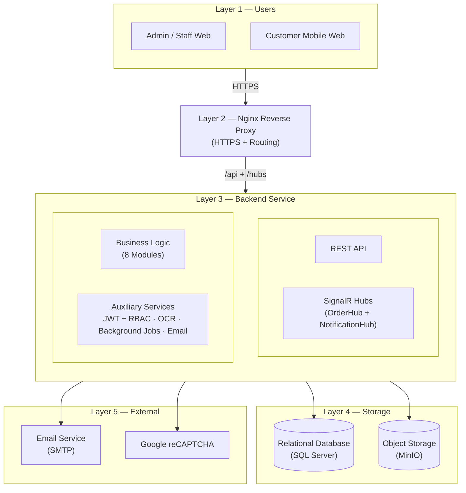

**รูปที่ 3.1 สถาปัตยกรรมระบบของระบบบริหารธุรกิจร้านอาหารผ่านเว็บพร้อมระบบ POS**

ระบบได้รับการออกแบบในรูปแบบสถาปัตยกรรมแบบหลายชั้น (N-Tier Architecture) เพื่อแยกหน้าที่ความรับผิดชอบของแต่ละส่วนอย่างชัดเจน โดยแบ่งออกเป็น 5 ชั้น (Layer) ดังนี้

1. **Layer 1 — กลุ่มผู้ใช้งาน (Users)** ประกอบด้วยผู้ใช้งาน 3 บทบาทตามหลักการ Use Case ได้แก่ ผู้ดูแลระบบ (Admin) พนักงาน (Staff) และลูกค้า (Customer) โดยผู้ดูแลระบบและพนักงานเข้าถึงระบบผ่าน Client Web สำหรับการจัดการข้อมูลพื้นฐาน การรับออเดอร์ การจัดการครัว และการเรียกดูแดชบอร์ด ส่วนลูกค้าเข้าถึงระบบผ่าน Mobile Web หลังจากสแกนรหัสคิวอาร์โค้ดที่โต๊ะ เพื่อสั่งอาหารด้วยตนเอง ติดตามสถานะ และขอชำระเงิน

2. **Layer 2 — เว็บเซิร์ฟเวอร์และเกตเวย์ (Gateway)** คำขอจากผู้ใช้งานทั้งสองฝั่งจะถูกส่งมายัง Nginx Reverse Proxy ซึ่งทำหน้าที่เป็นประตูทางเข้าหลักของระบบ โดยตรวจสอบใบรับรองความปลอดภัย (SSL Certificate) สำหรับการเชื่อมต่อแบบ HTTPS และกระจายเส้นทางคำขอ (Routing) ไปยังบริการที่เกี่ยวข้องในชั้นถัดไป ทั้งคำขอผ่านโปรโตคอล HTTP สำหรับการเรียกใช้ API และการเชื่อมต่อแบบ WebSocket สำหรับการสื่อสารแบบเวลาจริง

3. **Layer 3 — ส่วนประมวลผล (Backend)** เป็นชั้นที่รวมตรรกะทางธุรกิจของระบบทั้งหมด ประกอบด้วยกลุ่มบริการ 4 กลุ่ม ได้แก่ กลุ่ม REST API สำหรับการรับ-ส่งข้อมูลผ่านโปรโตคอล HTTP กลุ่ม SignalR Hubs ที่ประกอบด้วย OrderHub และ NotificationHub สำหรับการสื่อสารแบบเวลาจริง กลุ่ม Business Logic ที่ครอบคลุมโมดูลธุรกิจหลัก 8 โมดูล และกลุ่มบริการสนับสนุน (Auxiliary Services) ที่รวบรวมการยืนยันตัวตนและการตรวจสอบสิทธิ์การเข้าถึง (JWT + RBAC) ระบบรู้จำตัวอักษรด้วยภาพสำหรับตรวจสลิปการโอนเงิน (OCR) งานเบื้องหลังสำหรับทำความสะอาดข้อมูลและส่งการแจ้งเตือนการจองโต๊ะ ตลอดจนการส่งอีเมลรหัสครั้งเดียว (OTP) สำหรับการรีเซ็ตรหัสผ่าน

4. **Layer 4 — ชั้นจัดเก็บข้อมูล (Data Storage)** ประกอบด้วยระบบจัดเก็บข้อมูล 2 ระบบที่แยกหน้าที่กันอย่างชัดเจน ได้แก่ ฐานข้อมูลเชิงสัมพันธ์ (Relational Database) สำหรับจัดเก็บข้อมูลโครงสร้าง เช่น ออเดอร์ เมนู โต๊ะ พนักงาน การชำระเงิน สิทธิ์การเข้าถึง และการแจ้งเตือน และระบบจัดเก็บไฟล์แบบ Object Storage สำหรับจัดเก็บไฟล์รูปภาพและเอกสาร เช่น รูปเมนู รูปประจำตัวพนักงาน โลโก้ร้าน คิวอาร์โค้ดสำหรับชำระเงิน รูปสลิปโอน และใบเสร็จ

5. **Layer 5 — บริการภายนอก (External Services)** ระบบเชื่อมต่อกับบริการภายนอก 2 บริการ ได้แก่ บริการอีเมล (SMTP) สำหรับการส่งรหัส OTP และการแจ้งเตือนต่าง ๆ และบริการ Google reCAPTCHA สำหรับตรวจสอบความเป็นมนุษย์ของผู้ใช้งานในขั้นตอนการเข้าสู่ระบบ เพื่อป้องกันการโจมตีจากโปรแกรมอัตโนมัติ

ในด้านการติดตั้งและการเผยแพร่ใช้งาน (Deployment) ระบบทั้งหมดถูกห่อหุ้มในรูปแบบคอนเทนเนอร์ (Container) เพื่อให้สามารถติดตั้งและรันบนเครื่องเซิร์ฟเวอร์ใด ๆ ก็ได้โดยไม่ต้องตั้งค่าสภาพแวดล้อมเพิ่มเติม พร้อมพื้นที่จัดเก็บถาวร (Persistent Volume) สำหรับข้อมูลฐานข้อมูลและไฟล์ที่อัพโหลด เพื่อให้ข้อมูลคงอยู่แม้คอนเทนเนอร์จะถูกหยุดหรือสร้างใหม่ ซึ่งรายละเอียดของเครื่องมือและเฟรมเวิร์กที่ใช้ในการพัฒนาแต่ละชั้นได้อธิบายไว้แล้วในหัวข้อ 1.4.3 ขอบเขตด้านเครื่องมือและเทคโนโลยีที่ใช้ในการพัฒนา

---

## 3.2 ความต้องการของระบบ (System Requirements)

การวิเคราะห์ความต้องการของระบบแบ่งออกเป็น 2 ส่วนหลัก ได้แก่ ความต้องการด้านฟังก์ชันการทำงาน (Functional Requirements) ที่ระบุขอบเขตของฟังก์ชันที่ระบบต้องรองรับในภาพรวม และความต้องการที่อยู่นอกเหนือฟังก์ชันการทำงาน (Non-Functional Requirements) ที่ระบุคุณลักษณะเชิงคุณภาพของระบบ

### 3.2.1 ความต้องการด้านฟังก์ชันการทำงาน (Functional Requirements)

ฟังก์ชันของระบบสามารถจัดกลุ่มตามขอบเขตการทำงานออกเป็น 8 กลุ่ม โดยแต่ละกลุ่มระบุขอบเขตของฟังก์ชันที่ระบบต้องรองรับโดยภาพรวม ดังแสดงในตารางที่ 3.11

| รหัสกลุ่ม | กลุ่มฟังก์ชัน | ขอบเขตที่ระบบต้องรองรับ |
|-----------|----------------|---------------------------|
| FR-1 | การยืนยันตัวตนและการจัดการสิทธิ์ | JWT ร่วมกับ Refresh Token, การกู้คืนรหัสผ่านด้วย OTP ผ่านอีเมล, นโยบายล็อคบัญชี (Lockout Policy) แบบเพิ่มระดับ, การตรวจประวัติรหัสผ่านเพื่อป้องกันการใช้ซ้ำ และเมทริกซ์สิทธิ์ (Permission Matrix) แบบไดนามิก |
| FR-2 | การจัดการข้อมูลพื้นฐาน | ข้อมูลร้าน (Shop Settings) เวลาทำการรายวัน อัตราภาษีมูลค่าเพิ่มและค่าบริการ ตำแหน่งงาน สิทธิ์ และข้อมูลพนักงานพร้อมที่อยู่ ประวัติการศึกษา และประวัติการทำงาน |
| FR-3 | การจัดการเมนูและตัวเลือก | เมนู 2 ภาษา หมวดหมู่ย่อย กลุ่มตัวเลือกเสริม (Option Group) แบบ Many-to-Many การกำหนดช่วงเวลาเปิดขาย และการบันทึกสำเนาราคา (Price Snapshot) ณ ขณะสั่ง |
| FR-4 | การจัดการโต๊ะและการจอง | โซน แผนผังร้านแบบลากและวาง วัตถุภายในร้าน (Floor Object) การเชื่อมโต๊ะ (Table Link) สำหรับลูกค้ากลุ่มใหญ่ และการจองโต๊ะพร้อมตรวจการชนของช่วงเวลาโดยอัตโนมัติ |
| FR-5 | การรับและประมวลผลออเดอร์ | การเปิดโต๊ะ การรับออเดอร์ จอแสดงผลครัว (Kitchen Display) แยก 3 สถานี กลไกการเปลี่ยนสถานะของรายการอาหาร (State Machine) และการยกเลิกแบบ Void/Cancel พร้อมระบุเหตุผล |
| FR-6 | การชำระเงินและรอบแคชเชียร์ | การชำระเงินสดและคิวอาร์โค้ด การตรวจสลิปด้วย OCR การแยกและรวมบิล (Split/Merge Bill) การเปิด-ปิดรอบแคชเชียร์พร้อมเปรียบเทียบยอดเงินสดจริงและที่ระบบคำนวณ และการบันทึกเงินสดเข้า-ออกลิ้นชัก |
| FR-7 | การสั่งอาหารด้วยตนเองผ่าน Mobile Web | คิวอาร์โค้ดที่โต๊ะพร้อมโทเค็นอายุ 12 ชั่วโมง รหัสสั้น (Short Code) สำหรับกรณีสแกนไม่สำเร็จ โทเค็นยึดบิล (Bill Claim Token) แบบ Exclusive Lock และการอัพโหลดสลิปจากลูกค้า |
| FR-8 | การแจ้งเตือนแบบเวลาจริง | SignalR Hub 2 ตัว (OrderHub และ NotificationHub) การจัดกลุ่มผู้รับโดยอัตโนมัติตามสิทธิ์การเข้าถึง การจัดเก็บประวัติการแจ้งเตือน และการแสดงผลผ่าน Toast, Notification Drawer และตัวนับ (Badge) |

**ตารางที่ 3.11 สรุปกลุ่มฟังก์ชันการทำงานของระบบ**

### 3.2.2 ความต้องการที่อยู่นอกเหนือฟังก์ชันการทำงาน (Non-Functional Requirements)

1) **ด้านความปลอดภัย (Security)**: ระบบเข้ารหัสรหัสผ่านด้วยอัลกอริทึม BCrypt ป้องกันการโจมตีแบบ Brute-force ผ่านนโยบายล็อคบัญชี ส่งข้อมูลผ่านโปรโตคอล HTTPS และควบคุมการเข้าถึงตามสิทธิ์ของตำแหน่งงาน (Role-Based Access Control) พร้อมบันทึกร่องรอยการเปลี่ยนแปลงข้อมูลผ่านระบบ Audit Trail ที่บันทึกผู้สร้าง ผู้แก้ไข เวลาที่สร้าง และเวลาที่แก้ไข

2) **ด้านการใช้งาน (Usability)**: ระบบรองรับการใช้งานบนหน้าจอเดสก์ท็อปและแท็บเล็ตสำหรับพนักงาน และเว็บบนอุปกรณ์เคลื่อนที่ (Mobile Web) สำหรับลูกค้า โดยแยกเป็นแอปพลิเคชันสำหรับฝั่งพนักงานและฝั่งลูกค้าออกจากกันอย่างชัดเจน และใช้ภาษาไทยเป็นภาษาหลักของส่วนติดต่อผู้ใช้งาน

3) **ด้านสมรรถนะและความเสถียร (Performance & Reliability)**: ระบบใช้สถาปัตยกรรมแบบหลายชั้น (N-Tier) ที่แยกชั้นการทำงานอย่างชัดเจน ร่วมกับรูปแบบการประมวลผลแบบ Asynchronous ในการจัดการคำขอจำนวนมากพร้อมกัน เพื่อรองรับการใช้งานในช่วงเวลาที่มีลูกค้าหนาแน่น โดยคาดการณ์ตามสถาปัตยกรรมของระบบว่า การแจ้งเตือนแบบเวลาจริงผ่าน SignalR ในเครือข่ายภายในจะมีค่าหน่วงเวลา (Latency) ต่ำกว่า 1 วินาที และการตอบกลับจาก REST API จะอยู่ในระดับต่ำกว่า 200 มิลลิวินาที ทั้งนี้ตัวเลขดังกล่าวเป็นการคาดการณ์ตามสถาปัตยกรรม มิใช่ผลจากการทดสอบจริง

4) **ด้านการจัดการข้อมูล (Data Management)**: ระบบใช้ฐานข้อมูลเชิงสัมพันธ์เป็นฐานข้อมูลหลัก พร้อมระบบจัดการการปรับเปลี่ยนโครงสร้างฐานข้อมูล (Migration) รองรับการลบข้อมูลแบบไม่ทำลายข้อมูล (Soft Delete) ผ่านฟิลด์ DeleteFlag และการบันทึก Audit Fields อัตโนมัติผ่าน BaseEntity นอกจากนี้ยังจัดเก็บไฟล์รูปภาพและเอกสาร เช่น รูปเมนู โลโก้ร้าน รูปประจำตัวพนักงาน และสลิปการโอนเงิน แยกออกจากฐานข้อมูลหลักผ่าน Object Storage ที่เข้ากันได้กับมาตรฐาน Amazon S3 API เพื่อรองรับการขยายตัวของพื้นที่จัดเก็บในอนาคต

5) **ด้านการติดตั้งและการบำรุงรักษา (Deployability)**: ระบบทั้งหมดถูกห่อหุ้มในรูปแบบคอนเทนเนอร์ (Container) พร้อมพื้นที่จัดเก็บถาวร (Persistent Volume) และมี Reverse Proxy ร่วมกับระบบจัดการใบรับรอง SSL อัตโนมัติ ส่วนการอัปเดตโครงสร้างฐานข้อมูลใช้ระบบ Migration อัตโนมัติของ ORM เพื่อให้สามารถติดตั้ง ปรับปรุง และเผยแพร่ระบบใหม่ได้โดยไม่ต้องตั้งค่าสภาพแวดล้อมเพิ่มเติม

---

## 3.3 แผนภาพกรณีการใช้งาน (Use Case Diagram)

การวิเคราะห์ความต้องการของผู้ใช้งานในระบบบริหารธุรกิจร้านอาหารผ่านเว็บพร้อมระบบ POS สามารถแบ่งผู้ใช้งาน (Actor) ออกเป็น 3 กลุ่มหลัก ได้แก่ ผู้ดูแลระบบ (Admin) พนักงาน (Staff) และลูกค้า (Customer) โดยกลุ่มพนักงานสามารถแบ่งย่อยเป็นตำแหน่งงานต่าง ๆ ได้ตามโครงสร้างของแต่ละร้านผ่านระบบสิทธิ์การเข้าถึงแบบไดนามิก ซึ่งแต่ละกลุ่มมีสิทธิและขอบเขตการใช้งานระบบ (Use Case) ดังรายละเอียดต่อไปนี้

### 3.3.1 ผู้ดูแลระบบ (Admin)

เป็นกลุ่มผู้ใช้งานที่มีสิทธิ์สูงสุดในการบริหารจัดการระบบและตั้งค่าหลังบ้าน เพื่อให้ระบบสามารถดำเนินงานได้อย่างสมบูรณ์ โดยมีฟังก์ชันการทำงาน ดังนี้

3.3.1.1 เข้าสู่ระบบและจัดการบัญชี — ผู้ดูแลระบบสามารถเข้าสู่ระบบด้วยชื่อผู้ใช้และรหัสผ่าน เปลี่ยนรหัสผ่านของตนเอง และกู้คืนรหัสผ่านผ่านรหัสครั้งเดียว (One-Time Password หรือ OTP) ที่ส่งทางอีเมล

3.3.1.2 จัดการข้อมูลร้านและการตั้งค่า — ตั้งค่าข้อมูลร้าน ชื่อร้าน โลโก้ ที่อยู่ บัญชีธนาคาร พร้อมเพย์ และคิวอาร์โค้ดสำหรับรับชำระเงิน รวมถึงเวลาทำการรายวัน อัตราภาษีมูลค่าเพิ่ม (VAT) และค่าบริการ (Service Charge)

3.3.1.3 จัดการพนักงานและกำหนดสิทธิ์ — เพิ่ม แก้ไข และลบข้อมูลพนักงาน รวมถึงข้อมูลที่อยู่ การศึกษา และประวัติการทำงาน กำหนดตำแหน่งงาน และจัดสิทธิ์การเข้าถึงตามตำแหน่งงานผ่านระบบเมทริกซ์สิทธิ์แบบไดนามิก

3.3.1.4 จัดการเมนูและตัวเลือก — เพิ่ม แก้ไข และลบรายการเมนูอาหาร เครื่องดื่ม และของหวาน พร้อมจัดการหมวดหมู่ย่อยและกลุ่มตัวเลือกเสริม (Option Group) ที่ผูกกับเมนูแต่ละรายการ

3.3.1.5 จัดการโต๊ะและผังร้าน — สร้างโซนพื้นที่ เพิ่มโต๊ะ และจัดวางตำแหน่งโต๊ะบนผังร้านในรูปแบบลากและวาง (Drag-and-Drop) พร้อมระบุวัตถุประดับภายในร้าน เช่น เคาน์เตอร์ ห้องน้ำ และทางออก

3.3.1.6 เรียกดูรายงานและแดชบอร์ด — ตรวจสอบยอดขายรายวัน รายเดือน และรายปี รวมถึงรายงานเมนูที่มียอดขายสูงสุดและช่วงเวลาที่ขายดี เพื่อใช้เป็นข้อมูลประกอบการตัดสินใจในการดำเนินธุรกิจ

### 3.3.2 พนักงาน (Staff)

เป็นกลุ่มผู้ใช้งานที่ปฏิบัติงานภายในร้าน ครอบคลุมพนักงานเสริฟ พนักงานครัว แคชเชียร์ และผู้จัดการสาขา โดยแต่ละตำแหน่งจะได้รับสิทธิ์การเข้าถึงเฉพาะฟังก์ชันที่เกี่ยวข้องกับหน้าที่ของตนตามที่ผู้ดูแลระบบกำหนด มีฟังก์ชันการทำงานหลักดังนี้

3.3.2.1 เข้าสู่ระบบและจัดการเซสชั่นการทำงาน — เข้าสู่ระบบด้วยบัญชีที่ผู้ดูแลระบบสร้างให้ และเปิด-ปิดเซสชั่นการทำงานสำหรับพนักงานแคชเชียร์ (Cashier Session) พร้อมระบุยอดเงินสดเริ่มต้นและสิ้นกะ

3.3.2.2 รับและจัดการออเดอร์ — เปิดโต๊ะให้ลูกค้า รับออเดอร์ที่โต๊ะ ส่งรายการอาหารไปยังครัว เปลี่ยนสถานะรายการอาหารตามกลไกการเปลี่ยนสถานะ (State Machine) และยกเลิกออเดอร์ตามสิทธิ์ที่ได้รับ

3.3.2.3 จัดการการทำอาหารในครัว — พนักงานครัวดูหน้าจอแสดงรายการอาหาร (Kitchen Display) แยกตามประเภทเมนู ทั้งอาหาร เครื่องดื่ม และของหวาน พร้อมปรับสถานะของรายการอาหารจาก "กำลังทำ" ไปจนถึง "พร้อมเสริฟ"

3.3.2.4 จัดการโต๊ะและการจอง — ปรับสถานะของโต๊ะ ผูกโต๊ะหลายโต๊ะเข้าด้วยกัน (Table Link) สำหรับลูกค้ากลุ่มใหญ่ และจัดการการจองโต๊ะล่วงหน้าพร้อมตรวจสอบช่วงเวลาที่ชนกันโดยอัตโนมัติ

3.3.2.5 รับชำระเงินและตรวจสลิป — รับชำระเงินทั้งเงินสดและการสแกนคิวอาร์โค้ด พร้อมตรวจสอบสลิปการโอนเงินผ่านระบบรู้จำตัวอักษรด้วยภาพ (OCR) และเปรียบเทียบยอดเงิน วันที่ และเลขบัญชีปลายทางกับยอดบิลที่ต้องชำระ

3.3.2.6 แยกบิลและออกใบเสร็จ — แยกบิลตามรายการอาหารหรือตามจำนวนเงิน (Split Bill) รวมบิลก่อนการชำระเงิน และออกใบเสร็จในรูปแบบบิลเดี่ยวหรือใบเสร็จรวม (Consolidated Receipt) ให้ลูกค้า

3.3.2.7 ดูการแจ้งเตือนแบบเวลาจริง — รับการแจ้งเตือนผ่านระบบ SignalR เมื่อมีออเดอร์ใหม่ อาหารพร้อมเสริฟ หรือลูกค้าขอชำระเงิน โดยกลุ่มผู้รับการแจ้งเตือนจะถูกจัดตามสิทธิ์การเข้าถึงของผู้ใช้งานโดยอัตโนมัติ

### 3.3.3 ลูกค้า (Customer)

เป็นกลุ่มผู้ใช้งานปลายทางที่เข้าถึงระบบผ่านเว็บบนอุปกรณ์เคลื่อนที่ (Mobile Web) หลังการสแกนคิวอาร์โค้ดที่โต๊ะ โดยมีฟังก์ชันการทำงานที่สามารถเข้าถึงได้ ดังนี้

3.3.3.1 สแกนคิวอาร์โค้ดและเข้าสู่หน้าสั่งอาหาร — ลูกค้าใช้สมาร์ตโฟนสแกนคิวอาร์โค้ดที่โต๊ะ เพื่อเข้าสู่หน้าสั่งอาหารผ่าน Mobile Web พร้อมตั้งชื่อเล่นที่ใช้ในเซสชั่น โดยระบบจะมีโทเค็น (Token) อายุการใช้งาน 12 ชั่วโมงเพื่อยืนยันสิทธิ์การใช้งาน

3.3.3.2 ดูเมนูและเลือกรายการอาหาร — ค้นหาและเรียกดูรายละเอียดของเมนูอาหาร เครื่องดื่ม และของหวาน รวมถึงเลือกตัวเลือกเสริม เช่น ระดับความเผ็ดหรือขนาดของถ้วย พร้อมระบุจำนวนที่ต้องการสั่ง

3.3.3.3 ส่งออเดอร์และติดตามสถานะ — เพิ่มรายการลงในตะกร้า ยืนยันคำสั่งซื้อ ส่งออเดอร์เข้าสู่ระบบ และติดตามสถานะของรายการอาหารแบบเวลาจริง ตั้งแต่กำลังทำ พร้อมเสริฟ ไปจนถึงเสริฟแล้ว

3.3.3.4 เรียกพนักงาน — กดปุ่มเรียกพนักงานเพื่อขอความช่วยเหลือเมื่อต้องการ โดยระบบจะส่งการแจ้งเตือนไปยังพนักงานหน้าร้านทันที

3.3.3.5 ขอชำระเงิน — กดปุ่มขอชำระเงินเพื่อแจ้งพนักงานแคชเชียร์ พร้อมเลือกวิธีการชำระเงินระหว่างเงินสดและการโอนผ่านคิวอาร์โค้ด

3.3.3.6 อัพโหลดสลิปการโอนเงิน — สำหรับการชำระเงินผ่านคิวอาร์โค้ด ลูกค้าสามารถอัพโหลดสลิปการโอนเงินผ่าน Mobile Web เพื่อให้ระบบตรวจสอบความถูกต้องด้วยระบบ OCR และยืนยันการชำระเงิน โดยระบบใช้กลไกโทเค็นยึดบิล (Bill Claim Token) ป้องกันการสั่งซ้ำซ้อนจากหลายอุปกรณ์

### 3.3.4 แผนภาพ Use Case Diagram ของระบบ

แผนภาพต่อไปนี้แสดงความสัมพันธ์ระหว่าง Actor ทั้ง 3 กลุ่มกับ Use Case หลักของระบบ

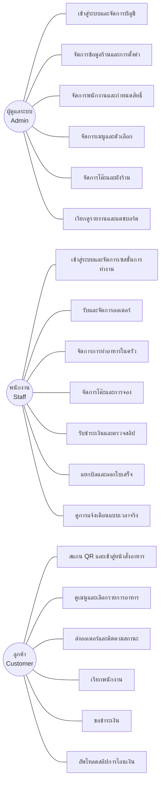

> **หมายเหตุ**: คณะผู้จัดทำใช้ Mermaid Diagram เป็นต้นแบบสำหรับการสร้างแผนภาพ จากนั้นนำโค้ดดังกล่าวไปวาดต่อในโปรแกรม draw.io และส่งออกเป็นไฟล์ภาพ PNG เพื่อใช้ในเอกสารรายงาน

---

## 3.4 ภาพรวมการทำงานของระบบ (System Overview Diagram)

เพื่อให้เห็นถึงความสัมพันธ์และหน้าที่รับผิดชอบในแต่ละขั้นตอนของระบบบริหารธุรกิจร้านอาหารผ่านเว็บพร้อมระบบ POS อย่างชัดเจน คณะผู้จัดทำได้ออกแบบแผนภาพภาพรวมการทำงานของระบบ โดยแบ่งแยกตามบทบาท (Swimlane) ออกเป็น 3 ส่วนหลัก ได้แก่ ลูกค้า (Customer) พนักงาน (Staff) และระบบประมวลผล (System) ซึ่งครอบคลุมขั้นตอนตั้งแต่ลูกค้าเข้ามาในร้าน การสั่งอาหาร การทำอาหาร การเสิร์ฟ การชำระเงิน ไปจนถึงการปิดบิล โดยมีรายละเอียดการไหลของข้อมูลในแต่ละส่วนดังนี้

### 3.4.1 ส่วนของลูกค้า (Customer)

ลูกค้าเป็นผู้เริ่มต้นกระบวนการของระบบ โดยลูกค้าสามารถเข้าใช้งานได้ใน 2 รูปแบบ คือ การแจ้งความประสงค์การสั่งอาหารกับพนักงานเสริฟโดยตรง หรือการสแกนรหัสคิวอาร์ที่โต๊ะเพื่อสั่งอาหารด้วยตนเองผ่านเว็บบนอุปกรณ์เคลื่อนที่ (Mobile Web)

ในกรณีของการสั่งอาหารด้วยตนเอง ลูกค้าจะตั้งชื่อเล่นเพื่อเข้าสู่เซสชั่นของโต๊ะ จากนั้นเลือกเมนูพร้อมระบุตัวเลือกเสริม และส่งออเดอร์เข้าสู่ระบบ ระหว่างรอลูกค้าสามารถติดตามสถานะของรายการอาหารแบบเวลาจริง ตั้งแต่กำลังทำ พร้อมเสิร์ฟ ไปจนถึงเสิร์ฟแล้ว เมื่อต้องการความช่วยเหลือลูกค้าสามารถกดปุ่มเรียกพนักงาน และเมื่อพร้อมชำระเงินลูกค้าสามารถกดขอชำระเงินผ่านระบบ พร้อมเลือกวิธีการชำระระหว่างเงินสดและการสแกนคิวอาร์โค้ดเพื่อโอนเงิน หากเลือกการโอนเงิน ลูกค้าจะอัพโหลดสลิปการโอนเงินผ่าน Mobile Web เพื่อให้ระบบตรวจสอบความถูกต้องด้วยระบบรู้จำตัวอักษรด้วยภาพ (Optical Character Recognition หรือ OCR) โดยอัตโนมัติ

### 3.4.2 ส่วนของพนักงาน (Staff)

พนักงานเป็นผู้ปฏิบัติงานภายในร้าน ครอบคลุม 3 ตำแหน่งหลัก ได้แก่ พนักงานเสริฟ พนักงานครัว และพนักงานแคชเชียร์ โดยแต่ละตำแหน่งมีหน้าที่ที่แตกต่างกันและทำงานประสานกันผ่านระบบ

พนักงานเสริฟมีหน้าที่เปิดโต๊ะให้ลูกค้า รับออเดอร์ที่โต๊ะในกรณีที่ลูกค้าไม่สั่งด้วยตนเอง รับการแจ้งเตือนเมื่ออาหารพร้อมเสิร์ฟ ยกอาหารไปเสิร์ฟที่โต๊ะ และเปลี่ยนสถานะของรายการอาหารเป็น "เสิร์ฟแล้ว" รวมถึงการจัดการผังโต๊ะและการเชื่อมโต๊ะ (Table Link) สำหรับลูกค้ากลุ่มใหญ่

พนักงานครัวปฏิบัติงานผ่านหน้าจอแสดงรายการอาหาร (Kitchen Display) ที่แยกตามประเภทเมนู ทั้งอาหาร เครื่องดื่ม และของหวาน เมื่อมีออเดอร์ใหม่จากระบบ พนักงานครัวจะเห็นรายการอาหารพร้อมตัวเลือกที่ลูกค้าเลือก จากนั้นกดเริ่มทำเพื่อเปลี่ยนสถานะเป็น "กำลังทำ" และเมื่อทำเสร็จกดยืนยันเพื่อเปลี่ยนสถานะเป็น "พร้อมเสิร์ฟ"

พนักงานแคชเชียร์เปิดเซสชั่นการทำงาน (Cashier Session) พร้อมระบุยอดเงินสดเริ่มต้น ตรวจสอบสลิปการโอนเงินที่ลูกค้าอัพโหลด ดำเนินการรับชำระเงินทั้งเงินสดและการโอนผ่านคิวอาร์โค้ด หากพบความผิดปกติของสลิปสามารถปฏิเสธการชำระเงินได้ ในขณะที่หากสลิปถูกต้องระบบจะเปลี่ยนสถานะบิลเป็น "ชำระแล้ว" และเมื่อสิ้นกะพนักงานจะปิดเซสชั่นพร้อมเปรียบเทียบยอดเงินสดจริงกับยอดที่ระบบคำนวณ

### 3.4.3 ส่วนของระบบประมวลผล (System)

ระบบทำหน้าที่เป็นตัวกลางในการประมวลผลและจัดการข้อมูลทั้งหมด ตั้งแต่การตรวจสอบความถูกต้องของโทเค็นคิวอาร์โค้ดเมื่อลูกค้าสแกน การสร้างเซสชั่นของลูกค้าและพนักงาน การบันทึกออเดอร์ลงในฐานข้อมูล การคำนวณราคารวมพร้อมค่าบริการและภาษีมูลค่าเพิ่ม รวมถึงการแยกบิลตามรายการหรือตามจำนวนเงินเมื่อลูกค้าร้องขอ

นอกจากนี้ ระบบยังทำหน้าที่กระจายการแจ้งเตือนแบบเวลาจริงผ่านเทคโนโลยี SignalR ไปยังกลุ่มผู้ใช้งานที่เกี่ยวข้องโดยอัตโนมัติ เช่น แจ้งเตือนพนักงานครัวเมื่อมีออเดอร์ใหม่ แจ้งเตือนพนักงานเสริฟเมื่ออาหารพร้อมเสิร์ฟ และแจ้งเตือนพนักงานแคชเชียร์เมื่อลูกค้าขอชำระเงิน รวมถึงการประมวลผลรูปสลิปการโอนเงินด้วยระบบ OCR เพื่ออ่านยอดเงิน วันที่ และเลขบัญชีปลายทาง พร้อมเปรียบเทียบกับข้อมูลที่ระบบบันทึกไว้โดยอัตโนมัติ และอัพเดตสถานะของรายการอาหาร ออเดอร์ บิล และโต๊ะตามขั้นตอนการทำงานที่กำหนดไว้

### 3.4.4 แผนภาพภาพรวมการทำงาน

แผนภาพต่อไปนี้แสดงการไหลของข้อมูลและการประสานงานระหว่าง 3 บทบาทหลักของระบบ โดยคณะผู้จัดทำใช้ Mermaid Diagram เป็นต้นแบบ และนำโค้ดดังกล่าวไปวาดต่อเป็นแผนภาพ Swimlane ในโปรแกรม draw.io เพื่อส่งออกเป็นไฟล์ภาพ PNG สำหรับใช้ในรายงาน

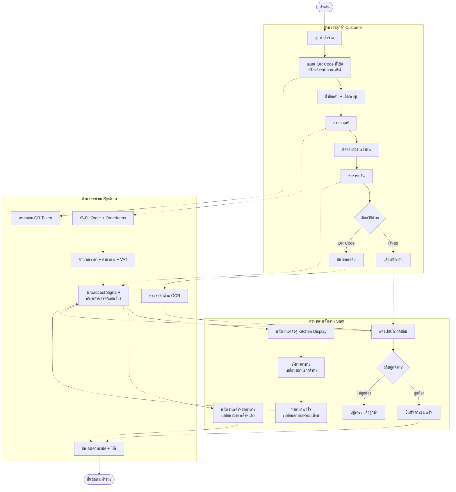

---

## 3.5 การออกแบบการทำงานของระบบ (System Flowchart)

การออกแบบการทำงานของระบบประกอบด้วยแผนภาพการทำงานหลัก 10 ส่วน โดยใช้รูปแบบ Mermaid Diagram ซึ่งสามารถนำไปวาดต่อใน draw.io ได้ทันที

### 3.5.1 แผนภาพการทำงานส่วนการเข้าสู่ระบบและตรวจสอบสิทธิ์

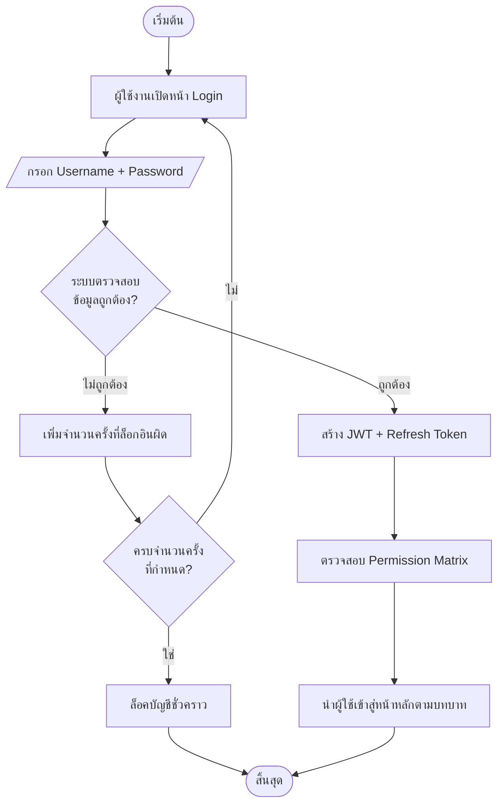

**คำอธิบายขั้นตอนการทำงาน:**
- ผู้ใช้งานกรอก Username และ Password ที่หน้า Login
- ระบบตรวจสอบข้อมูลที่กรอกกับฐานข้อมูล หากไม่ถูกต้องจะเพิ่มจำนวนครั้งที่ล็อกอินผิด
- หากครบจำนวนครั้งที่กำหนด ระบบจะล็อคบัญชีชั่วคราวตาม Lockout Policy
- หากข้อมูลถูกต้อง ระบบจะสร้าง JWT และ Refresh Token พร้อมตรวจสอบสิทธิ์ผ่าน Permission Matrix
- ระบบจะนำผู้ใช้เข้าสู่หน้าหลักตามบทบาทที่ได้รับ

### 3.5.2 แผนภาพการทำงานส่วนการจัดการเมนูอาหาร

### 3.5.3 แผนภาพการทำงานส่วนการสั่งอาหารผ่าน QR Code (Self-Order)

### 3.5.4 แผนภาพการทำงานส่วนการสร้าง Order โดยพนักงาน

### 3.5.5 แผนภาพการทำงานส่วน Kitchen Display และ State Machine

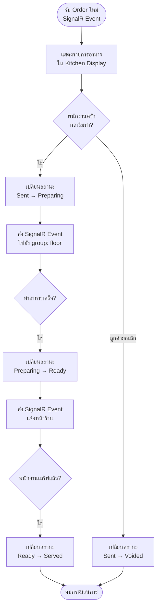

### 3.5.6 แผนภาพการทำงานส่วนการปิดบิลและ Split Bill

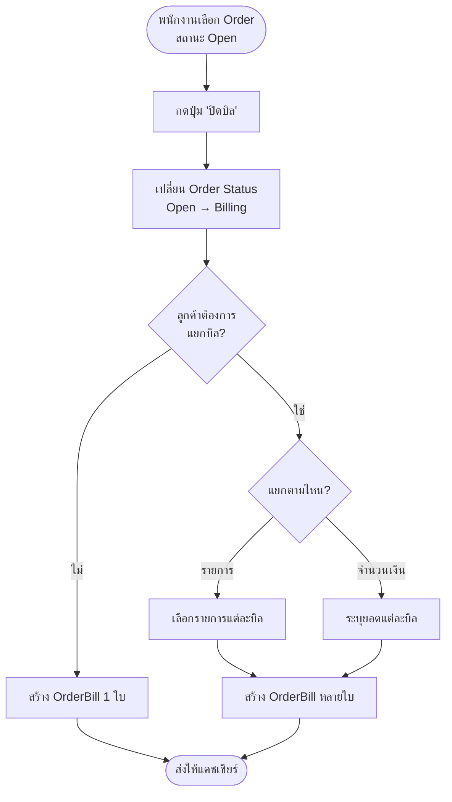

### 3.5.7 แผนภาพการทำงานส่วนการชำระเงินและ OCR Slip Verification

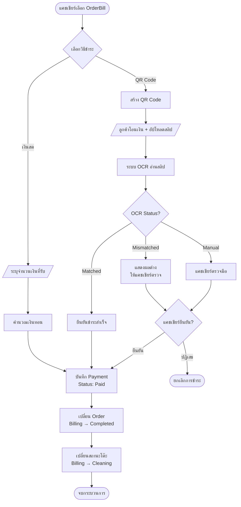

### 3.5.8 แผนภาพการทำงานส่วนการจัดการสถานะโต๊ะ

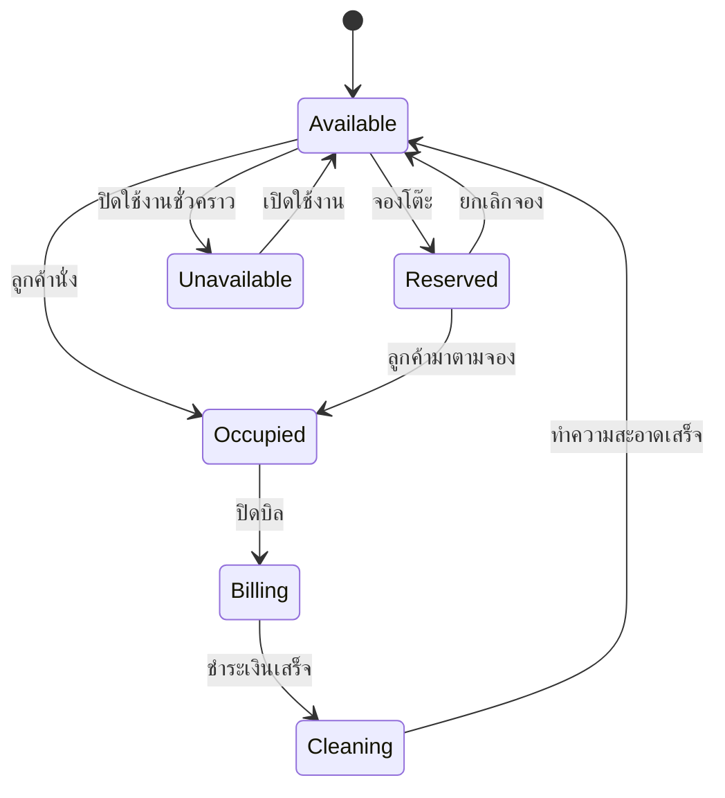

### 3.5.9 แผนภาพการทำงานส่วน Permission Matrix

### 3.5.10 แผนภาพการทำงานส่วนแจ้งเตือน Real-time ผ่าน SignalR

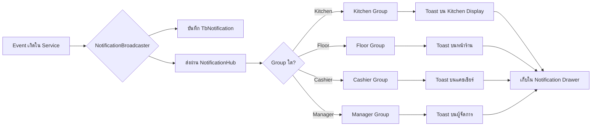

---

## 3.6 การออกแบบฐานข้อมูล (Data Dictionary)

จากขั้นตอนการออกแบบและพัฒนาระบบบริหารธุรกิจร้านอาหารผ่านเว็บพร้อมระบบ POS คณะผู้จัดทำได้ออกแบบฐานข้อมูลเพื่อใช้ในการจัดเก็บข้อมูลที่เกี่ยวข้องกับการดำเนินงานของร้านอาหารทั้งหมด โดยใช้ระบบฐานข้อมูลเชิงสัมพันธ์ (Relational Database) ผ่าน Microsoft SQL Server ซึ่งฐานข้อมูลประกอบด้วยทั้งหมด 34 ตาราง จัดแบ่งตาม 8 โมดูลธุรกิจของระบบ ได้แก่ ตารางเก็บข้อมูลตำแหน่งงาน ตารางเก็บประเภทสิทธิ์การใช้งาน ตารางเก็บโมดูลของระบบ ตารางเก็บเมทริกซ์สิทธิ์ ตารางเก็บการกำหนดสิทธิ์ตามตำแหน่ง ตารางเก็บข้อมูลบัญชีผู้ใช้ ตารางเก็บการตั้งค่าร้าน ตารางเก็บเวลาทำการรายวัน ตารางเก็บการตั้งค่าค่าบริการ ตารางเก็บข้อมูลไฟล์ที่อัพโหลด ตารางเก็บโทเค็นต่ออายุการเข้าสู่ระบบ ตารางเก็บโทเค็นรีเซ็ตรหัสผ่าน ตารางเก็บประวัติรหัสผ่าน ตารางเก็บข้อมูลพนักงาน ตารางเก็บหมวดหมู่ย่อยของเมนู ตารางเก็บรายการเมนูอาหาร ตารางเก็บกลุ่มตัวเลือกเสริม ตารางเก็บรายการตัวเลือก ตารางเชื่อมเมนูกับกลุ่มตัวเลือก ตารางเก็บโซนพื้นที่ของร้าน ตารางเก็บข้อมูลโต๊ะ ตารางเก็บการเชื่อมโต๊ะ ตารางเก็บวัตถุประดับในผังร้าน ตารางเก็บการจองโต๊ะ ตารางเก็บออเดอร์ ตารางเก็บรายการอาหารในออเดอร์ ตารางเก็บตัวเลือกของรายการอาหาร ตารางเก็บบิล ตารางเก็บเซสชั่นลูกค้าสำหรับ Self-Order ตารางเก็บเซสชั่นการทำงานของแคชเชียร์ ตารางเก็บรายการเงินสดเข้า-ออกลิ้นชัก ตารางเก็บการชำระเงิน ตารางเก็บการแจ้งเตือน และตารางเก็บสถานะการอ่านการแจ้งเตือน

ในรายงานฉบับนี้จะนำเสนอตารางหลัก 10 ตารางที่เป็นโครงสร้างสำคัญของระบบ ส่วนรายละเอียดของตารางทั้งหมดสามารถดูได้จากภาคผนวก พจนานุกรมข้อมูล (Data Dictionary) ซึ่งมีรายละเอียดดังนี้

### 3.6.0 การกำหนดตัวเลือกที่ตายตัว (ENUMS)

1. **EOrderStatus**: สถานะออเดอร์ ได้แก่ Open (กำลังสั่ง), Billing (เริ่มปิดบิล), Completed (เสร็จสิ้น)
2. **EOrderItemStatus**: สถานะรายการอาหาร ได้แก่ Pending (รอส่ง), Sent (ส่งครัว), Preparing (กำลังทำ), Ready (พร้อมเสริฟ), Served (เสริฟแล้ว), Voided (ยกเลิกหลังส่ง), Cancelled (ยกเลิกก่อนส่ง)
3. **ETableStatus**: สถานะโต๊ะ ได้แก่ Available, Reserved, Occupied, Billing, Cleaning, Unavailable
4. **EPaymentMethod**: วิธีชำระเงิน ได้แก่ Cash (เงินสด), QrPayment (QR Code)
5. **EPaymentStatus**: สถานะการชำระเงิน ได้แก่ Pending, Paid, Refunded
6. **ESlipVerificationStatus**: สถานะการตรวจสลิป ได้แก่ None, Matched, Mismatched, Manual
7. **ECategoryType**: ประเภทหมวดเมนู ได้แก่ Food, Beverage, Dessert
8. **EMenuTag**: แท็กเมนู ได้แก่ Recommended, Seasonal, SlowPreparation
9. **ENotificationGroup**: กลุ่มผู้รับแจ้งเตือน ได้แก่ Kitchen, Floor, Cashier, Manager
10. **EFloorObjectType**: ประเภทวัตถุภายในร้าน ได้แก่ Restroom, Stairs, Counter, Kitchen, Exit, Cashier, Plant, Decoration

### 3.6.1 ตาราง TbUser (ข้อมูลผู้ใช้งาน)

**หน้าที่**: เก็บข้อมูลบัญชีผู้ใช้งานสำหรับเข้าสู่ระบบ

| ชื่อฟิลด์ | ชนิดข้อมูล | คีย์ | ว่างได้ | คำอธิบาย |
|----------|------------|------|---------|----------|
| Id | INT | PK | No | รหัสผู้ใช้งาน (Auto Increment) |
| Username | NVARCHAR(50) | - | No | ชื่อผู้ใช้ (Unique) |
| PasswordHash | NVARCHAR(255) | - | No | รหัสผ่านที่เข้ารหัสด้วย BCrypt |
| RefreshToken | NVARCHAR(500) | - | Yes | Refresh Token สำหรับต่ออายุ Session |
| RefreshTokenExpiresAt | DATETIME2 | - | Yes | วันเวลาหมดอายุของ Refresh Token |
| PositionId | INT | FK | No | รหัสตำแหน่งงาน (อ้างอิง TbPosition) |
| EmployeeId | INT | FK | Yes | รหัสพนักงาน (อ้างอิง TbEmployee) |
| FailedLoginCount | INT | - | No | จำนวนครั้งที่ล็อกอินผิด |
| LockedUntil | DATETIME2 | - | Yes | วันเวลาที่ปลดล็อค |
| IsActive | BIT | - | No | สถานะการใช้งานบัญชี |
| CreatedAt | DATETIME2 | - | No | วันที่สร้างบัญชี (BaseEntity) |

**ตารางที่ 3.1** TbUser (ข้อมูลผู้ใช้งาน)

### 3.6.2 ตาราง TbPosition (ตำแหน่งงาน)

**หน้าที่**: เก็บข้อมูลตำแหน่งงานในร้าน

| ชื่อฟิลด์ | ชนิดข้อมูล | คีย์ | ว่างได้ | คำอธิบาย |
|----------|------------|------|---------|----------|
| Id | INT | PK | No | รหัสตำแหน่ง |
| Name | NVARCHAR(100) | - | No | ชื่อตำแหน่งงาน |
| Description | NVARCHAR(500) | - | Yes | คำอธิบายเพิ่มเติม |
| IsActive | BIT | - | No | สถานะการใช้งาน |

**ตารางที่ 3.2** TbPosition (ตำแหน่งงาน)

### 3.6.3 ตาราง TbPermissionMatrix (สิทธิ์การเข้าถึง)

**หน้าที่**: เก็บข้อมูลสิทธิ์การเข้าถึงของแต่ละตำแหน่ง

| ชื่อฟิลด์ | ชนิดข้อมูล | คีย์ | ว่างได้ | คำอธิบาย |
|----------|------------|------|---------|----------|
| Id | INT | PK | No | รหัสสิทธิ์ |
| PositionId | INT | FK | No | รหัสตำแหน่ง (อ้างอิง TbPosition) |
| ModuleId | INT | FK | No | รหัส Module |
| CanRead | BIT | - | No | สิทธิ์อ่านข้อมูล |
| CanCreate | BIT | - | No | สิทธิ์สร้างข้อมูล |
| CanUpdate | BIT | - | No | สิทธิ์แก้ไขข้อมูล |
| CanDelete | BIT | - | No | สิทธิ์ลบข้อมูล |

**ตารางที่ 3.3** TbPermissionMatrix (สิทธิ์การเข้าถึง)

### 3.6.4 ตาราง TbEmployee (ข้อมูลพนักงาน)

**หน้าที่**: เก็บข้อมูลพนักงานของร้าน

| ชื่อฟิลด์ | ชนิดข้อมูล | คีย์ | ว่างได้ | คำอธิบาย |
|----------|------------|------|---------|----------|
| Id | INT | PK | No | รหัสพนักงาน |
| FirstName | NVARCHAR(100) | - | No | ชื่อ |
| LastName | NVARCHAR(100) | - | No | นามสกุล |
| NickName | NVARCHAR(50) | - | Yes | ชื่อเล่น |
| Phone | NVARCHAR(20) | - | Yes | เบอร์โทรศัพท์ |
| Email | NVARCHAR(255) | - | Yes | อีเมล |
| StartDate | DATETIME2 | - | No | วันเริ่มงาน |
| EndDate | DATETIME2 | - | Yes | วันสิ้นสุดงาน |
| ProfileImageId | INT | FK | Yes | รหัสไฟล์รูปประจำตัว |
| IsActive | BIT | - | No | สถานะการทำงาน |

**ตารางที่ 3.4** TbEmployee (ข้อมูลพนักงาน)

### 3.6.5 ตาราง TbMenu (ข้อมูลเมนูอาหาร)

**หน้าที่**: เก็บข้อมูลเมนูอาหารและเครื่องดื่ม

| ชื่อฟิลด์ | ชนิดข้อมูล | คีย์ | ว่างได้ | คำอธิบาย |
|----------|------------|------|---------|----------|
| Id | INT | PK | No | รหัสเมนู |
| Name | NVARCHAR(200) | - | No | ชื่อเมนู |
| Description | NVARCHAR(MAX) | - | Yes | คำอธิบาย |
| Price | DECIMAL(18,2) | - | No | ราคา |
| CategoryId | INT | FK | No | รหัสหมวดหมู่ |
| ImageFileId | INT | FK | Yes | รหัสไฟล์รูป |
| Tag | INT | - | Yes | แท็กเมนู (EMenuTag) |
| IsAvailable | BIT | - | No | พร้อมขายหรือไม่ |
| IsPinned | BIT | - | No | ปักหมุดเมนูแนะนำ |

**ตารางที่ 3.5** TbMenu (ข้อมูลเมนูอาหาร)

### 3.6.6 ตาราง TbZone และ TbTable (โซนและโต๊ะ)

**หน้าที่**: เก็บข้อมูลโซนและโต๊ะในร้าน

| ชื่อฟิลด์ TbTable | ชนิดข้อมูล | คีย์ | ว่างได้ | คำอธิบาย |
|------------------|------------|------|---------|----------|
| Id | INT | PK | No | รหัสโต๊ะ |
| Name | NVARCHAR(50) | - | No | ชื่อ/เลขโต๊ะ |
| ZoneId | INT | FK | No | รหัสโซน |
| Seats | INT | - | No | จำนวนที่นั่ง |
| Status | INT | - | No | สถานะโต๊ะ (ETableStatus) |
| PositionX | DECIMAL | - | No | พิกัด X บนผังร้าน |
| PositionY | DECIMAL | - | No | พิกัด Y บนผังร้าน |

**ตารางที่ 3.6** TbTable (ข้อมูลโต๊ะ)

### 3.6.7 ตาราง TbOrder (ข้อมูลออเดอร์)

**หน้าที่**: เก็บข้อมูลออเดอร์แต่ละครั้ง

| ชื่อฟิลด์ | ชนิดข้อมูล | คีย์ | ว่างได้ | คำอธิบาย |
|----------|------------|------|---------|----------|
| Id | INT | PK | No | รหัสออเดอร์ |
| OrderNumber | NVARCHAR(50) | - | No | เลขที่ออเดอร์ (YYYYMMDD-NNN) |
| TableId | INT | FK | Yes | รหัสโต๊ะ |
| Status | INT | - | No | สถานะออเดอร์ (EOrderStatus) |
| OrderedBy | NVARCHAR(100) | - | Yes | ผู้สั่ง (employee:id หรือ customer:sessionId) |
| TotalAmount | DECIMAL(18,2) | - | No | ยอดรวม |

**ตารางที่ 3.7** TbOrder (ข้อมูลออเดอร์)

### 3.6.8 ตาราง TbOrderItem (รายการอาหารใน Order)

**หน้าที่**: เก็บข้อมูลรายการอาหารแต่ละรายการในออเดอร์

| ชื่อฟิลด์ | ชนิดข้อมูล | คีย์ | ว่างได้ | คำอธิบาย |
|----------|------------|------|---------|----------|
| Id | INT | PK | No | รหัสรายการอาหาร |
| OrderId | INT | FK | No | รหัสออเดอร์ |
| MenuId | INT | FK | No | รหัสเมนู |
| MenuName | NVARCHAR(200) | - | No | ชื่อเมนู (Snapshot) |
| Price | DECIMAL(18,2) | - | No | ราคา (Snapshot) |
| Quantity | INT | - | No | จำนวน |
| Status | INT | - | No | สถานะ (EOrderItemStatus) |
| VoidReason | NVARCHAR(500) | - | Yes | เหตุผลในการ Void |

**ตารางที่ 3.8** TbOrderItem (รายการอาหาร)

### 3.6.9 ตาราง TbOrderBill และ TbPayment (บิลและการชำระเงิน)

**หน้าที่**: เก็บข้อมูลบิลและการชำระเงิน

| ชื่อฟิลด์ TbPayment | ชนิดข้อมูล | คีย์ | ว่างได้ | คำอธิบาย |
|--------------------|------------|------|---------|----------|
| Id | INT | PK | No | รหัส Payment |
| OrderBillId | INT | FK | No | รหัสบิล |
| Method | INT | - | No | วิธีชำระ (EPaymentMethod) |
| Amount | DECIMAL(18,2) | - | No | จำนวนเงิน |
| Status | INT | - | No | สถานะ (EPaymentStatus) |
| SlipImageId | INT | FK | Yes | รหัสไฟล์สลิป |
| SlipVerificationStatus | INT | - | Yes | สถานะตรวจสลิป (ESlipVerificationStatus) |
| PaidAt | DATETIME2 | - | Yes | วันเวลาชำระสำเร็จ |

**ตารางที่ 3.9** TbPayment (ข้อมูลการชำระเงิน)

### 3.6.10 ตาราง TbCashierSession (Session ลิ้นชักเงินสด)

**หน้าที่**: เก็บข้อมูล Session การเปิด-ปิดลิ้นชักเงินสดของแคชเชียร์

| ชื่อฟิลด์ | ชนิดข้อมูล | คีย์ | ว่างได้ | คำอธิบาย |
|----------|------------|------|---------|----------|
| Id | INT | PK | No | รหัส Session |
| UserId | INT | FK | No | รหัสแคชเชียร์ที่เปิดกะ |
| OpenedAt | DATETIME2 | - | No | วันเวลาเปิดกะ |
| ClosedAt | DATETIME2 | - | Yes | วันเวลาปิดกะ |
| InitialCash | DECIMAL(18,2) | - | No | ยอดเงินสดเริ่มต้น |
| FinalCash | DECIMAL(18,2) | - | Yes | ยอดเงินสดสิ้นกะ |
| ExpectedCash | DECIMAL(18,2) | - | Yes | ยอดที่ระบบคำนวณได้ |
| Difference | DECIMAL(18,2) | - | Yes | ผลต่าง |

**ตารางที่ 3.10** TbCashierSession (Session ลิ้นชักเงินสด)

---

## 3.7 แผนภาพความสัมพันธ์ของเอนทิตี (Entity-Relationship Diagram)

ในการพัฒนาระบบ คณะผู้จัดทำได้ออกแบบโครงสร้างฐานข้อมูลเชิงสัมพันธ์โดยมีเอนทิตี (Entity) ทั้งหมด 37 ตาราง เพื่อให้ผู้อ่านสามารถพิจารณาความสัมพันธ์ของข้อมูลได้อย่างชัดเจนและไม่หนาแน่นเกินไป รายงานฉบับนี้จึงแสดงแผนภาพ ER แยกตามขอบเขตของแต่ละโมดูลธุรกิจ รวม 7 รูป โดยซอร์สโค้ดของแผนภาพแต่ละรูปในรูปแบบ DBML สำหรับนำไปสร้างบนเครื่องมือ dbdiagram.io จัดเก็บไว้ในโฟลเดอร์ `doc/dbdiagram/` ดังรายละเอียดต่อไปนี้

### 3.7.1 ER Diagram ส่วน Authentication และ User Account

ส่วนนี้ครอบคลุมการยืนยันตัวตนของผู้ใช้งานระบบ ประกอบด้วยข้อมูลบัญชีผู้ใช้ การจัดการโทเค็นการเข้าใช้งาน ประวัติรหัสผ่านเพื่อป้องกันการนำกลับมาใช้ซ้ำ และโทเค็นสำหรับการกู้คืนรหัสผ่านผ่านรหัสครั้งเดียว (OTP)

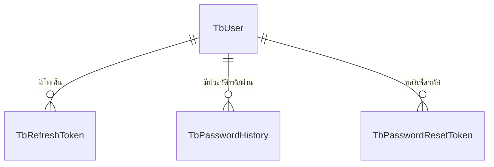

**รูปที่ 3.11 แผนภาพความสัมพันธ์ของเอนทิตี ส่วน Authentication และ User Account**

### 3.7.2 ER Diagram ส่วน Authorization และ Human Resource

ส่วนนี้ครอบคลุมการกำหนดสิทธิ์การเข้าถึงตามตำแหน่งงาน ผ่านกลไกเมทริกซ์สิทธิ์ (Permission Matrix) ที่เชื่อมโยงโมดูล สิทธิ์ และตำแหน่งงาน ร่วมกับข้อมูลพนักงานที่ผูกกับตำแหน่ง พร้อมข้อมูลส่วนตัวของพนักงาน ได้แก่ ที่อยู่ ประวัติการศึกษา และประวัติการทำงาน

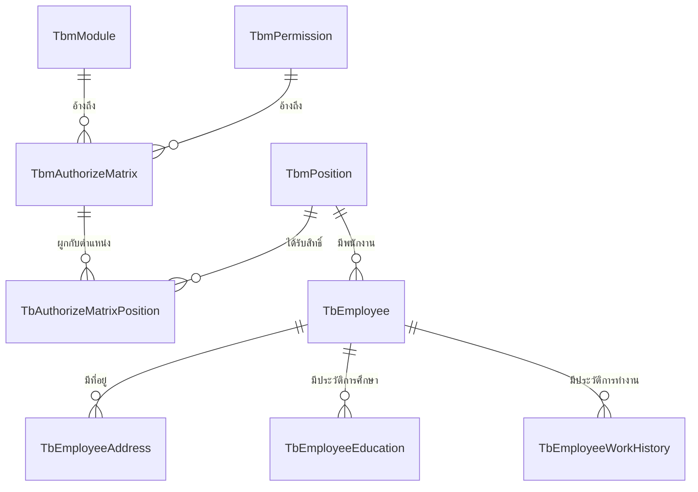

**รูปที่ 3.12 แผนภาพความสัมพันธ์ของเอนทิตี ส่วน Authorization และ Human Resource**

### 3.7.3 ER Diagram ส่วน Admin Settings และ File

ส่วนนี้ครอบคลุมการตั้งค่าข้อมูลของร้านในรูปแบบเดี่ยว (Singleton) เวลาทำการรายวัน และค่าบริการ ตลอดจนระบบจัดเก็บไฟล์ (File Management) ที่เป็นจุดอ้างอิงกลางของระบบสำหรับไฟล์รูปภาพต่าง ๆ เช่น โลโก้ร้านและคิวอาร์โค้ดสำหรับชำระเงิน

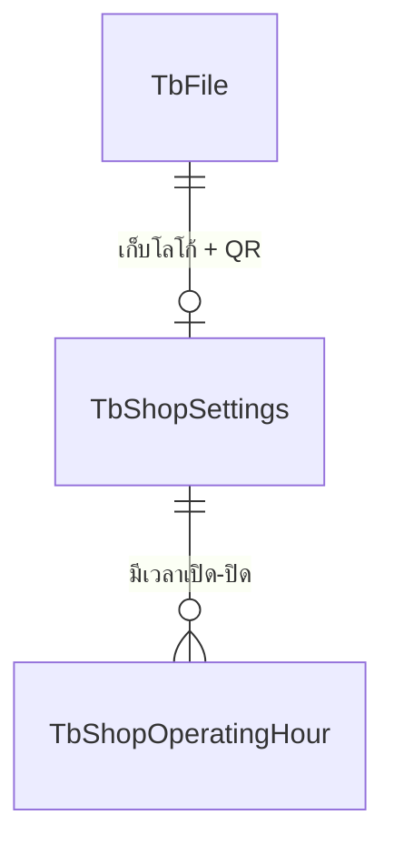

**รูปที่ 3.13 แผนภาพความสัมพันธ์ของเอนทิตี ส่วน Admin Settings และ File**

### 3.7.4 ER Diagram ส่วน Menu Management

ส่วนนี้ครอบคลุมการจัดการเมนูอาหาร หมวดหมู่ย่อย และกลุ่มตัวเลือกเสริม (Option Group) โดยมีตารางเชื่อม TbMenuOptionGroup สำหรับจัดความสัมพันธ์แบบกลุ่มต่อกลุ่ม (Many-to-Many) ระหว่างเมนูกับกลุ่มตัวเลือก พร้อมการเก็บรูปเมนูในระบบไฟล์

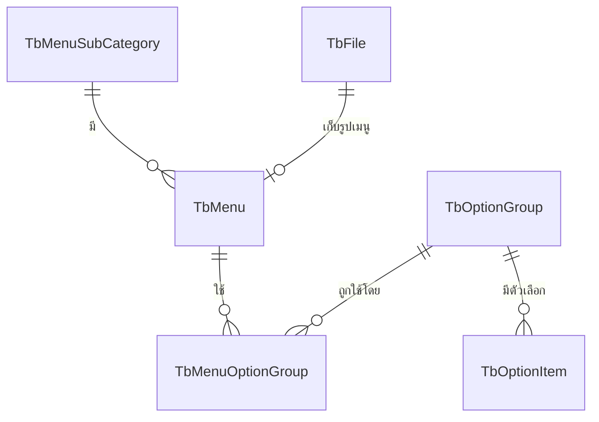

**รูปที่ 3.14 แผนภาพความสัมพันธ์ของเอนทิตี ส่วน Menu Management**

### 3.7.5 ER Diagram ส่วน Table Management และ Customer Self-Order

ส่วนนี้ครอบคลุมการจัดการโซนพื้นที่ ผังโต๊ะ และวัตถุประดับภายในร้าน (Floor Object) ตลอดจนการจองโต๊ะล่วงหน้า การเชื่อมโต๊ะ (Table Link) สำหรับลูกค้ากลุ่มใหญ่ และเซสชั่นของลูกค้าที่สั่งอาหารผ่านการสแกนคิวอาร์โค้ดที่โต๊ะ

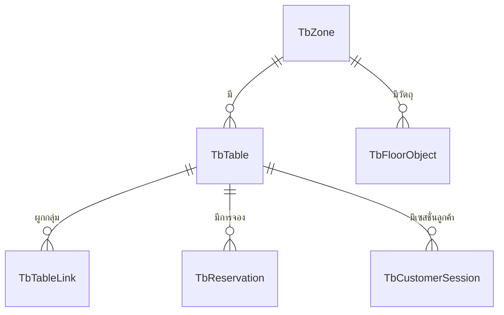

**รูปที่ 3.15 แผนภาพความสัมพันธ์ของเอนทิตี ส่วน Table Management และ Customer Self-Order**

### 3.7.6 ER Diagram ส่วน Order และ Payment

ส่วนนี้ครอบคลุมการรับและประมวลผลออเดอร์ ตั้งแต่ออเดอร์หลัก รายการอาหารและตัวเลือก (Snapshot) บิลที่รองรับการแยกบิล (Split Bill) ไปจนถึงการชำระเงินผ่านรอบการทำงานของแคชเชียร์ (Cashier Session) และการบันทึกเงินสดเข้า-ออกลิ้นชัก

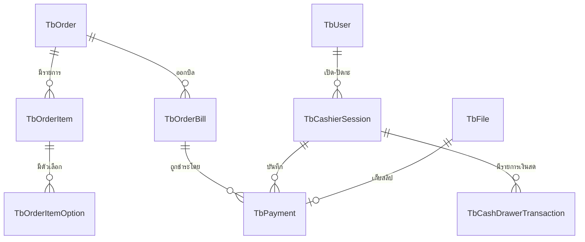

**รูปที่ 3.16 แผนภาพความสัมพันธ์ของเอนทิตี ส่วน Order และ Payment**

### 3.7.7 ER Diagram ส่วน Notification

ส่วนนี้ครอบคลุมระบบแจ้งเตือนแบบเวลาจริง ประกอบด้วยตารางบันทึกการแจ้งเตือนที่อ้างถึงเหตุการณ์ในระบบ (เช่น ออเดอร์ โต๊ะ และการจอง) และตารางบันทึกสถานะการอ่านของผู้ใช้งานแต่ละราย เพื่อแสดงตัวนับจำนวนข้อความที่ยังไม่ได้อ่าน (Badge)

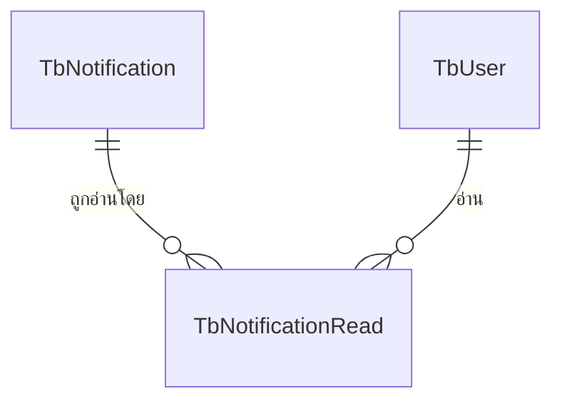

**รูปที่ 3.17 แผนภาพความสัมพันธ์ของเอนทิตี ส่วน Notification**

### 3.7.8 คำอธิบายความสัมพันธ์ของระบบฐานข้อมูล

จากแผนภาพ ER-Diagram ระบบถูกออกแบบให้มีความสัมพันธ์แบบหนึ่งต่อกลุ่ม (One-to-Many หรือ 1:N) เป็นหลัก โดยมีบางส่วนที่เป็นความสัมพันธ์แบบหนึ่งต่อหนึ่ง (One-to-One หรือ 1:1) และบางส่วนเป็นความสัมพันธ์แบบกลุ่มต่อกลุ่ม (Many-to-Many หรือ M:N) ที่จัดการผ่านตารางเชื่อมโยง (Junction Table) โดยมีรายละเอียดของความสัมพันธ์ที่สำคัญดังนี้

1. **TbmPosition กับ TbEmployees (1:N)**: ตำแหน่งงาน 1 ตำแหน่งสามารถมีพนักงานได้หลายคน แต่พนักงานแต่ละคนจะมีเพียง 1 ตำแหน่งเท่านั้น (เชื่อมโยงผ่าน PositionId)

2. **TbmPosition กับ TbmAuthorizeMatrix (M:N)**: ตำแหน่งงาน 1 ตำแหน่งสามารถได้รับสิทธิ์การเข้าถึงโมดูลและการดำเนินการได้หลายรายการ และในทางกลับกัน 1 สิทธิ์การเข้าถึงสามารถถูกกำหนดให้กับหลายตำแหน่งได้ โดยจัดการผ่านตารางเชื่อม TbAuthorizeMatrixPosition

3. **TbUsers กับ TbEmployees (1:1)**: บัญชีผู้ใช้งาน 1 บัญชีจะเชื่อมโยงกับข้อมูลพนักงาน 1 คน และในทางกลับกันพนักงาน 1 คนจะมีบัญชีผู้ใช้งานเพียง 1 บัญชี (เชื่อมโยงผ่าน UserId)

4. **TbUsers กับ TbRefreshTokens (1:N)**: ผู้ใช้งาน 1 บัญชีสามารถมีโทเค็นการต่ออายุการเข้าสู่ระบบได้หลายโทเค็น (สำหรับการเข้าใช้งานจากหลายอุปกรณ์) (เชื่อมโยงผ่าน UserId)

5. **TbShopSettings กับ TbShopOperatingHours (1:N)**: การตั้งค่าร้านมีเพียง 1 เรคคอร์ดแต่สามารถมีเวลาทำการได้ 7 รายการครอบคลุมจันทร์ถึงอาทิตย์ (เชื่อมโยงผ่าน ShopSettingsId)

6. **TbMenuSubCategories กับ TbMenus (1:N)**: หมวดหมู่ย่อย 1 หมวดสามารถมีรายการเมนูได้หลายรายการ แต่เมนูแต่ละรายการจะอยู่ในหมวดหมู่เดียว (เชื่อมโยงผ่าน SubCategoryId)

7. **TbMenus กับ TbOptionGroups (M:N)**: เมนู 1 รายการสามารถมีกลุ่มตัวเลือกเสริมได้หลายกลุ่ม และกลุ่มตัวเลือก 1 กลุ่มสามารถนำไปใช้ในเมนูได้หลายรายการ โดยจัดการผ่านตารางเชื่อม TbMenuOptionGroups

8. **TbOptionGroups กับ TbOptionItems (1:N)**: กลุ่มตัวเลือก 1 กลุ่มสามารถมีตัวเลือกย่อยได้หลายตัวเลือก เช่น กลุ่ม "ระดับความเผ็ด" มีตัวเลือก เผ็ดน้อย เผ็ดกลาง และเผ็ดมาก (เชื่อมโยงผ่าน OptionGroupId)

9. **TbZones กับ TbTables (1:N)**: โซน 1 โซนสามารถมีโต๊ะได้หลายโต๊ะ แต่โต๊ะแต่ละตัวจะอยู่ในโซนเดียวเท่านั้น (เชื่อมโยงผ่าน ZoneId)

10. **TbTables กับ TbOrders (1:N)**: โต๊ะ 1 โต๊ะสามารถมีออเดอร์ได้หลายรอบตามช่วงเวลาที่ลูกค้าเข้ามาใช้บริการ แต่ละออเดอร์จะผูกกับโต๊ะเดียว (เชื่อมโยงผ่าน TableId)

11. **TbTables กับ TbReservations (1:N)**: โต๊ะ 1 โต๊ะสามารถมีการจองล่วงหน้าได้หลายรายการในวันเวลาที่แตกต่างกัน (เชื่อมโยงผ่าน TableId)

12. **TbOrders กับ TbOrderItems (1:N)**: ออเดอร์ 1 รายการสามารถมีรายการอาหารได้หลายรายการ โดยลูกค้าสามารถเพิ่มรายการอาหารเข้าออเดอร์เดิมได้ตลอดช่วงเวลาที่นั่งโต๊ะ (เชื่อมโยงผ่าน OrderId)

13. **TbOrders กับ TbOrderBills (1:N)**: ออเดอร์ 1 รายการสามารถมีบิลได้หลายใบ ในกรณีที่ลูกค้าขอแยกบิล (Split Bill) ตามรายการอาหารหรือตามจำนวนเงิน (เชื่อมโยงผ่าน OrderId)

14. **TbOrderItems กับ TbOrderItemOptions (1:N)**: รายการอาหาร 1 รายการสามารถมีตัวเลือกเสริมได้หลายรายการ ที่ลูกค้าเลือกประกอบกับเมนูในขณะที่สั่ง (เชื่อมโยงผ่าน OrderItemId)

15. **TbOrderBills กับ TbPayments (1:N)**: บิล 1 ใบสามารถได้รับการชำระเงินหลายครั้งได้ เช่น การชำระบางส่วนด้วยเงินสดและที่เหลือผ่าน QR Code (เชื่อมโยงผ่าน OrderBillId)

16. **TbCashierSessions กับ TbPayments (1:N)**: เซสชั่นการทำงานของแคชเชียร์ 1 รอบสามารถรับการชำระเงินได้หลายรายการตลอดช่วงกะที่ปฏิบัติงาน (เชื่อมโยงผ่าน CashierSessionId)

17. **TbCashierSessions กับ TbCashDrawerTransactions (1:N)**: เซสชั่น 1 รอบสามารถมีรายการเงินสดเข้า-ออกลิ้นชักได้หลายรายการ เช่น การเติมเงินทอนและการนำเงินสดไปฝากธนาคารระหว่างกะ (เชื่อมโยงผ่าน CashierSessionId)

18. **TbTables กับ TbCustomerSessions (1:N)**: โต๊ะ 1 โต๊ะสามารถมีเซสชั่นของลูกค้าที่สั่งอาหารด้วยตนเองผ่าน QR Code ได้หลายเซสชั่นในเวลาเดียวกัน (กรณีลูกค้าหลายคนสแกนจากอุปกรณ์ที่แตกต่างกัน) (เชื่อมโยงผ่าน TableId)

19. **TbNotifications กับ TbNotificationReads (1:N)**: การแจ้งเตือน 1 รายการสามารถถูกอ่านโดยพนักงานหลายคนได้ และระบบจะบันทึกสถานะการอ่านของพนักงานแต่ละคนแยกกัน (เชื่อมโยงผ่าน NotificationId)

ความสัมพันธ์เหล่านี้แสดงให้เห็นถึงโครงสร้างของระบบที่ออกแบบให้รองรับการดำเนินงานของร้านอาหารอย่างครบวงจร ตั้งแต่การจัดการพนักงาน การจัดการเมนู การรับออเดอร์ การชำระเงิน ไปจนถึงการแจ้งเตือนแบบเวลาจริง โดยการจัดเก็บข้อมูลในลักษณะนี้ช่วยให้ระบบสามารถสืบค้น เชื่อมโยง และวิเคราะห์ข้อมูลในมิติต่าง ๆ ได้อย่างมีประสิทธิภาพ
